```{r echo=FALSE}
yml_content <- yaml::read_yaml("chapterauthors.yml")
author <- yml_content[["exploring-spatial-data"]][["author"]]
```

# Exploring Spatial Data {#exploring-spatial-data}

Written by
```{r results='asis', echo=FALSE}
cat(author)
```

## Lab Overview {.unnumbered}

In this lab you will learn how to find, evaluate, and visualize vector spatial data. You are encouraged to select datasets for a geography that is meaningful to you, such as the area where you are planning to do your project or capstone. This will help you begin to build a library of data that may be directly useful later. As you work through the lab, you will explore some of the basic capabilities of the ArcGIS Pro software that we will continue to build upon throughout the course. You will look at a variety of different spatial data file formats and data types. Y

------------------------------------------------------------------------

## Learning Objectives {.unnumbered}

-   Locate and download relevant datasets from open data portals
-   Identify spatial data file formats and attribute field data types
-   Inspect metadata (coordinate reference system, extent, file type, data type) within ArcGIS Pro
-   Choose the most appropriate coordinate reference system for your study area
-   Examine attribute tables to understand data content, codes, and field data types
-   Create a simple map that visualizes multiple vector spatial datasets

## Deliverables {#lab1-deliverables .unnumbered}

<input type="checkbox" unchecked> Responses to the questions posed throughout the lab on the course management system. (75 points)</input>

<input type="checkbox" unchecked> Upload your final map that shows your three selected datasets. At least one dataset must be symbolized by a field in the attribute table. You can pick the colors/symbols to use for each layer. Layers that appear to use the default random color/weight assignment by ArcGIS Pro will not be accepted for credit. You must show that you manipulated the symbology for each layer. Your map must also contain a title, north arrow, scale bar, and a legend that contains the symbologies of all the layers. (25 points)</input>

------------------------------------------------------------------------

## Data {.unnumbered}

For this lab, you will explore different publicly available spatial data portals.

------------------------------------------------------------------------

## Task 1: Create an ArcGIS Pro Project {.unnumbered}

**Step 1**: Start ArcGIS Pro. On the start-up screen, you will be prompted to select the type of project. Select "Map" and give your project a meaningful name, something like `FRST538_Lab1` is a good choice. When you create a project, ArcGIS Pro will create a folder with your project name in `C:\Users\[your username]\Documents\ArcGIS\Projects\[your project name]\`.

```{r 01-arcgis-create-project, echo=FALSE, fig.align = 'center', out.width = "50%"}
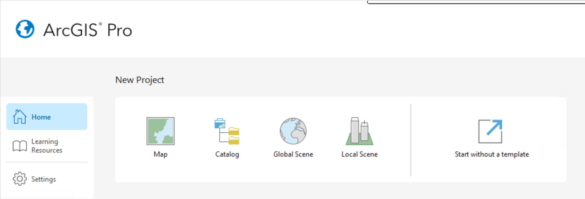
```

Inside this folder, you will find ArcGIS Pro has generated a bunch of files and folders. Importantly, there is the `.aprx` file, which is the file you can use to open your project in ArcGIS Pro. The other important folder is `FRST538_Lab1.gdb`, which is the default geodatabase for your project. When you start running different tools in ArcGIS Pro, this is where the outputs will automatically be stored. If you navigate to this folder in Windows Explorer, it will just look like a bunch of random files, so you can only view the contents of your geodatabase through GIS software like ArcGIS Pro.

```{r 01-arcgis-project-folder, echo=FALSE, fig.align = 'center', out.width = "25%"}
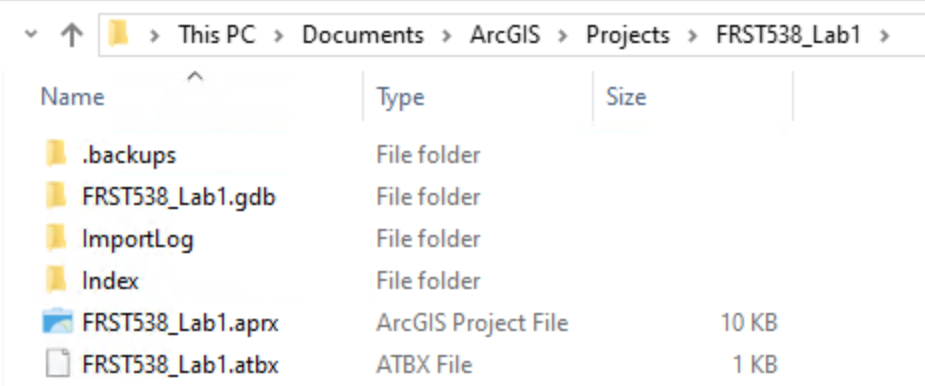
```

Take note of your project location because this is where you will be saving the spatial data files that you download so that you can view them in ArcGIS Pro.

In ArcGIS Pro, you should take note of four areas: - The map in the middle; this is where your spatial layers will be mapped, right now you are looking at the default basemap. - The navigation ribbon at the top (Project, Map, Insert, Analysis, View, Edit, Imagery, Share, Help); this is where you can add data and find tools. - The "Contents" pane on the left; this is like a table of contents where your spatial data layers will be listed in the "top-down" that they are drawn/appear on the map. - The "Catalog" pane on the right; this lists sources for data and if you expand "Databases", you will see your default geodatabase listed there that has the same name as your project.

```{r 01-arcgis-panes, echo=FALSE, fig.align = 'center', out.width = "100%"}
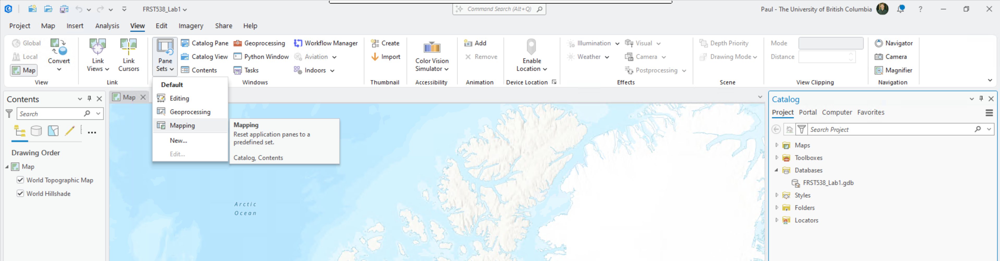
```

If you do not see the "Contents" and/or "Catalog" panes, then navigate to the "View" tab from the top ribbon, "Set Panes", then select "Mapping" to return to the default configuration.

**Step 2:** Navigate to the "Map" tab from the top ribbon. This will be the most useful tab for this lab as it allows you to navigate around the map, add data, and select/query the spatial data.

```{r 01-arcgis-navigation, echo=FALSE, fig.align = 'center', out.width = "25%"}
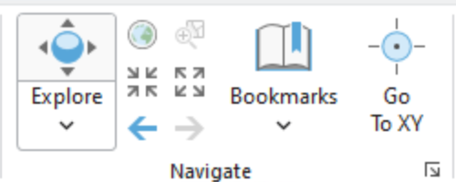
```

The "Navigation" group has methods for panning around and zooming in/out of the the map. If you click "Explore" then you can pan freely around the map. Using your mouse scroll wheel or trackpad scroll gesture on your computer, you can zoom in/out. the other buttons with the arrows allow you to zoom in/out of the centre point of your current map view at fixed intervals. "Bookmarks" allow you to return to the current view of the map after you have navigated away. These can be really handy for returning to the extent/scale that you previously viewed something or maybe for re-locating a feature that you found interesting. If you have a specific coordinate, you can use "Go To XY" to automatically pan to that location.

```{r 01-arcgis-layer, echo=FALSE, fig.align = 'center', out.width = "25%"}
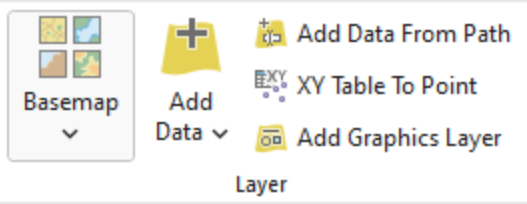
```

The "Layer" group allows you to change the basemap and add spatial data as layers from various sources. An important concept to understand in GIS is the distinction between "layer" and "data". "Layers" are exactly that, they are what we *see* in the map. We can change the colours and symbology of layers in ArcGIS Pro, and these *visual* choices are stored as part of the `.aprx` project file. When you add spatial data to your map, they *appear* as "layers" in the "Contents Pane". On the other hand, "data" are the spatial data files that are being read from your project folder or some other source. When you change the symbology of a layer, we are not editing or changing the data in any way. Even if remove the layer from your map, you are not deleting the data file, rather you are removing the *reference* to that file from your project that is used to display the layer.

##### Q1. What are the names of the current layers in your map? (4 points) {.unnumbered}

```{r 01-arcgis-bottom-toolbar, echo=FALSE, fig.align = 'center', out.width = "100%"}
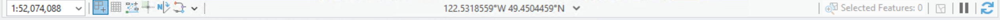
```

We will explore the other tool groups in later tasks and other labs. For now, the last feature that you should be aware of is the information toolbar at the very bottom of the application. Here you will find the current scale of your map (`1:52,074,088` in the image above), and you can also type any number directly into the box and press Enter to change to a different, set scale. In the middle of the toolbar you can see the location of your cursor with the default units in decimal degrees. On the far right, there is a pause button and a refresh button. These are used to stop loading or re-load the layers in your map. These can be very useful later when it might take your computer a long time to re-draw thousands of features in the layers in your map. In this case, you can pause drawing mode momentarily while you configure the layer symbology.

**Step 3:** From the "Contents" pane, right-click on "Map", and select "Properties". Here you can find and set various properties about your map. Navigate to the "Coordinate Systems" from the list on the left and you will see the current Coordinate Reference System (CRS) that is being used by your map.

```{r 01-arcgis-map-properties, echo=FALSE, fig.align = 'center', out.width = "75%"}
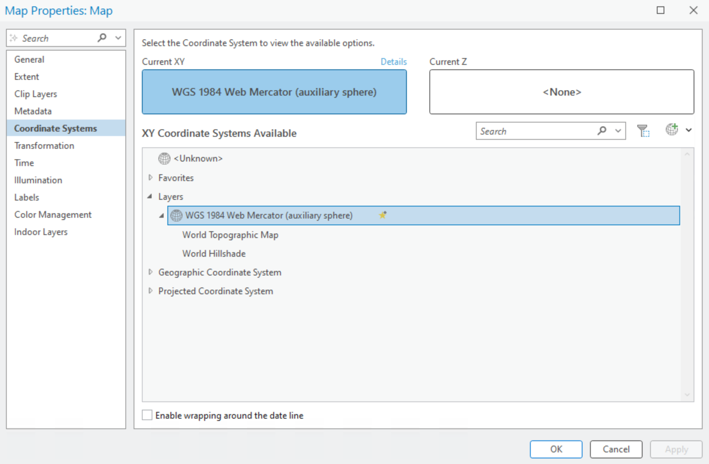
```

##### Q2. What is the datum of the current CRS for your map? (2 points) {.unnumbered}

##### Q3. What is the projection of the current CRS for your map? (2 points) {.unnumbered}

We can change the CRS of the map to any CRS that we want. Notice that there are separate lists for "Geographic Coordinate Systems" and "Projected Coordinate Systems".

##### Q4. What is the difference between a geographic coordinate system and a projected coordinate system? (10 points) {.unnumbered}

**Step 4:** Select or search for "North Pole Azimuthal Equidistant" and double-click it or select it and click "Apply". Inspect the result. We can also modify CRS definitions to create a custom map projection. For example, notice how Canada is rotated in this azimuthal projection because the default central meridian is 0° longitude. Open the map properties again, but this time right-click on "North Pole Azimuthal Equidistant" and select "Copy and Modify". In the dialogue window that appears, find the value for "Central Meridian" and change it from `0` to `-123`, then click "Save", then click "Apply". Inspect the result. Notice that we have now rotated the map projection over Vancouver, Canada. Feel free to explore other projections, if you want, but before proceeding to the following steps, be sure to change your map CRS back to "WGS 1984 Web Mercator (auxillary sphere)".

```{r 01-arcgis-custom-projection, echo=FALSE, fig.align = 'center', out.width = "75%"}
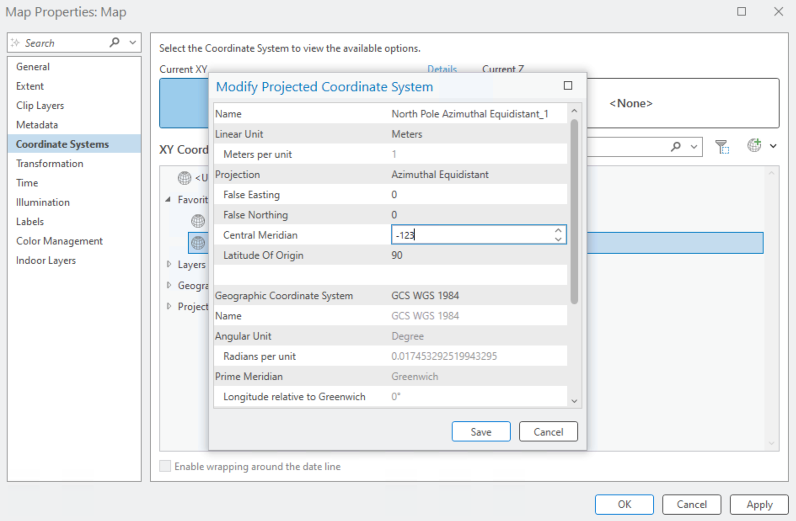
```

What we just explored is that your ArcGIS Pro Map has its own CRS defined. This is an important concept because a map can only have one coordinate system, whether we are talking about a digital map in ArcGIS Pro or an historical paper map. It will be very important for you to understand that your ArcGIS Map can have a different CRS than the data that you want to map. ArcGIS Pro and other modern GIS software solve this issue by re-projecting your spatial data "on-the-fly" using the current CRS of your map. You see the illusion that everything is "mapped" in the same coordinate system, but in fact, your underlying data can be in completely different coordinate systems, even different datums. For our purposes in this lab, this is okay because we will only be visualizing the data as layers, but this issue becomes very problematic when we start to run data through tools and rely on the calculations of position, area, and perimeter/length of features, which can be very inaccurate when working between different CRS. Therefore, it is best practice to choose the CRS that is most appropriate for your study area and purpose and then change your map to that CRS.

##### Q5. What CRS would be most appropriate for your study area and why? Justify your reasoning. (15 points) {.unnumbered}

As you will discover in the next task, spatial data are distributed in a wide variety of coordinate systems, and you are not always guaranteed the CRS that matches your project. So you may need to manually re-project your data before undertaking any analysis beyond simple visualization. Below is a table of three commonly used CRS in British Columbia and Canada:

| Coordinate Reference System (CRS) | Uses |
|--------------|----------------|
| **NAD 1983 UTM Zone 10N** | Mapping within Universal Transverse Mercator (UTM) Zone 10 North around Vancouver |
| **NAD 1983 BC Environment Albers** | Mapping across all of British Columbia |
| **Canada Albers Equal Area Conic** | Mapping across all of Canada |

------------------------------------------------------------------------

## Task 2: Find your own spatial datasets {.unnumbered}

Spatial data are everywhere. For this task, you will begin to explore different kinds of spatial data portals and also the variety of data formats that you might come across. In later tasks, we will dive further into examining, assessing, and visualizing the datasets that you find.

The table below lists a few places to start your search:

| Portal | URL | Focus / Notes |
|------------------------|------------------------|------------------------|
| BC Data Catalogue | <https://catalogue.data.gov.bc.ca/> | Provincial datasets: forestry, land cover, cadastral, climate, transportation, natural resources |
| City of Vancouver Open Data Portal | <https://opendata.vancouver.ca/> | Municipal datasets: zoning, land use, parks, trees, utilities, transportation, planning |
| Government of Canada Geoportal | <https://geo.ca/home/> | Federal datasets: topography, land cover, soils, administrative boundaries |
| Lunaris | <https://www.lunaris.ca/> | National discovery service for research data across Canadian institutions |
| UBC Geospatial Open Data | <https://github.com/UBCGeodata/ubc-geospatial-opendata> | UBC-hosted geospatial datasets, campus and research related |
| Natural Resources Canada | <https://maps.canada.ca/> | Federal geospatial data: topographic maps, forests, geology, hydrography |
| Metro Vancouver Data Portal | <http://www.metrovancouver.org/data> | Regional planning: air quality, utilities, infrastructure, parks |
| Natural Earth | <https://www.naturalearthdata.com/> | Global vector and raster datasets at multiple scales |
| UN FAO GeoNetwork | <https://data.apps.fao.org> | Global agriculture, land cover, and environmental datasets |

**Step 1:** Navigate to one or more of the portals linked above and search for three vector datasets that might be relevant to your project. You can select data of any themes that you are interested in, but you must follow these guidelines to receive credit:

-   You must select one dataset each of points, lines, and polygons (i.e., 2D vector data only, and one of each type)
-   You must select datasets from at least two different sources
-   You must only use the sources listed above
-   You must properly cite the source of your dataset

**Step 2:** Once you have found a dataset, download the file into your ArcGIS Pro project folder location that you noted from Task 1. Do not download files directly into your project's default geodatabase. Most likely the files that you will find will be zipped (compressed), so you will also need to unzip (uncompress) the files into your project folder so that ArcGIS Pro can read them.

Pay attention to the metadata on the portal that describe what you are downloading. Metadata are data about data. They describe data and help to make them findable through portals and library indexes. For example, you might come across metadata that describes who the author of the data is, when the data were created/collected/updated, how large the files are and what formats they are, codes for understanding the attribute table, licensing, and more. Rather than provide detailed instructions here for each portal, just ask the instructor or TA if you have any doubts or questions about what you are looking at.

**Step 3:** For each dataset that you download, check the file type and then bring it into ArcGIS Pro using the instructions in the table below. For many file types, you can just drag and drop the file into ArcGIS Pro. You can also navigate to your project folder in the "Catalog" pane (expand "Folders", expand "FRST538_Lab1") and drag files from there or right-click files and select "Add To Project" (you may need to right-click the project folder and select "Refresh" to see recently added files from this method).

| Format | File Extension(s) | Notes | Opening in ArcGIS Pro |
|------------------|------------------|------------------|------------------|
| **Shapefile** | `.shp` (+ `.dbf`, `.shx`, etc.) | Legacy, widely used, multiple files | *Add Data* → select `.shp` |
| **GeoPackage** | `.gpkg` | Modern OGC standard, single file, may contain many layers | *Add Data* → select `.gpkg` then choose layer |
| **File Geodatabase** | `.gdb` (folder) | ESRI native format, may contain many layers | *Add Data* → browse into folder, select layer |
| **GeoJSON** | `.geojson` | Web-mapping format | *Add Data* → select `.geojson` |
| **FlatGeobuf** | `.fgb` | Fast modern format | *Add Data* → select `.fgb` |
| **KML/KMZ** | `.kml`, `.kmz` | Google Earth | *Add Data* → ArcGIS Pro converts to feature class |
| **CSV with coordinates** | `.csv` | Tabular data with X/Y columns | *Add Data* → XY Table, set fields |

**Step 4:** Import you data into your project's geodatabase. This will vary depending on the file formats that you encounter, but generally you can right-click the geodatabase in the project folder, select "Import", then select "Feature Class(es)". In the "Feature Class to Geodatabase" tool that appears, select your three datasets from the drop down menus (if you added them to your ArcGIS Pro Map already) or navigate to the location of the files in your project folder then click "Run". When it completes, be sure to remove the old layers from your map (right-click the layer, "Remove") and then add the three feature classes in your geodatabase to your map.

Note that ArcGIS Pro refers to vector data (i.e., points, lines, polygons) as a "feature class". You will see this language throughout various tools in ArcGIS Pro (e.g., "Input Feature Class", "Output Feature Class").

```{r 01-arcgis-import-geodatabase, echo=FALSE, fig.align = 'center', out.width = "75%"}
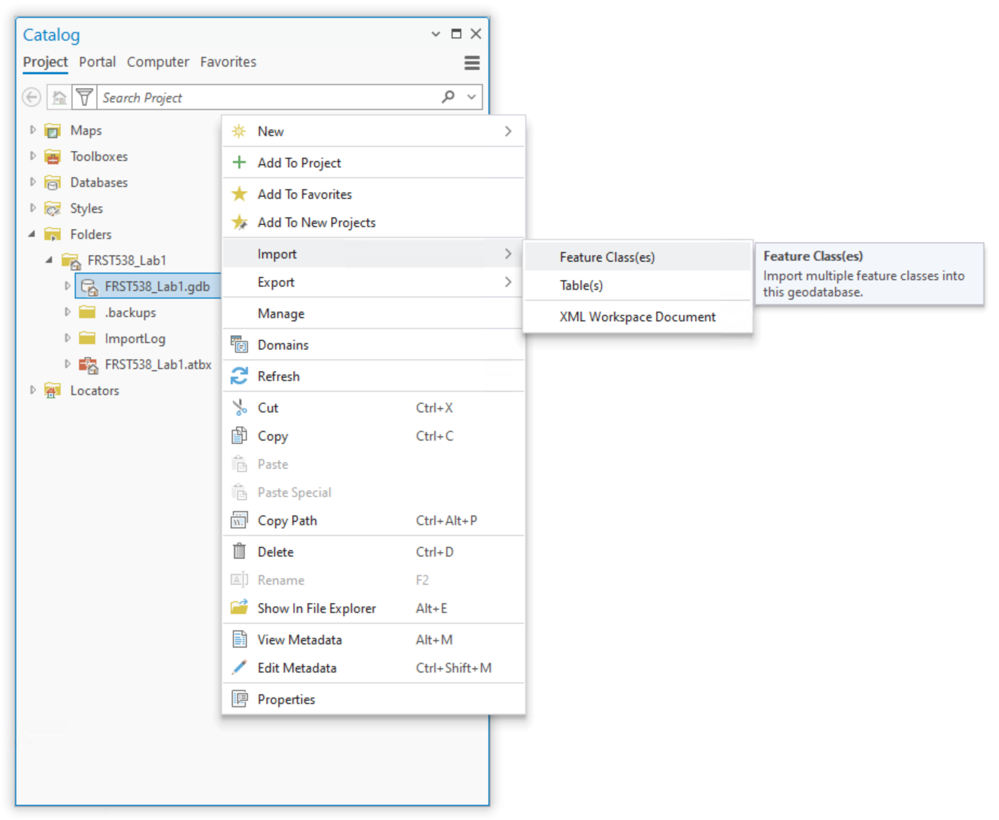
```

Up to this point, you have primarily been manipulating data directly through ArcGIS Pro, but you have not really changed much about your actual project. So there is no project state to really save. For example, if ArcGIS Pro crashed right now, you should still be able to find the feature classes that you imported into your project geodatabase. That said, it is good practice to save your project file moving forward as you work through this lab and later assignments.

##### Q6. What are the three datasets you chose and what sources did they come from? Provide the URL to the data source and report the file format that the data were provided in. (15 points) {.unnumbered}

------------------------------------------------------------------------

## Task 3: Inspect and Examine your Spatial Data in ArcGIS Pro {.unnumbered}

Ensure that you have added your three datasets as layers in your ArcGIS Pro Map.

**Step 1:** Right-click on each layer in the "Contents" pane and select "Properties". From here, you can view a lot of important metadata for your layers. Navigate to the "Source" tab from the list on the left and then expand "Extent" and "Spatial Reference".

```{r 01-arcgis-layer-properties, echo=FALSE, fig.align = 'center', out.width = "75%"}
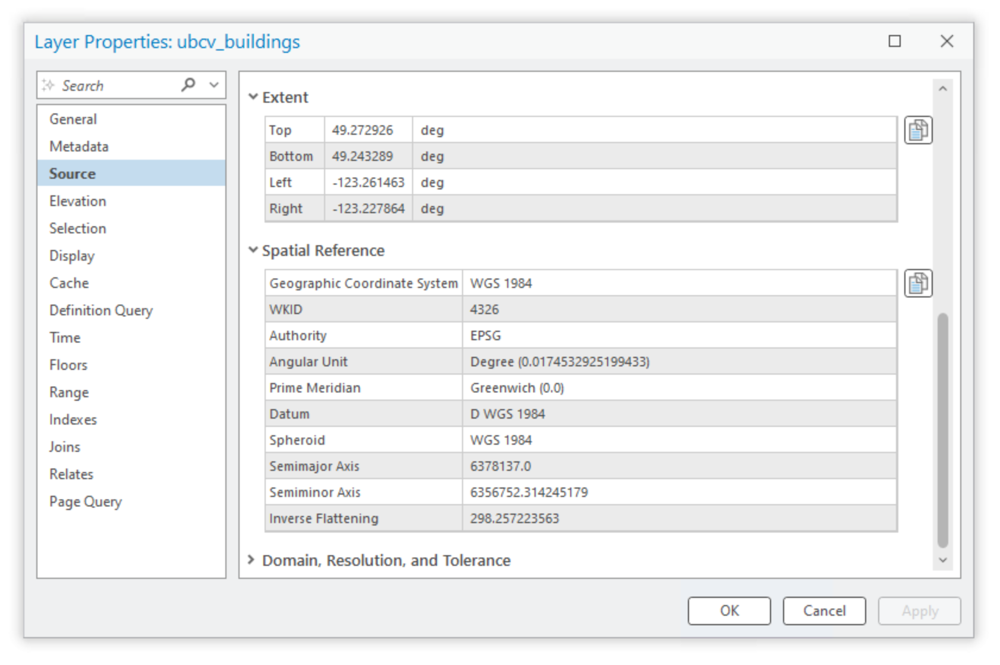
```

The extent represents the extreme spatial limits of the dataset, as if you drew a rectangle around all the features, what we call a bounding box. In the image above, the units of the extent for the buildings on UBC Vancouver campus are given in decimal degrees ("deg"). Below that, we see the CRS for these data is WGS 1984, a geographic coordinate system. In other words, these data are mapped purely in latitude/longitude values and are not projected. Remember that the CRS of our data can be different than the CRS of our ArcGIS Pro Map.

##### Q7. What is the CRS and extent for each of your three datasets? Paste the values from ArcGIS Pro and be sure to indicate which value cooresponds to which dataset. (15 points) {.unnumbered}

Close the layer properties.

**Step 2:** For each of your layers, right-click the layer in the "Contents" pane and select "Attribute Table". Inspect the attributes. Are there any acronyms or codes that you are not familiar with? To decode those, you might need to refer to the metadata from the portal. From the top ribbon, click "Table", then select "Fields". Here we can see a quick overview of all the data types in the attribute table. Each field must contain values that are in the same data type.

```{r 01-arcgis-attribute-table, echo=FALSE, fig.align = 'center', out.width = "75%"}
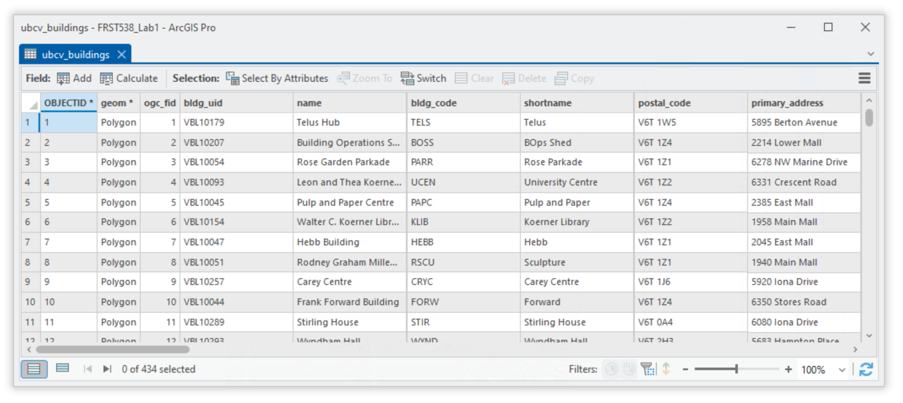
```

##### Q8. For each of your three datasets, pick one field and report the field name, the data type of the field, and one example of a value stored in that field. (9 points) {.unnumbered}

At the bottom of the attribute table you can quickly see how many features there are.

##### Q9. How many features are in each of your three datasets? (3 points) {.unnumbered}

From the attribute table, you can right-click on any row and select "Zoom To" and the map pan and zoom to that feature in the map.

```{r 01-arcgis-zoom-to-feature, echo=FALSE, fig.align = 'center', out.width = "75%"}
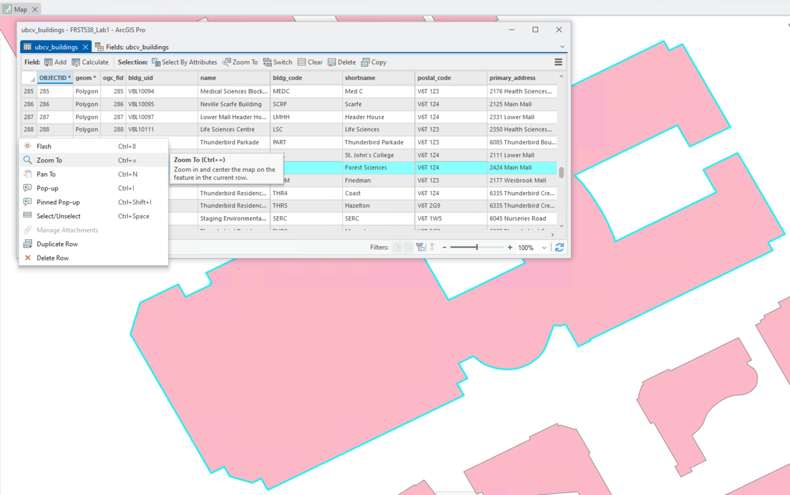
```

------------------------------------------------------------------------

## Task 4: Visualize your Spatial Data in ArcGIS Pro {.unnumbered}

In this last task, we will look at some simple ways to manipulate the symbology of your layers and produce and export a final map.

**Step 1:** Right-click one of your layers and select "Symbology". Note that ArcGIS Pro randomly assigns a colour/symbology to a layer when it is added to the map. Very rarely do data have a pre-defined symbology that come with the data. The default symbology is typically a random colour that is applied to all features, this is called "Single Symbol". For something like polygons, you can change the fill and the border by clicking the icon next to "Symbol". From here, you can select any of a number of preset symbologies provided by ArcGIS Pro or you can select the "Properties" tab at the top and customize with whatever features you want.

```{r 01-arcgis-single-symbology, echo=FALSE, fig.align = 'center', out.width = "75%"}
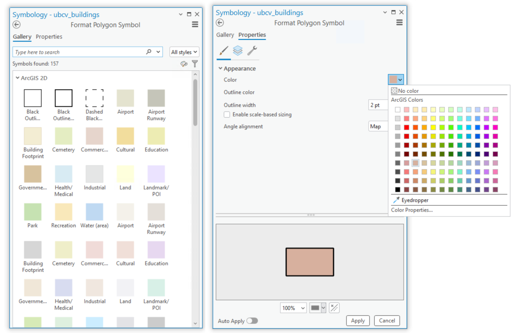
```

**Step 2:** From the "Symbology" pane, click the drop-down menu under "Primary Symbology" and select "Graduated Colors". From here, you can select any numeric field to serve as the basis for applying color to your features. In the example below, I have selected "max_floors" as the field to symbolize and chosen the blue-yellow color palette. ArcGIS Pro will update the layer and also show the classes in the "Contents" pane. 

```{r 01-arcgis-graduated-colors, echo=FALSE, fig.align = 'center', out.width = "75%"}
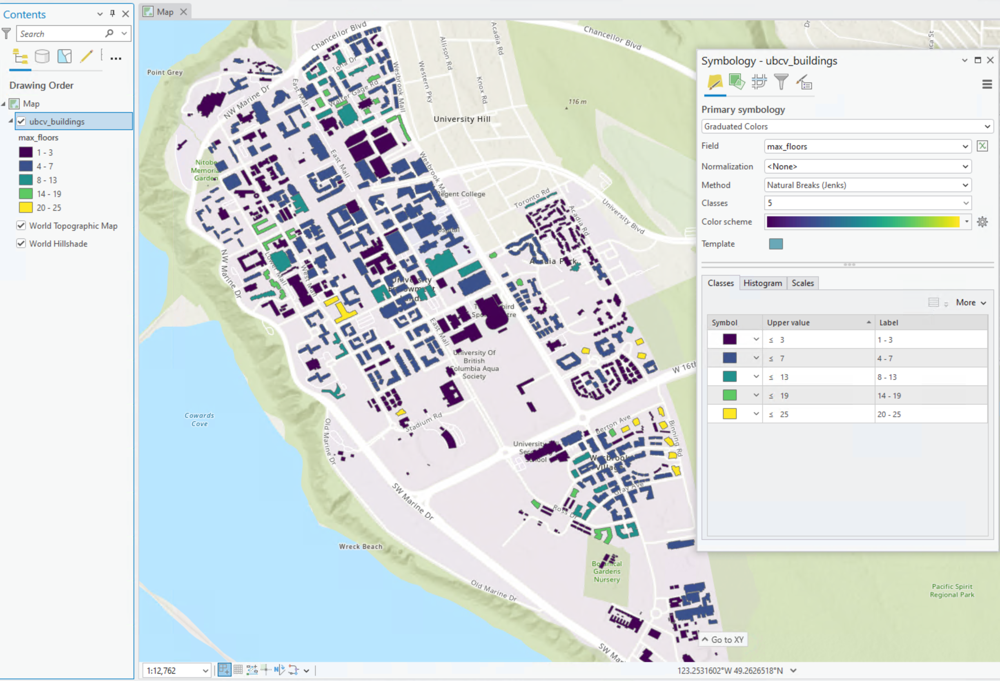
```

Experiment with the different symbology types for your layers and attributes until you arrive at something you like. Be sure to change the smybology of each of your layers.

You can also change the basemap to something more neutral like "Light Gray" to make your chosen colour palette more visible ("Map" tab on the top ribbon, select "Basemap").

```{r 01-arcgis-basemap, echo=FALSE, fig.align = 'center', out.width = "75%"}
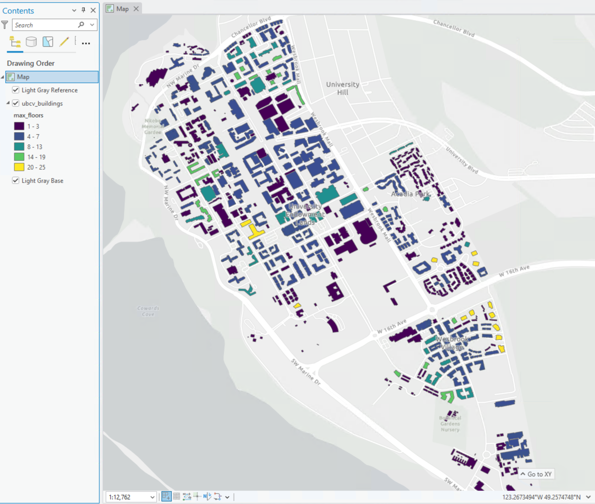
```

**Step 3:** When you are satisfied with your layer symbologies, you can enter the map layout mode to begin the final layout and export process. From the top ribbon, select "Insert", and then "New Layout". We are not actually printing the map, so you can select a regular letter size layout in either portrait or landscape mode. This will open a new blank Layout tab in your project and expose a bunch of new options specific to exporting a professional map.

**Step 4:** Add your ArcGIS Pro Map to your Layout by selecting "Map Frame" from the top ribbon under the "Insert" tab. From there, you can select any Maps that you have created in your project. When you select your Map, your cursor will switch to a cross hairs and you just click and drag a rectangle where you want the map to appear on the layout.

**Step 5:** Add a North Arrow, Scale Bar, and Legend from the top ribbon under the "Insert" tab. Pick your favourite styles for these features and experiment with the large number of customization options until you achieve something you like. You can directly rename the layers in your "Contents" pane to update how they appear in the legend. You may need to go back to your individual layer symbologies to adjust how the values are grouped and displayed.

**Step 6:** Add a title to your map by select the text icon in the "Graphics and Text" grouping on the top ribbon under the "Insert" tab. Here you will need to adjust the size and position of the text.

Note that there are too many options here to provide detailed instructions for. If you want to know how to do something specifically, just ask your instructor or TA. 

##### Map 1. Upload your final map that shows your three selected datasets. At least one dataset must be symbolized by a field in the attribute table. You can pick the colors/symbols to use for each layer. Layers that appear to use the default random color/weight assignment by ArcGIS Pro will not be accepted for credit. You must show that you manipulated the symbology for each layer. Your map must also contain a title, north arrow, scale bar, and a legend that contains the symbologies of all the layers. (25 points) {.unnumbered}

------------------------------------------------------------------------

## Summary {.unnumbered}

In this lab, you learned how to find, evaluate, and visualize vector spatial data for a study area that matters to you. You searched multiple open data portals, chose relevant vector spatial data, and practiced importing external files into your project geodatabase. You inspected metadata to identify each dataset's coordinate reference system, extent, and field data types; distinguished geographic vs. projected coordinate systems; and justified an appropriate CRS for your study area. You also examined attribute tables to interpret codes and data types, then customized symbology (single symbol, graduated colors, etc.) so each dataset communicates something meaningful. Finally, you assembled a clean map layout and exported a finished map showing all three datasets. You will likely repeat nearly all of these tasks for almost every GIS project you undertake in the future, and we will continue to build on this foundation in later labs.

Return to the [**Deliverables**](#lab1-deliverables) section to check off everything you need to submit for credit in the course management system.