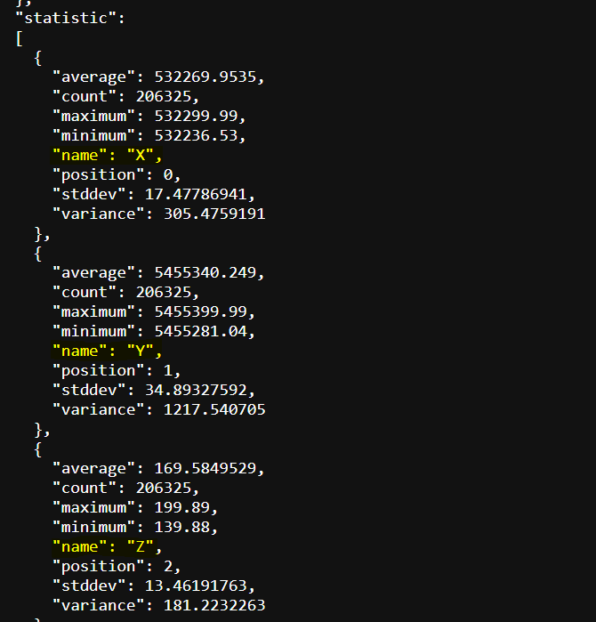
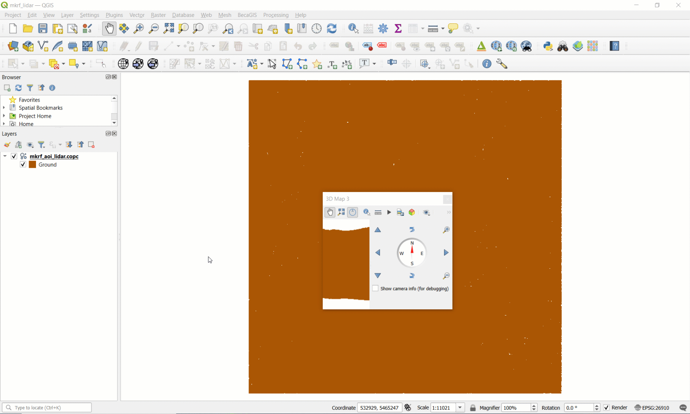

```{r echo=FALSE}
yml_content <- yaml::read_yaml("chapterauthors.yml")
author <- yml_content[["terrain-spatial-interpolation"]][["author"]]
```

# Spatial interpolation and visualization of LiDAR {#terrain-spatial-interpolation}

Written by
```{r results='asis', echo=FALSE}
cat(author)
```

## Lab Overview {.unnumbered}

The aim of this lab is to use LiDAR data from the University of British Columbia Malcolm Knapp Research Forest (MKRF) to create Digital Elevation Model (DEM) using a variety of spatial interpolation approaches. We will investigate how these methods compare to one another, and explore their strengths and weaknesses. Additionally, we will explore point cloud manipulation and visualization using both QGIS and ArcGIS Pro.

------------------------------------------------------------------------

## Learning Objectives {.unnumbered}

-   Interpret metadata for a LiDAR acquisition and point cloud

-   Manipulate a LiDAR point cloud with a variety of different tools

-   Generate and evaluate DEMs from a LiDAR point cloud using different terrain spatial interpolation approaches

-   Create maps and 3D visualizations of point clouds and interpolated surfaces

------------------------------------------------------------------------

## Deliverables {#lab1-deliverables .unnumbered}

Lab report with the following specification:

<input type="checkbox" unchecked> 6 pages maximum PDF including figures, tables and references (3 points). Single-spaced, 12-point Times New Roman font (1 point). All figures and tables should be properly captioned (1 point).</input>

<input type="checkbox" unchecked> Introduction should address the following questions and requirements (10 points):</input>

-   What is spatial interpolation? Why is it useful? 

-   Describe the different spatial interpolation methods that were tested.

-   What are the parameters of each corresponding tool in ArcGIS Pro and how do they impact the algorithm?

-   Reference to at least 3 peer review sources.

<input type="checkbox" unchecked> Methods should address the following requirements (10 points):</input>

-   Brief study area description and study area map (Note: there is an orthophoto of the research forest that was acquired at the same time as the LiDAR point cloud that you can reference and map).

-   Outline all primary steps included in the lab (no need to include exact ArcGIS Pro tool parameters).

-   Justify the use of specific methodological choices indicated in the lab.

<input type="checkbox" unchecked> Results should address the following questions and requirements (15 points):</input>

-   Statistics of the LiDAR point cloud in the AOI. What is the true, measured range of elevation by LiDAR within the AOI?

-   Table of summary statistics of the binned DEM.

-   A panel of maps that symbolizes the DEMs produced and the difference rasters that were produced by the comparison to the binning approach.

-   Tables that show zonal statistics of the difference rasters across elevation and slope ranges. Which zones has the largest differences?

-   Additional maps and/or 3D scenes that illustrate any local observations you made about the magnitude of differences or comparisons between interpolation algorithms

<input type="checkbox" unchecked> Discussion should address the following questions and requirements (10 points):</input>

-   How did each spatial interpolation algorithm perform relative to the binned DEM and the raw point cloud?

-   Interpret the results using your observations of the point cloud and other available data, statistics and metadata.

-   Strengths and limitations of each spatial interpolation algorithm in this study area.

-   Which spatial interpolation algorithm would you recommend the research forest use? Defend and justify your choice.

-   Reference to at least 3 peer review sources (can be the same sources as introduction).

------------------------------------------------------------------------

## Data {.unnumbered}

We will be working with LiDAR data collected over the UBC Malcolm Knapp Research Forest (MKRF) in Maple Ridge, British Columbia. These data are publicly available from the Master of Geomatics for Environmental Management (MGEM) Data Store and the instructions for accessing these data are given in the tasks below.

------------------------------------------------------------------------

## Task 1: Preprocess LiDAR data in PDAL {.unnumbered}

Point cloud data are large. For example, the point cloud collection that we will be working with contains 1,671,233,402 points! Typically, we should not interact with point cloud data in a desktop environment until we have to. Graphical user interfaces like QGIS and ArcGIS Pro introduce a large amount of computational overhead when working with point cloud data and these software are more suited for visualizing the data rather than processing them. Point cloud data are much more commonly hosted on remote servers nowadays, in cloud-optimized formats, and available for on-demand and query-ready streaming.

In this task, we will explore large LiDAR acquisitions that have been collected at the University of British Columbia (UBC) Malcolm Knapp Research Forest (MKRF). LiDAR collections are typically tiled to reduce the overhead with transacting with individual files. We are only going to process a handful of tiles, but we need to first grab the right tiles for our area of interest (AOI).

**Step 1:** Navigate to the MGEM Data Store and inspect the UBC MKRF 2016 LiDAR collection: <https://206-12-122-94.cloud.computecanada.ca/UBC_MKRF_LiDAR_2016/>

At the top, you will see some generic metadata for the collection. Below that, you will see a web map showing the tiles. If you click on one of the tiles, it gives the direct download universal resource locator (URL) and file size. If you scroll down, all the tiles are listed in a table along with a metadata file that provides some more specific information about each individual tile-file.

**Step 2:** Click to open one of the metadata txt files in your browser. This is json-formatted metadata for the associated LiDAR tile. Scrolling through it you will find summary statistics over a number of different dimensions. What attributes describe these LiDAR data?

```{r 01-metadata, out.width= "50%", echo = FALSE}
    
```

Suppose that we have some AOI within the research forest that we need to retrieve the LiDAR data from. How could we figure out which tiles we need without downloading all of them from the server? In most cases, you should have a polygon tile index available to assist you with this task. The tile index is another form of metadata, albeit spatial metadata.

**Step 3:** Right-click on the **tile_index.geojson** file at the top of the file listing and select "Copy Link". Open QGIS and click the "Open Data Source Manager" button (Layer > Data Source Manager). 

On the left of the Data Source Manager dialogue, select "Vector", toggle on "Protocol: HTTP(S), cloud, etc", then paste the URL you copied into the "URI" field (uniform resource identifier). "Add" the layer to your map view then "Close" the dialogue and inspect the result.

```{r 01-qgis-data-source-manager-tile-index, out.width= "75%", echo = FALSE}
    knitr::include_graphics("images/01-qgis-data-source-manager-tile-index.png")
```

A nice feature about QGIS is that it supports the ability to read any openly-specified geospatial file directly from a remote source. ArcGIS Pro only allows you to read some sources published on compatible remote databases (e.g., ArcGIS enterprise geodatabase or PostgreSQL) or from layers published on ArcGIS Online.

Now that we have spatial tile metadata, we can perform spatial intersection to find the right tiles. Our AOI is going to be the following longitude-latitude bounding box:

Lower left (LL): -122.55275, 49.32325

Upper right (UR): -122.52506, 49.34135

**Step 4:** Open a notepad text editor (**Notepad ++**) and convert this bounding box into a geojson polygon feature with the following syntax:

```         
{
  "type": "Polygon",
  "coordinates": [
    [
      [LL_longitude, LL_latitude],
      [UR_longitude, LL_latitude],
      [UR_longitude, UR_latitude],
      [LL_longitude, UR_latitude],
      [LL_longitude, LL_latitude]
    ]
  ]
}
```

Replace with the correct longitude/latitude values. Note that this creates a square polygon and the fifth coordinate is the same as the first, which topologically encloses the polygon. Save the geojson in your QGIS project folder as **"mkrf_aoi.geojson"** then open the file in QGIS. You should see that our AOI spans 16 total tiles.

**Step 4:** Click the "Select by Location" tool and "Select features from" the **ubc_mkrf_lidar_2016_tile_index** layer by intersecting with the **mkrf_aoi** you just made. Now the intersecting tiles are selected. Turn off **mkrf_aoi** layer so that you can see the selection.

```{r 01-selectbylocation, out.width= "75%", echo = FALSE}
    knitr::include_graphics("images/01-selectbylocation.png")
```
```{r 01-qgis-intersect-aoi-tiles, out.width= "75%", echo = FALSE}
    knitr::include_graphics("images/01-qgis-intersect-aoi-tiles.png")
```

**Step 5:** Click the "Identify Features" tool and click on one of the selected tiles, which will highlight it in red and open the attributes for the polygon. Expand "ubc_mkrf_lidar_2016_tile_index", "url", "(Actions)", and "url". Click the hyperlinked URL to download the tile to your QGIS project folder. Repeat this step for all 16 tiles.

```{r 01-identifyfeatures, out.width= "75%", echo = FALSE}
    knitr::include_graphics("images/01-identifyfeatures.png")
```

**Step 6:** Add all of the downloaded tiles to your QGIS map canvas. The default symbology is the classification attribute, but only ground returns have been classified for the research forest.

However, the tiles are all still stored in separate files and some portions are outside our AOI. So next, we are going to filter, merge, and crop the point cloud, but we are going to do this outside of QGIS because it will be faster and more reliable. We are going to use the Point Data Abstraction Library (PDAL) command line utility to perform this processing. You can read more about the extensive PDAL functionality here: <https://pdal.io/> Note that many of the functions we are going to use with PDAL are available as tools through QGIS, but you have less control over the options and parameters in QGIS.

**Step 7:** Open the OSGeo4W shell and navigate to your QGIS project folder where your LiDAR data are located. For example, `cd C:\users\paul\Documents\QGIS\mkrf_lidar`. Type the command `pdal --version` to make sure that PDAL was installed with your current version of QGIS. If a version number is returned in the console window, then continue to the next step, otherwise ask your instructor to help you install PDAL using the [OSGeo4W installer](https://trac.osgeo.org/osgeo4w).

PDAL can run functions in two ways. First, as subcommands, much like you have used with GDAL in prior labs. For example, `pdal merge [filename1.laz] [filename2.las] output.copc.laz` will use the `merge` subcommand and the file names that follow to merge many different las/laz/copc files together into the named output. Subcommands are generally good for small or incidental tasks like converting a file format or re-projecting data, but if you want to apply a more complex workflow then you should use a pipeline.

[Pipelines](https://pdal.io/en/2.6.0/pipeline.html#pipeline) are JSON-formatted files that give PDAL a set of instructions for reading, processing and writing point cloud data. With pipelines, you can define every step of the processing that you want and you can specify the finest level of detail at every stage. Pipelines are executed linearly, so we read the instructions from top-down. Below is an example of a pipeline that we are going to use, which is described in more detail below:

```         
{
    "pipeline": 
        [
            "AQ11.copc.laz",
            "AQ12.copc.laz",
            "AQ13.copc.laz",
            "AQ14.copc.laz",
            "AR11.copc.laz",
            "AR12.copc.laz",
            "AR13.copc.laz",
            "AR14.copc.laz",
            "AS11.copc.laz",
            "AS12.copc.laz",
            "AS13.copc.laz",
            "AS14.copc.laz",    
            "AT11.copc.laz",
            "AT12.copc.laz",
            "AT13.copc.laz",
            "AT14.copc.laz",
            {
                "type":"filters.range",
                "limits":"Classification[2:2]"
            },
            {
                "type":"filters.crop",
                "bounds":"([-122.55275,-122.52506],[49.32325,49.34135])",
                "a_srs":"EPSG:4326"
            },
            {
                "type": "filters.merge"
            },
            {
                "type":"writers.las",
                "filename":"mkrf_aoi_lidar.las"
            }
        ]
}
```

This pipeline will take all of our input tiles and filter, crop, merge, and write them out to a new file called "mkrf_aoi_lidar.las".

```         
            {
                "type":"filters.range",
                "limits":"Classification[2:2]"
            },
```

This first stage applies a [filter](https://pdal.io/en/2.6.0/stages/filters.html) stage with a function called [range](https://pdal.io/en/2.6.0/stages/filters.range.html#filters-range). Basically, this filter is telling PDAL that we only want the points that are classified as ground returns `Classification[2:2]` where `2:2` indicates the range of values from 2 to 2, which is the ground return classification code. So only ground returns are passed to the next stage:

```         
            {
                "type":"filters.crop",
                "bounds":"([-122.55275,-122.52506],[49.32325,49.34135])",
                "a_srs":"EPSG:4326"
            },
```

This next filter stage [crops](https://pdal.io/en/2.6.0/stages/filters.crop.html#filters-crop) the ground returns from the previous stage using the bounds of our AOI. We need to specify the spatial reference system `a_srs` of these coordinates since the LiDAR data are in a projected coordinate system (EPSG:26910). So only ground returns that fall within our AOI are passed to the next stage:

```         
            {
                "type": "filters.merge"
            },
```

This next filter stage [merges](https://pdal.io/en/2.6.0/stages/filters.merge.html#filters-merge) all the ground returns in our AOI into a single stream, which is then passed to the last stage that writes it to an output file in LAS (uncompressed) format:

```         
            {
                "type":"writers.las",
                "filename":"mkrf_aoi_lidar.las"
            }
```

**Step 8:** Copy the contents of the pipeline to a text editor and save the file as "process-lidar.json" in your QGIS project folder. It should be in the same place as the .laz tiles you just downloaded. The output will also be written to this folder. 

```{r 01-json, out.width= "100%", echo = FALSE}
    knitr::include_graphics("images/01-json.PNG")
```

**Step 9:** Return to the OSGeo4W shell and run the pipeline using the following command: `pdal pipeline process-lidar.json`. It may take several minutes for this step to complete, but in the end you should have a file called "mkrf_aoi_lidar.las" in your QGIS project folder. Drag it into QGIS and inspect it. The processed file should be ~90000KB when finished. If you get an error at this step make sure you have downloaded the correct tiles and the filenames match what is being loaded into the pipeline.  

**Step 10**: Finally, we will create a thinned point cloud to compare different interpolation methods in Task 3. In the OSGeo4w shell run the following command:

```pdal translate mkrf_aoi_lidar.las thinned.las sample --filters.sample.radius=5```

This will thin the point cloud by selecting a random point within a sphere with 5m radius. The output will be called "thinned.las" and will be written to the current working directory.   

------------------------------------------------------------------------

## Task 2: Visualize LiDAR data in QGIS {.unnumbered}

The default symbology of LiDAR data in QGIS will be the classification, but we only have ground returns in our file, so everything will appear brown. Try symbolizing some of the other attributes like Intensity, ReturnNumber, and ScanAngleRank.

```{r 01-ground, out.width= "75%", echo = FALSE}
    knitr::include_graphics("images/01-ground.PNG")
```

**Step 1:** Right-click the **mkrf_aoi_lidar** layer, open "Properties", select "Symbology" from the left, and then select "Attribute by Ramp" from the very top drop-down menu. Then choose your attribute and apply your symbology parameters. Make some notes of your observations for these attributes that you can reference in your report.

2D is a very boring way to visualize point cloud data, so let's create a 3D map view in QGIS.

**Step 2:** From the top menu, select "View", then "3D map views", and click "New 3D Map View". A small window will appear. Click and drag it to the top of your map canvas to dock it and make it larger.

```{r 01-qgis-dock-3d-map-view, out.width= "100%", echo = FALSE}
    
```

**Step 3:** From the 3D map view menu bar, click the tool icon and toggle on "Show Eye Dome Lighting". Then, holding the `SHIFT` key, left-click and drag your cursor from top-to-bottom then release both buttons. This will give you an oblique shaded 3D perspective of the terrain.

```{r 01-qgis-shift-up-down, out.width= "100%", echo = FALSE}
    knitr::include_graphics("images/01-qgis-shift-up-down.gif")
```

Navigating 3D data can be challenging using a 2D input device like a mouse, so we need to use different keyboard keys to control how we want to change our view:

### Hold SHIFT: Orbit camera around fixed position {.unnumbered}

If you want to pan around a fixed position, then hold the `SHIFT` key and drag your cursor. The point cloud will rotate in the opposite direction. As you can see from the animation below, dragging your cursor in a circular pattern rotates the point cloud around a stationary imaginary point. If you continuously drag your cursor to the right, you will rotate around the fixed point counter-clockwise.

```{r 01-qgis-shift, out.width= "75%", echo = FALSE}
    knitr::include_graphics("images/01-qgis-shift.gif")
```

### Hold CTRL: Maintain camera position and change camera angle {.unnumbered}

If you want to pan your camera angle up, down, left or right, then hold the `CTRL` key and drag your cursor in the direction you want to look. This only changes the camera angle, not the camera elevation or position.

```{r 01-qgis-ctrl, out.width= "75%", echo = FALSE}
    knitr::include_graphics("images/01-qgis-ctrl.gif")
```

### Hold ALT: Move camera position on the X-Y plane {.unnumbered}

If you find yourself wanting to move around, then hold the `ALT` key and drag your cursor in the direction that you want to move the camera. Think of this as sliding along an X-Y plane that is fixed at the camera elevation and angle.

```{r 01-qgis-alt, out.width= "75%", echo = FALSE}
    knitr::include_graphics("images/01-qgis-alt.gif")
```

### Scroll: Move camera position to/from the cursor location {.unnumbered}

If you want to move towards some feature, then simply point your cursor at it and scroll without clicking. This movement is akin to traversing a ray that connects your current camera position with a look direction angle (relative to X-Y-Z). Scrolling therefore changes the camera position and elevation. Scrolling down has the effect of "zooming in" while scrolling up has the effect of "zooming out". Be careful, though, because scrolling will always follow the current position of the cursor, so if you scroll down on one position and then move your cursor and scroll up, your camera position will not be where it started.

```{r 01-qgis-scroll, out.width= "75%", echo = FALSE}
    knitr::include_graphics("images/01-qgis-scroll.gif")
```

**Step 4:** Practice navigating in 3D and observing the different attributes across the ground surface. Make some notes of your observations for your report. There is a button on the top of the 3D map view to save an image of any given view.

------------------------------------------------------------------------

## Task 3: Prepare LiDAR in ArcGIS Pro {.unnumbered}

For this task, we will switch to ArcGIS Pro and practice manipulating the LiDAR point cloud to derive a terrain surface using different algorithms. ArcGIS Pro has several tools that we can use to view and analyse LiDAR point clouds. In order to view the dataset, we need to import it as a LAS Dataset. Note that QGIS with open LAS or LAZ files and immediately convert them to COPC format (.copc.laz), but ArcGIS Pro does not currently support reading COPC, so we must use the LAS file. If you want to reproduce this lab with other LiDAR data in ArcGIS Pro, you can convert LAZ to LAS using the "Convert LAS" tool. 

**Step 1:** Open a new ArcGIS Pro map project and Search for the "Create LAS Dataset" tool. Specify the "mkrf_aoi_lidar.las" file as your input file. Make sure to name the output LAS Dataset and specify the correct coordinate system. Ensure that "Create PRJ for LAS files" is set to "All LAS Files". Toggle on "Compute Statistics" and run the tool. This will produce a LAS Dataset file (.lasd). **Repeat this step for the thinned las dataset.** 

**Step 2:** We can now add our LAS Datasets to the map. Depending on the zoom extent, you may only see the red bounding box of the LAS Dataset file; this is not an error, you just need to zoom in to see the actual points. Alternatively, you can open the dataset in a Local Scene, although due to the size of the point cloud this might cause some lag. Compare the full and thinned point clouds. 

```{r 01-arcgis-lasd, out.width= "75%", echo = FALSE}
    knitr::include_graphics("images/01-arcgis-lasd.png")
```

**Step 3:** Another way to explore the dataset is to view the properties. Right-click the LAS Dataset and open the "Properties". Here we can see some statistics of the point cloud, such as information regarding the Classification Codes and Return Number. You can get more detailed metadata from a Catalog view. From the top ribbon, select the View tab and then click "Catalog View". Navigate to where you saved the LAS Dataset, right-click it, and open the "Properties" again. 

Record and compare these values for the full and thinned datasets:

- How many points are in the dataset? 

- What is the average point spacing?

- What is the range of elevation?

**Step 4:** Search for the "LAS Dataset to Raster" tool, and use "mkrf_aoi_lidar.las" (not thinned) as the input. Since we are interested in creating a terrain surface model, we want to use the "Binning" "Interpolation Type", and make sure that we use the "Minimum" (i.e., the lowest "Elevation") points in each "Cell Assignment" of the output raster. "Sampling Value" refers to the resolution of the raster that we are creating, in other words, the spacing of our raster cell samples. Set the "Sampling Value" to **1** (meters), name the output raster "MKRF_DEM" and run the tool.

```{r 01-arcgis-lasd-to-raster, out.width= "50%", echo = FALSE}
    knitr::include_graphics("images/01-arcgis-lasd-to-raster.png")
```

The tool above is the most straight-forward way to create a DEM from a LiDAR point cloud in ArcGIS Pro. Because this DEM was fit using all available lidar points we will consider it to be our "ground-truth" dataset. 

In the following steps you will create a 2D point dataset using the **thinned LiDAR point cloud**. We will use this to test and compare three interpolation methods in the next task. 

Note, for future reference you can use these methods to spatially interpolate all other kinds of attributes that are not terrain!

**Step 5:** Search for the "LAS to Multipoint" tool. Input your thinned LAS Dataset. You will notice that there is a box asking for the "Average Point Spacing". Enter the value that you recorded from Step 3. Set the correct coordinate system and then run the tool.

```{r 01-arcgis-las-to-multipoint, out.width= "50%", echo = FALSE}
    knitr::include_graphics("images/01-arcgis-las-to-multipoint.png")
```


**Step 6:** Search for the "Multipart to Singlepart" tool. The multipoint feature class from the previous step is the input then run the tool. ArcGIS Pro will attempt to draw the symbols for every single point in the multipart and singlepart feature classes, so keep them toggled off.

**Step 7:** Now we need to add the Z value as an attribute. Search for the "Add Z Information" tool and use the singlepart features as the input. The only option available should be "Spot Z" and make sure it is toggled then run the tool. This may take several minutes.

We now have a 2D point feature class that we can use to compare different spatial interpolation algorithms! 

------------------------------------------------------------------------

## Task 4: Apply and evaluate spatial interpolation algorithms in ArcGIS Pro {.unnumbered}

Since we now have points representing height values, we can use the raster interpolation toolset to experiment with three different interpolation methods: Natural Neighbor, Inverse Distance Weighting (IDW), and Spline. You can read more about the tools we will be using from the [ArcGIS Pro documentation](https://pro.arcgis.com/en/pro-app/tool-reference/spatial-analyst/an-overview-of-the-interpolation-tools.htm).

Search for each of the interpolation tools listed above individually (for IDW, the tool is called "IDW") and explore their parameters. Natural Neighbor can be found within the "LAS Dataset to Raster" tool, change the "Interpolation Type" to "Triangulation", and "Interpolation Method" to "Natural Neighbor". 

**Step 1:** Create three rasters for each interpolation method: Natural Neighbor, IDW, and Spline. We suggest writing these rasters out to GeoTiffs so that you can also view them in QGIS, if you want. For each tool, keep the default settings, but make sure that you generate the rasters at 1 m resolution or whatever resolution you decided to run. Note that the Spline tool will take several minutes to run. If you have trouble running this step try generating the rasters at a slightly coarser resolution (5 or 10m). 

Take some time to inspect each raster, and look at their similarities and differences (make sure that you are using a common symbology when comparing). We can compare the differences between our interpolated rasters with the binned DEM that we created in the last task.

**Step 2:** In order to compare the rasters, we will make a raster of the differences between the interpolated surface and the binned DEM. You will use the "Raster Calculator" tool to do this. Subtract each interpolated surface from **MKRF_DEM**. Name each difference raster according to the interpolation method: "spline_diff", "nn_diff", and "idw_diff". We suggest writing these rasters out to GeoTiffs so that you can also view them in QGIS, if you want.

Next, we are going to quantitatively evaluate the differences and calculate statistics over different zones to see if there are any patterns or relationships with other variables.

**Step 3:** Change the Symbology of the **MKRF_DEM** to Classify and set the number of Classes to 3 with the method of your choice. Use the "Reclassify (Spatial Analyst)" tool to reclassify the binned **MKRF_DEM** into "high", "medium", and "low" areas using this classification scheme.  (If you symbolize first, then open the Reclassify tool it should popukate the start and end fields with the symbolized values.)

**Step 4:** Use the "Slope (Spatial Analyst)" tool to create a raster called "mkrf_slope" using degrees. Then, use the "Reclassify" tool to reclassify the degree slope values into three classes using the same method. 

We will use these reclassified areas as zones to calculate statistics about the difference between the interpolated surfaces and the binned DEM.

**Step 5:** Search for the "Zonal Statistics as Table (Spatial Analyst)" tool. The "Input Raster or Feature Zone Data" are the reclassified zone rasters you just made. "Zone Field" should be "Value". The "Input Value Raster" is the raster that we want to summarize over the zones, which are all of the difference rasters we calculated in the earlier step. Run this tool for both each combination of the two topography zonations and the three difference rasters for the different interpolation methods. You should finish with six tables:

-   idw_diff_elev

-   idw_diff_slope

-   nn_diff_elev

-   nn_diff_slope

-   spline_diff_elev

-   spline_diff_slope

**Step 6:** Create a final map with the following elements and include it in the Results: 

- Each of the interpolated surfaces and difference rasters (6 total)
     - The interpolated surfaces should be symbolized using **Shaded Relief** symbology
- Summary statistics showing the mean and standard deviation across slope and elevation zones
- North arrow and appropriate labels for each map panel (no need for name, date and title as this figure will be embedded in your report)

Note that you can add standalone tables to your Map Layout by first clicking on the table in the Contents pane then Insert > Table Frame. Click and drag to set the extent of the table on the map, (similar to how you add a Map Frame).  

------------------------------------------------------------------------

## Task 5: Visualize 3D data in ArcGIS Pro {.unnumbered}

In this last brief task are some instructions for visualizing the point cloud and interpolated DEM surfaces in ArcGIS Pro. You can produce and export some 3D scenes that may help to illustrate your observations in your report.

**Step 1:** In ArcGIS Pro, click the "Insert" tab, click and expand "New Map", and select "New Local Scene".

**Step 2:** Add the "mkrf_aoi_lidar.las" file to the scene. Navigating an ArcGIS Pro scene is nearly the same as it is in QGIS. Though, instead of using keys on the keyboard to toggle between the different camera axes to manipulate, ArcGIS Pro provides an on-screen navigator in the bottom left. In this way, you can manipulate an ArcGIS Pro scene using just your mouse.

```{r 01-arcgis-scene-navigation, out.width= "100%", echo = FALSE}
    knitr::include_graphics("images/01-arcgis-scene-navigation.gif")
```

By default, ArcGIS Pro uses its own "WorldElevation3D/Terrain3D" source for the "Ground" in the Contents Pane. You can change the ground source to any DEM or really any other raster that you want to use the values of to create a "ground" surface. We are going to use this feature to explore the differences between the surface models we derived and the actual point cloud.

**Step 3:** Add the three interpolated DEM rasters to the scene and also the difference rasters. Toggle everything off in the scene. Drag the three DEM rasters under "Ground". Leave the three difference rasters under "2D Layers". 

**Step 4:** For each difference raster, toggle it on and change the symbology to "Stretch", using a diverging "Color Scheme" and a "Minimum Maximum" "Stretch Type". Below in the "Statistics" tab, click "Dataset" and then select "Custom" from the drop-down menu. Modify the "Minimum" and "Maximum" values so that they are the same magnitude, but one is positive and the other is negative. You select the appropriate values based on the range of values that you observe in the difference raster and you will need to test different values to get your desired effect. For example, if the range of difference values is -10.51 and 21.32, then you might try setting the "Minimum" to -10 and the "Maximum" to 10. If you want the colors to be more apparent, then incrementally reduce the magnitude of your values: try -7, 7 next; then -5, 5; etc. until you reach your desired visualization. It it important to ensure that the midpoint is zero when using a diverging color scheme.

**Step 5:** Toggle on each pair of DEM (under "Ground") and difference raster (under "2D Layers"). The ground source adds elevation to the difference raster that you symbolized, but does not impact or change the point cloud because it is inherently 3D data. Since we are using our own custom ground source, we can actually pan and observe a cross-section of the point cloud sitting on, above, or below the ground source and then observe local deviations between the point cloud and the derived DEM surface. 

The white background might make it difficult to observe the differences. You can change the background color of the scene by left-clicking on "Scene" in the Contents Pane, open the "Properties", and then select the background color. We suggest using a light grey. There are other options for illumination that you can also modify in the "Properties", if you want. The image below shows an example of what the IDW might look like:

```{r 01-arcgis-idw-diff, out.width= "100%", echo = FALSE}
    knitr::include_graphics("images/01-arcgis-idw-diff.png")
```

Explore all of the DEM surfaces and export some examples that could help you interpret and illustrate your observations in your report.

------------------------------------------------------------------------

## Summary {.unnumbered}

We covered a lot of ground in this lab about LiDAR processing with GIS software. One thing that should be apparent is that the vast majority of your time will be spent preparing LiDAR data for analysis. Point clouds are dense. Advances in scanning technology are creating new challenges for managing, accessing, organizing, and manipulating these dense data. Remember, we always want to work with the least amount of LiDAR data that our task requires. For spatial interpolation of terrain, this means only working with the necessary ground returns in our AOI. By filtering the tiles and points to only those we needed for the interpolation task, we reduced our data overhead by over 650%! 
You also practiced evaluating different spatial interpolation algorithms, which can have a large impact on subsequent analyses with those surfaces. When choosing an interpolation algorithm, you must always consider how dense your data are (i.e., how long will it take for me to produce this surface), what properties you want the output surface to have (i.e., statistical intervals, reproducing the true ranges, etc.), and what the surface will be used for (i.g., hydrology mapping, suitability analysis, etc.). Finally, you also practiced visualizing 3D data to augment and enhance your interpretations of these 2D interpolated surfaces.

Return to the [**Deliverables**](#lab1-deliverables) section to check off everything you need to submit for credit in the course management system.
