```{r echo=FALSE}
yml_content <- yaml::read_yaml("chapterauthors.yml")
author <- yml_content[["collecting-and-processing-gnss-data"]][["author"]]
```

# Collecting and processing GNSS data {#collecting-and-processing-gnss-data}

Written by
```{r results="asis", echo=FALSE}
cat(author)
```

## Lab Overview {.unnumbered}

Oftentimes, you will need to collect and display your own data. There are many phone applications to collect your own GNSS data. In this lab, you will plan your own GNSS collection, collect data, and process the data.

**Planning Your GNSS Data Collection**

All students are expected to collect data at UBC Vancouver campus. The instructions that follow illustrate how to design and deploy a field campaign using UBC Vancouver datasets. However, if you are a student in the UBC Master of Sustainable Forest Management (MSFM) program, then you may have the option to instead design your field campaign for Malcolm Knapp Research Forest to support your site plan exercise. In this case, you are responsible for adhering to the UBC safety plan and following the directions of the instructors for that course when visiting Malcolm Knapp Research Forest. If you are unable or unwilling to do that, then you should plan your data collection for UBC Vancouver campus.

Avoid going somewhere that is unfamiliar to you without supervision. Ensure that you stay off of private or restricted property. Most of the outdoor academic campus is public and accessible. You should only collect data during daylight hours and plan to go out in sunny weather only. Check government websites for any recent animal sightings and be aware that coyotes are often sighted on campus. Do not plan to collect your GNSS data at Wreck Beach or near other bodies of water. Do not plan to collect your GNSS data near cliffs or on steep terrain. Finally, ensure that you will have good cell phone coverage in case of an emergency.

**Likely Hazards**

At all times, you must be aware of possible hazards both overhead and underfoot. The main overhead hazard is going to be trees and falling branches. Do not collect your GNSS data during windy or stormy weather, which may cause tree branches to fall. Wet and slippery surfaces, steep angles, holes, logs, debris, and loose soil all pose fall hazards. Many of these hazards can be avoided with careful planning before you even step outside. Speaking of stepping, make sure you wear appropriate footwear, closed toed shoes are best for this work. You may need to cross or transit streets to reach your location. Always follow local traffic laws and look for moving vehicles in and around your site. Always use designated crosswalks and do not look at your phone when walking near stopped or moving vehicles.

*Do not collect your GNSS data while walking and looking at your phone. Always be aware of your surroundings.*

*Important: If you feel uncomfortable undertaking this task, please contact the instructor for alternative arrangements or accommodations for this particular assignment*

For this lab, you will choose your own site through your own knowledge and simple remote sensing. Your site must be somewhere that you can legally and safely visit on UBC Vancouver campus or Malcolm Knapp Research Forest and have features on the ground must be visible from the most recent aerial orthophoto.

------------------------------------------------------------------------

### Learning Objectives {.unnumbered}

-   Plan and collect field data using Global Navigation Satellite Systems and consider the constraints of the system and local geography for achieving positional accuracy targets
-   Design a field sheet for collecting attribute values in the field
-   Create a field map for use in mobile mapping applications such as ArcGIS Field Maps
-   Evaluate the accuracy and precision of positional data

------------------------------------------------------------------------

### Deliverables {#lab2-deliverables .unnumbered}

<input type="checkbox" unchecked> Responses to the questions posed throughout the lab on the course management system. (57 points)</input>

<input type="checkbox" unchecked> Screenshots of your Trimble GNSS Planning tool charts (your settings must be visible in all the screenshots): Number of Satellites, DOPs, Iono Information, Sky Plot. (8 points)</input>

<input type="checkbox" unchecked> Map of the "True" and "Observed" points. (25 points)</input>

<input type="checkbox" unchecked> Table of accuracy and precision calculated values. (10 points)</input>

------------------------------------------------------------------------

## Task 1: Preparing for GNSS Data Collection {.unnumbered}

Field data collection is an important skill set to learn and practice. In this task, you will plan the collection of your GNSS data on UBC Vancouver campus or Malcolm Knapp Research Forest. This section is meant to inform you of the likely hazards and how to stay safe.

**Step 1:** Open ArcGIS Pro and create a new project for this lab.

**Step 2:** Navigate to this website and find the most recent aerial orthophoto for your site (either UBC Vancouver campus or MKRF): <https://206-12-122-94.cloud.computecanada.ca/UBC_ORTHOPHOTOS/> Note that for each orthophoto, there are two files: a GeoTIFF and a VRT. The GeoTIFF (TIF) is the raw file and these are large (several gigabytes), multi-band images. VRT is Virtual Raster, a very small file that basically points to a remote file so that the raw data can be retrieved dynamically and on-the-fly. If you think you will not have reliable internet access in the field, then you can take the orthophoto offline by downloading the raw TIF. But for our purposes in this lab, we will use the much smaller VRT file. After you have found the year of the orthophoto that you want to use, right-click the VRT file and (depending on your browser), select "Save link as..." or something similar to download the file. You will want to save or move the file to your ArcGIS Pro project folder.

**Step 3:** Add the orthophoto VRT to your ArcGIS Pro map. You can do this either by "Add data" and then browse and select it or simply drag and drop it from Windows Explorer into your ArcGIS Pro map canvas.

Before physically visiting your study area, you will need to verify that there are usable reference features in your chosen site. Use the orthophoto that you have added to the map in order to find some features that you can easily find and visit on the ground. The reference feature should be immovable and not tall (ideally not trees or buildings). Look for features that are easily identified from aerial imagery and not obstructed from tree canopy. Additionally, you will be walking to your reference feature, so it should be somewhere safely accessible and not too far from each other.

**Step 4:** From the "Analysis" tab in the top ribbon, select "Tools" to open the "Geoprocessing" pane and search for the "Create Feature Class" tool. Save it to your ArcGIS Pro project geodatabase and name it "refpoints". Your new feature class should now be in the "Contents" Pane, but it has no points.

```{r 02-arcgis-create-feature-class, out.width= "40%", echo = FALSE}
  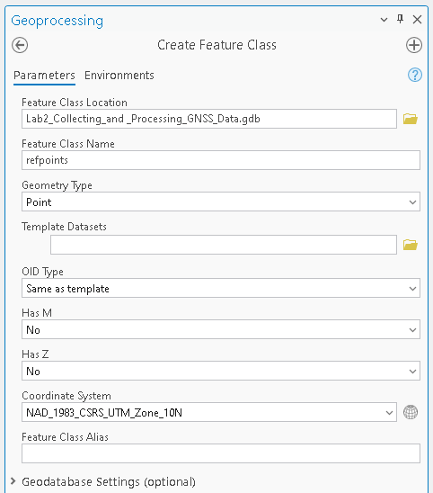
```

##### Q1. Describe your reference point. What feature does it represent? Why did you choose this reference point? (5 points) {.unnumbered}

**Step 5:** Choose "Edit" from the top ribbon, then select "Create". On the right, a "Create Features" pane will appear. In there, click "refpoints", which will then allow you to start placing points on the map. Zoom in closely on the orthophoto before creating point features so that the point is placed precisely. Left-click to place one reference point, then select "Save" from the Edit ribbon. If you need to move or delete your reference point, then select "Delete" or "Move" from the "Edit Tools" in the top ribbon. When you are finished, select "Save" from the top ribbon.

```{r 02-arcgis-edit-features, out.width= "100%", echo = FALSE}
  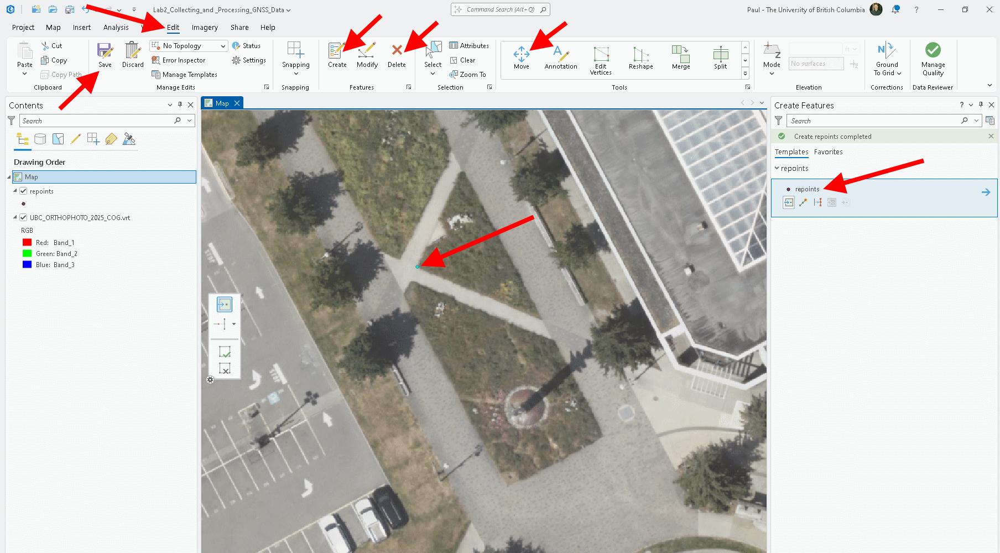
```

**Step 6:** Open the attribute table of "refpoints" and add three new columns: "Name", "Easting", and "Northing". Save your edits then go to the new attribute table.

```{r 02-arcgis-add-fields, out.width= "100%", echo = FALSE}
  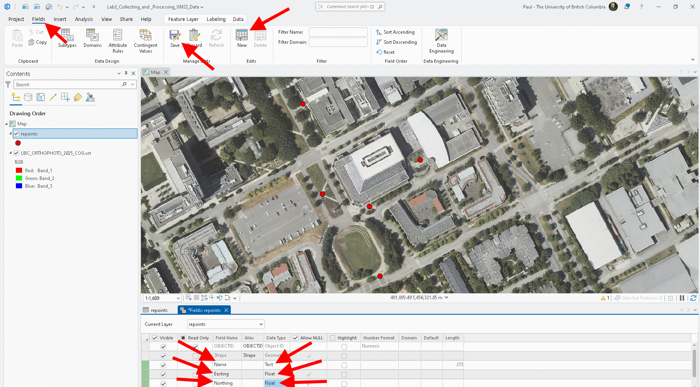
```

**Step 7:** Edit the "Name" field by directly clicking in the empty field and typing a short description of what feature the point represents. If you cannot remember the order you placed the points, simply click the farthest left number of the row to highlight the point in the map. When you are done, click the "Clear" button to remove the selection and then save your edits.

```{r 02-arcgis-edit-name, out.width= "100%", echo = FALSE}
  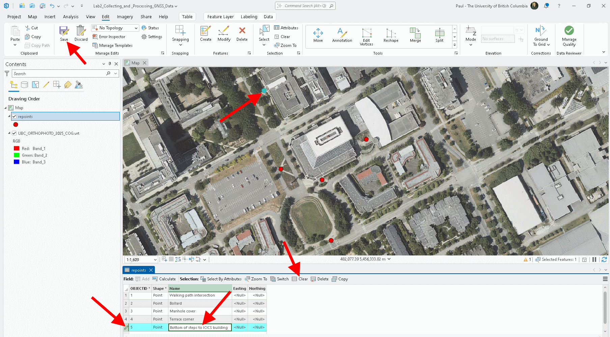
```

**Step 8:** The "Easting" and "Northing" fields can be populated using the "Calculate Geometry Attributes" tool. Select the field names then match the x- and y-coordinate to the correct fields and choose NAD 83 CSRS UTM Zone 10N as the coordinate system (both UBC Vancouver campus and MKRF are in the same UTM zone). Check that your attribute table now has Northings and Eastings calculated.

```{r 02-arcgis-calculate-geometry-attributes, out.width= "40%", echo = FALSE}
  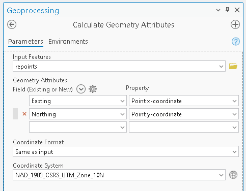
```

**Step 9:** Right-click "refpoints" and select "Sharing", then "Share As Web Layer". In the tool that opens, change the name of the layer to "YOURNAME_refpoints", press the "Analyze" button and then "Publish". This will take a few minutes to upload your layer to the UBC ArcGIS Online portal.

**Step 10:** From ArcGIS Pro, grab the coordinates of your site so that you can use them in the Trimble GNSS Planning Online website. At the bottom of your ArcGIS Pro map, the coordinates are currently displayed in UTM Eastings and Northings, but you can click the downward arrow to change it degrees, minutes, seconds, which is what the Trimble Planning tool website uses. Then just right-click anywhere on your map and select "Copy Coordinates". Paste them onto a notepad to retrieve later. You only need one latitude-longitude pair for your entire site.

```{r 02-arcgis-map-units, out.width= "75%", echo = FALSE}
  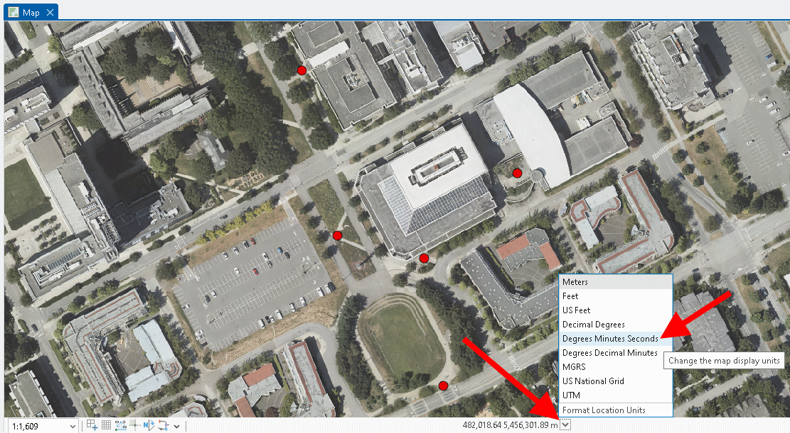
```

**Step 11:** In a web browser, open <https://www.arcgis.com/index.html>. Click "Sign-in". Do not enter any credential in the fields shown, instead click "Your ArcGIS organization's url". Type "ubc" in the text field. Click the blue button that says "University of British Columbia", then sign in with your CWL.

```{r 02-arcgis-online-sign-in, out.width= "33%", echo = FALSE, fig.show='hold'}
knitr::include_graphics(c(
  "images/02-arcgis-online-sign-in-1.png",
  "images/02-arcgis-online-sign-in-2.png",
  "images/02-arcgis-online-sign-in-3.png"
))
```

**Step 12:** Once you are signed into your ArcGIS Online account, select "Content" from the top navigation ribbon. You should see your "YOURNAME_refpoints" layer listed along with a service definition file of the same name. If you do not see any content, then return to ArcGIS Pro and check for errors when you published the layer.

**Step 13:** From the ArcGIS Online portal, select the nine dots symbol next to your profile name in the top-right to expand all the cool things you can build in ArcGIS Online. From here, select "Field Maps Designer".

```{r 02-arcgis-field-maps-designer, out.width= "100%", echo = FALSE}
  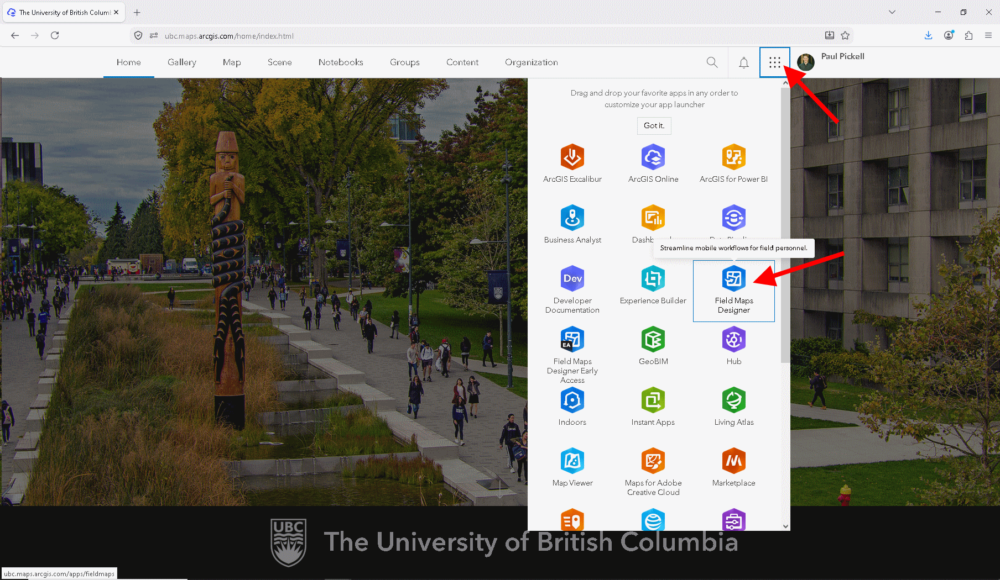
```

ArcGIS Field Maps is the primary application that enables field work and remote data collection in ArcGIS. The app is available on Android and iOS. We are going to set up a simple project that will allow us to display a map in the field and collect some points using the GNSS receiver on your phone.

**Step 14:** Select the blue button "+ New Map" and when prompted select "Start with new layers" and then "Next". Name the new layer "YOURNAME_GNSS_points" and select "Next".

```{r 02-arcgis-online-field-maps-new, out.width= "100%", echo = FALSE}
  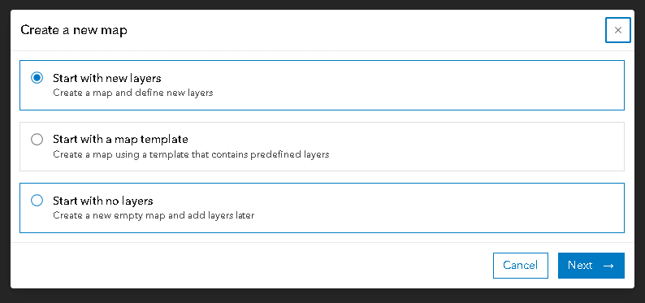
```

**Step 15:** Toggle on "Will high accuracy GPS receivers be used to collect data?" and further below expand "Advanced settings", select "Use a coordinate system" from the drop-down menu, and click "Browse". You can find the corect coordinate system quickly by typing the ID 26910 and then click on the coordinate system name that appears then press "Next". Finally, name the map title "YOURNAME_GNSS_Field_Map" and name the Feature layer title "YOURNAME_GNSS_points" and select "Create Map".

```{r 02-arcgis-online-configure-gnss-points-1, out.width= "100%", echo = FALSE}
  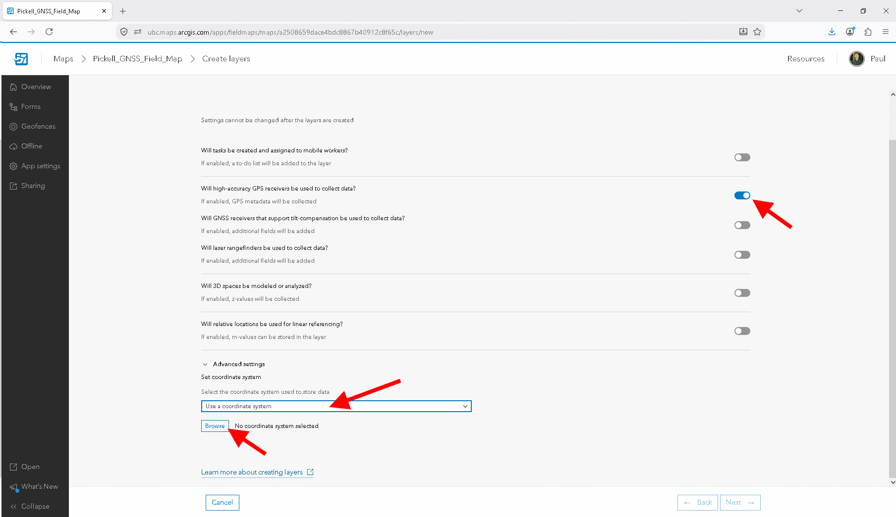
```

```{r 02-arcgis-online-configure-gnss-points-2, out.width= "40%", echo = FALSE}
  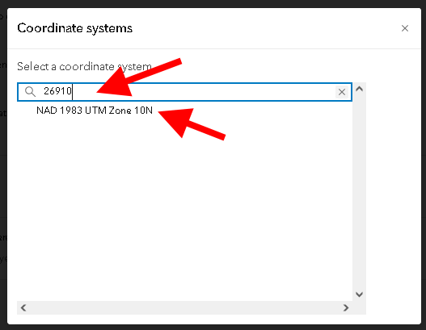
```

**Step 16:** On the left, select "Add Layer" and then using the search bar, search for your "YOURNAME_refpoints" layer and press the "+ Add" button to add it to your web map.

```{r 02-arcgis-online-add-refpoints-to-field-map, out.width= "100%", echo = FALSE}
  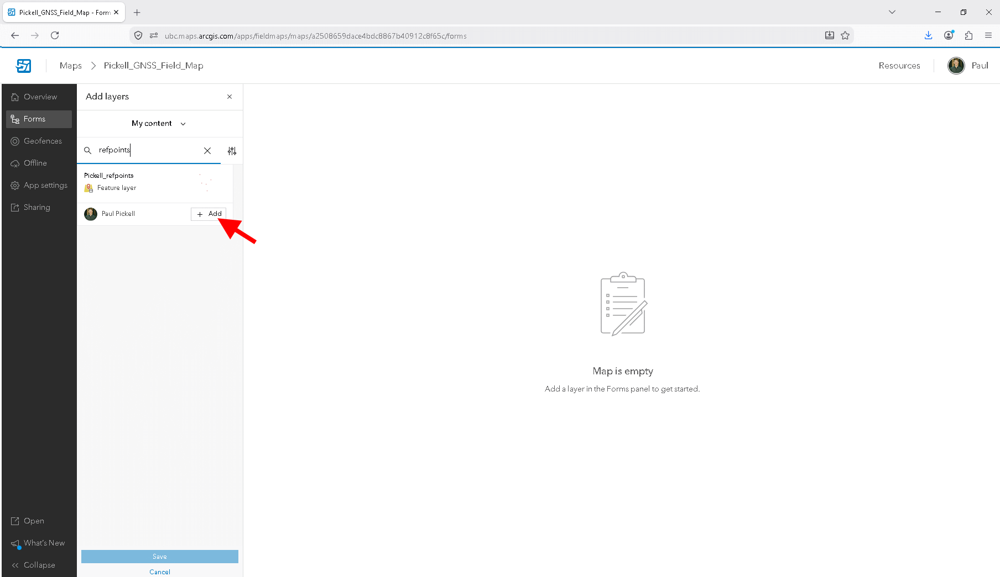
```

You should now see two layers, "YOURNAME_refpoints" and "YOURNAME_GNSS_points" in your web map called "YOURNAME_GNSS_Field_Map". These names must all be unique across the shared UBC ArcGIS Online portal, which is why we ask you to identify your assets with your name. Next, we are going to configure the form that will be displayed when you open the ArcGIS Field Maps app on your phone. In the middle of your screen, you should see "Start configuring a form for the layer". Make sure that you have selected "YOURNAME_GNSS_points" layer on the left, then you can drag and drop elements on the right into the space in the centre.

**Step 17:** Add a "Date" element and a "Time" element to your form. Toward the top is a small button to save the form state. We are going to set these up so that they automatically populate with values of the current date and time.

```{r 02-arcgis-online-add-datetime-field-save, out.width= "100%", echo = FALSE}
  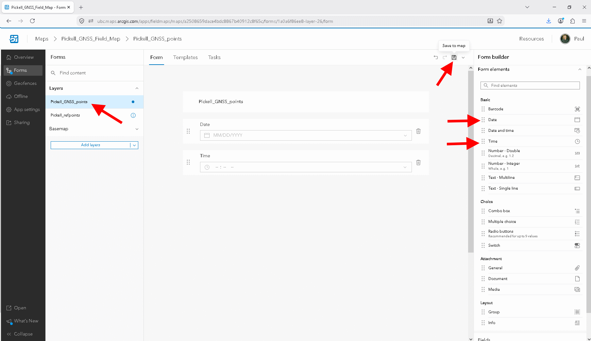
```

Once you have added the "Date" element to your form and saved, click on it to highlight it. On the right, at the very bottom, click the gear icon next to "Calculated expression" and then select "+ New Expression". Name the new express "Today's date" and then in the code block simply type `Today()`. This expression will automatically add the current date to the attribute table for any new point you add. Repeat this step with another expression for the "Time" element, but use `Now()` instead.

```{r 02-arcgis-online-calculated-expression, out.width= "100%", echo = FALSE}
  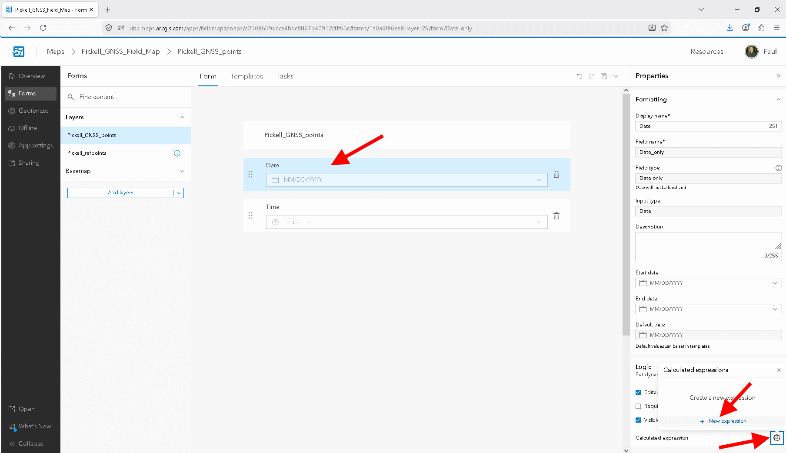
```

**Step 18:** Add two "Double - Number" elements to your form. Name one "Easting" and the other "Northing". We will calculate these fields later once we have collected the sample points.

If you want, you can add additional elements to your form.

**Step 19:** In a web browser, open the Trimble GNSS Planning Online website (<http://www.gnssplanning.com/>) and enter your site's latitude, longitude and height. If your site is at UBC Vancouver campus, you can just use the average elevation for campus, which is 81 m. If your site is MKRF, then you may want to consult your instructor for which elevation value to use since elevations at the research forest range between 2 to 1018 m, depending on where you are. Select the date that you plan to do your data collection and be sure to change the "Time Zone" to Pacific Time.

"Elevation cutoff" is used to discard satellite paths that are very close to your visible horizon. Since GNSS is a line-of-sight system, any tall objects above your horizon can obstruct the signal. Here we are mostly concerned with tall buildings and mountains. The default values of 10 degrees is generally reasonable for UBC Vancouver campus. Consider that an object that is as tall as it is from you will appear 45 degrees above your horizon. Stretch your arm fully out in front of you. Your closed fist is about 10 degrees, three fingers held together is about 5 degrees, and one finger is about 1 degree. You might want to make a note of this when you are in the field so that you can better interpret your sky plot and answer the lab questions that follow (e.g., "a mountain to my north appears to be 20 degrees above my horizon").

After you have input your information into Settings, click "Apply" and look through the other tabs (Satellite Library, Charts, Sky Plot, World View). Using the information on the website, determine the ideal time to collect your GNSS points. Justify your chosen time using the data on the website.

##### Screenshot 1. Upload a screenshot of the Number of Satellites chart from the Trimble GNSS Planning Tool. The settings that you used must be visible in the screenshot. (2 points) {.unnumbered}

##### Screenshot 2. Upload a screenshot of the DOPs chart from the Trimble GNSS Planning Tool. The settings that you used must be visible in the screenshot. (2 points) {.unnumbered}

##### Screenshot 3. Upload a screenshot of the Iono Information chart from the Trimble GNSS Planning Tool. The settings that you used must be visible in the screenshot. (2 points) {.unnumbered}

##### Screenshot 4. Upload a screenshot of the Sky Plot from the Trimble GNSS Planning Tool. The settings that you used must be visible in the screenshot. (2 points) {.unnumbered}

##### Q2. Interpret the Trimble GNSS Planning Tool charts and sky plot with 1-2 sentences each. When is the ideal time to collect data at your study area? When did you actually collect data at your study area? How did the conditions during your collection time vary from the ideal time? (15 points) {.unnumbered}

------------------------------------------------------------------------

## Task 2: Collect your GNSS data {.unnumbered}

You will need either an Android or iOS smartphone capable of installing the Field Maps app. If you do not have an Android or iOS smartphone, then please contact the instructor for alternative arrangements or accommodations. Alternatively, you may be able to use one of the Trimble data collectors during lab, if they are available.

**Step 1:** To start you will need to install ArcGIS Field Maps App on your phone. There is an Android version as well as an iOS version so just go to your app store and download it. It is free!

**Step 2:** Once you have the app installed on your phone, you need to sign in using your ArcGIS account using the instructions that were provided previously.

```{r 02-field-maps-sign-in, out.width= "25%", echo = FALSE, fig.show='hold'}
knitr::include_graphics(c(
  "images/02-field-maps-sign-in-1.jpeg",
  "images/02-field-maps-sign-in-2.jpeg",
  "images/02-field-maps-sign-in-3.jpeg",
  "images/02-field-maps-sign-in-4.jpeg"
))
```

**Step 3:** Search for your "YOURNAME_GNSS_Field_Map" and select it to load onto your app. If you zoom in, you should see your current position along with the marker that represents your chosen reference point. Navigate to your reference point and then while standing at one point click the "+" button in the bottom right of your screen to add a point at your current location. Then, select "Submit" in the top right to save the point. Repeat this process until you have collected 10 points for your reference point.

##### Screenshot 5. Take a photo of your feature with your phone when you visit your reference point and upload the photo. (2 points) {.unnumbered}

------------------------------------------------------------------------

## Task 3: Assess Precision, Accuracy, and Possible Errors {.unnumbered}

For this lab, we will consider the initial reference point from Task 1 as the "true" value and perform an accuracy assessment with that in mind.

**Step 1:** After you have finished collecting your GNSS sample points with ArcGIS Field Maps, return to your ArcGIS Pro project on your computer. From the top navigation ribbon, select "Map", then "Add Data", and in the window that appears expand "Portal" and then "My content" on the left navigation panel. This will display all of your content that is stored on the UBC ArcGIS Online portal. Find and select "YOURNAME_GNSS_points Feature Layer (Hosted)" and then click "OK" to add it to your map.

You should see a new layer appear in the contents pane of your map. It might not be apparent, but if you click the little triangle to the left of the layer name, it will expand and show you the layer. Right-click the nested layer to open the attribute table. You should now see your first glimpse of all of the GNSS metadata that was collected when you created your sample points in the field. Depending on the device that you used, some of the fields may be empty, which is OK!

**Step 2:** Add two fields to your "YOURNAME_GNSS_points" called "Northing" and "Easting" and set the data type to float. Calculate the Northings and Eastings for the 10 points you collected. Refer to Task 1 for how to do this. Now add two more fields to "YOURNAME_GNSS_points", "Northing_error" and "Easting_error", and set the data type to float.

**Step 3:** Inspect the attribute table for "YOURNAME_refpoints" and copy the Northing and Easting values for your reference point. This is the "true" value that we are going to use to calculate the errors. Open the attribute table for "YOURNAME_GNSS_points", right-click the field named "Easting_error" and calculate the difference (error) between the "true" Easting value that you copied down and each of the 10 points that you collected. You should use an expression like `Easting - YOUR_TRUE_VALUE_HERE`. Repeat this process for "Northing_error".

```{r 02-arcgis-online-calculate-error, out.width= "75%", echo = FALSE}
  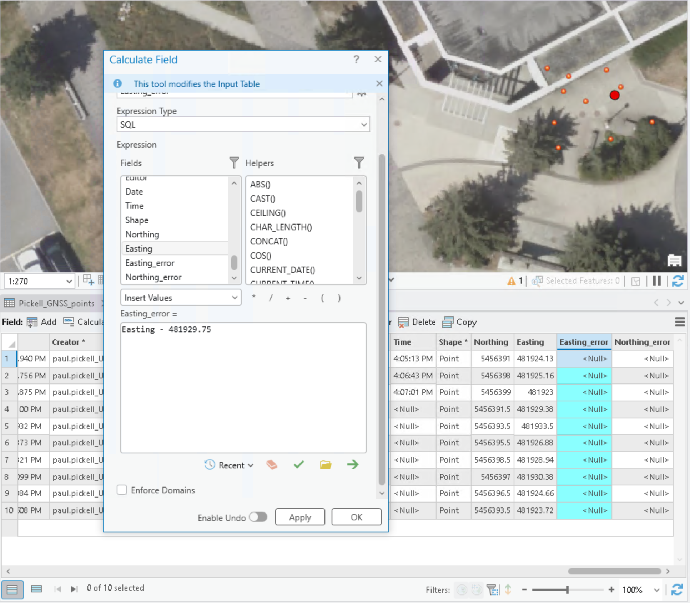
```

##### Table 1. Submit a table that shows the Northing and Easting errors for each of your 10 sample points. (20 points) {.unnumbered}

Calculate the Euclidean distance horizontal accuracy for the average of your 10 sample points using the following equation:

$H_{accuracy} = \sqrt{(\overline{E} - E_{true})^2 + (\overline{N} - N_{true})^2}$

First, calculate the mean observed Easting value, then subtract the "True" East value. Square this difference. Do the same for Northing. Then add the two and take the square root of the sum. The resulting value represents how far (in meters) the GNSS measurements were in the x-y plane, a lower value represents greater accuracy.

##### Q4. Report your calculated horizontal accuracy and show your work. (4 points) {.unnumbered}

To assess the precision, you will use the following equation:

$H_{precision} = \sqrt{\sigma^2_E + \sigma^2_N}$

Calculate the standard deviation of the observed Easting and Northing ***errors***, square them, then add them and take the square root of the sum. The resulting value represents how precise the GNSS measurements were, a lower value represents greater precision.

##### Q5. Report your calculated horizontal precision and show your work. (4 points) {.unnumbered}

Finally, we will assess the ellipsoidal height. We do not have a reference "true" value for this, so just find the "Ellipsoidal Height (m)" field in the attribute table of your "YOURNAME_GNSS_points" and calculate the average and standard deviation.

##### Q6. Report the mean and standard deviation of the ellispoidal height from your sample points. (2 points) {.unnumbered}

##### Q7. Discuss the potential errors in your data collection and describe what may have affected accuracy and precision. Was one direction (i.e., Easting versus Northing) more prone to error than another? How did the horizontal percision compare to the vertical precision? Integrate your site observations with the information from the Trimble GNSS Planning tool. Reflect on the validity of the "true" reference point that you derived from the basemap imagery. (40 points) {.unnumbered}

------------------------------------------------------------------------

## Summary {.unnumbered}

In this lab, you learned how to plan, collect, and process GNSS data using a combination of ArcGIS Pro, Trimble GNSS Planning tools, and the ArcGIS Field Maps mobile application. Planning is a critical part of the GNSS collection process for both safety concerns and also to acquire the best satellite signals. Using the Trimble Planning Tool, you evaluated satellite availability, DOPs, and ionospheric conditions to select an ideal collection time. In the field, you practiced recording GNSS coordinates at reference points with ArcGIS Field Maps, producing multiple observations to assess variability. Back in the lab, you compared these sampled values with the ArcGIS "true" reference points to calculate both precision and accuracy. This exercise highlighted the limitations of phone-based GNSS receivers, the effects of environmental conditions on data quality, and the importance of systematic planning and error assessment in field data collection. Overall, this lab showed you not only the technical workflow for GNSS data collection and analysis but also how to critically evaluate results by integrating field observations with planning tools and quantitative measures of accuracy and precision.

Return to the [**Deliverables**](#lab2-deliverables) section to check off everything you need to submit for credit in the course management system.
