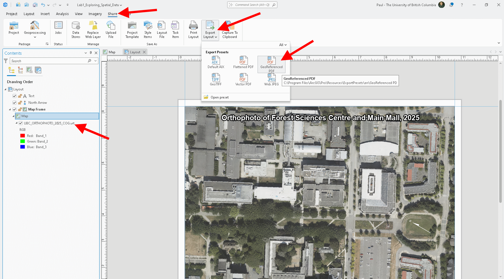
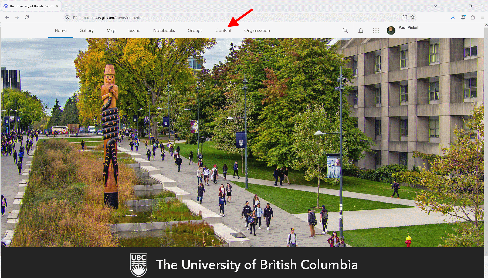
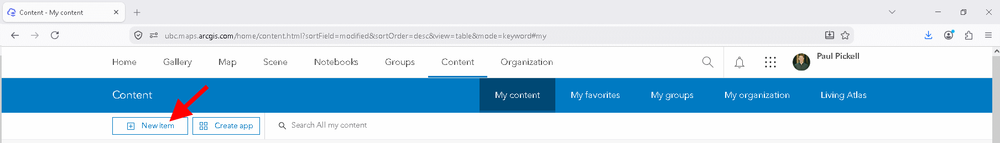
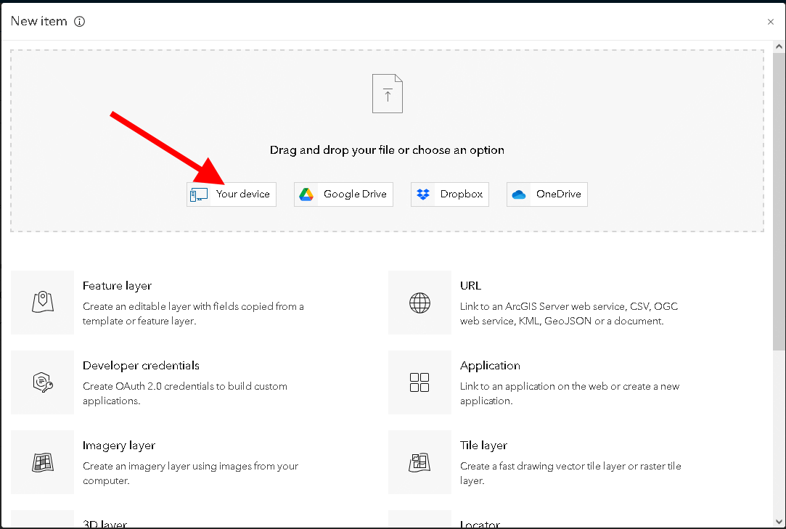
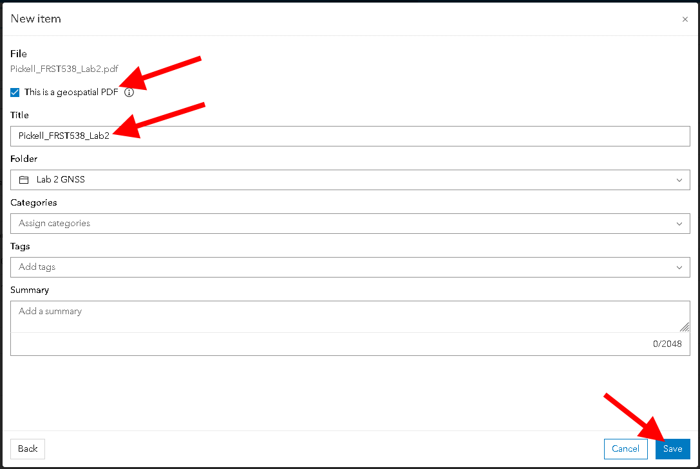

```{r echo=FALSE}
yml_content <- yaml::read_yaml("chapterauthors.yml")
author <- yml_content[["collecting-and-processing-gnss-data"]][["author"]]
```

# Collecting and processing GNSS data {#collecting-and-processing-gnss-data}

Written by
```{r results="asis", echo=FALSE}
cat(author)
```

## Lab Overview {.unnumbered}

Oftentimes, you will need to collect and display your own data. There are many phone applications to collect your own GNSS data. In this lab, you will plan your own GNSS collection, collect data, and process the data.

------------------------------------------------------------------------

### Learning Objectives {.unnumbered}

-   Plan and collect field data using Global Navigation Satellite Systems and consider the constraints of the system and local geography for achieving positional accuracy targets
-   Design a field sheet for collecting attribute values in the field
-   Create a field map for use in mobile mapping applications such as ArcGIS Field Maps
-   Evaluate the accuracy and precision of positional data

------------------------------------------------------------------------

### Deliverables {#lab2-deliverables .unnumbered}

<input type="checkbox" unchecked> Responses to the questions posed throughout the lab on the course management system. (57 points)</input>

<input type="checkbox" unchecked> Screenshots of your Trimble GNSS Planning tool charts (your settings must be visible in all the screenshots): Number of Satellites, DOPs, Iono Information, Sky Plot. (8 points)</input>

<input type="checkbox" unchecked> Map of the "True" and "Observed" points. (25 points)</input>

<input type="checkbox" unchecked> Table of accuracy and precision calculated values. (10 points)</input>

------------------------------------------------------------------------

## Task 1: Preparing for GNSS Data Collection {.unnumbered}

Field data collection is an important skill set to learn and practice. In this task, you will plan the collection of your GNSS data on UBC Vancouver campus or Malcolm Knapp Research Forest. This section is meant to inform you of the likely hazards and how to stay safe.

**Planning Your GNSS Data Collection**

All students are expected to collect data at UBC Vancouver campus. The instructions that follow illustrate how to design and deploy a field campaign using UBC Vancouver datasets. However, if you are a student in the UBC Master of Sustainable Forest Management (MSFM) program, then you may have the option to instead design your field campaign for Malcolm Knapp Research Forest to support your site plan exercise. In this case, you are responsible for adhering to the UBC safety plan and following the directions of the instructors for that course when visiting Malcolm Knapp Research Forest. If you are unable or unwilling to do that, then you should plan your data collection for UBC Vancouver campus.

Avoid going somewhere that is unfamiliar to you without supervision. Ensure that you stay off of private or restricted property. Most of the outdoor academic campus is public and accessible. You should only collect data during daylight hours and plan to go out in sunny weather only. Check government websites for any recent animal sightings and be aware that coyotes are often sighted on campus. Do not plan to collect your GNSS data at Wreck Beach or near other bodies of water. Do not plan to collect your GNSS data near cliffs or on steep terrain. Finally, ensure that you will have good cell phone coverage in case of an emergency.

**Likely Hazards**
At all times, you must be aware of possible hazards both overhead and underfoot. The main overhead hazard is going to be trees and falling branches. Do not collect your GNSS data during windy or stormy weather, which may cause tree branches to fall. Wet and slippery surfaces, steep angles, holes, logs, debris, and loose soil all pose fall hazards. Many of these hazards can be avoided with careful planning before you even step outside. Speaking of stepping, make sure you wear appropriate footwear, closed toed shoes are best for this work. You may need to cross or transit streets to reach your location. Always follow local traffic laws and look for moving vehicles in and around your site. Always use designated crosswalks and do not look at your phone when walking near stopped or moving vehicles.

*Do not collect your GNSS data while walking and looking at your phone. Always be aware of your surroundings.*

*Important: If you feel uncomfortable undertaking this task, please contact the instructor for alternative arrangements or accommodations for this particular assignment*

For this lab, you will choose your own site through your own knowledge and simple remote sensing. Your site must be somewhere that you can legally and safely visit on UBC Vancouver campus or Malcolm Knapp Research Forest and have features on the ground must be visible from the most recent aerial orthophoto.

**Step 1:** Open ArcGIS Pro and create a new project for this lab. 

**Step 2:** Navigate to this website and find the most recent aerial orthophoto for your site (either UBC Vancouver campus or MKRF): https://206-12-122-94.cloud.computecanada.ca/UBC_ORTHOPHOTOS/ Note that for each orthophoto, there are two files: a GeoTIFF and a VRT. The GeoTIFF (TIF) is the raw file and these are large (several gigabytes), multi-band images. VRT is Virtual Raster, a very small file that basically points to a remote file so that the raw data can be retrieved dynamically and on-the-fly. If you think you will not have reliable internet access in the field, then you can take the orthophoto offline by downloading the raw TIF. But for our purposes in this lab, we will use the much smaller VRT file. After you have found the year of the orthophoto that you want to use, right-click the VRT file and (depending on your browser), select "Save link as..." or something similar to download the file. You will want to save or move the file to your ArcGIS Pro project folder.

**Step 3:** Add the orthophoto VRT to your ArcGIS Pro map. You can do this either by "Add data" and then browse and select it or simply drag and drop it from Windows Explorer into your ArcGIS Pro map canvas.

Before physically visiting your study area, you will need to verify that there are usable reference features in your chosen site. Use the orthophoto that you have added to the map in order to find some features that you can easily find and visit on the ground/ The reference features should be immovable and not tall (ideally not trees or buildings). Look for features that are easily identified from aerial imagery and not obstructed from tree canopy. Additionally, you will be walking to your reference features, so they should be somewhere safely accessible and not too far from each other.

**Step 4:** Find at least five possible reference points (all at least 10 m from each other). You will create a new feature class and populate it with these reference points. From the "Analysis" tab in the top ribbon, select "Tools" to open the "Geoprocessing" pane and search for the "Create Feature Class" tool. Save it to your ArcGIS Pro project geodatabase and name it "refpoints". Your new feature class should now be in the "Contents" Pane, but it has no points.

```{r 02-arcgis-create-feature-class, out.width= "40%", echo = FALSE}
  knitr::include_graphics("images/02-arcgis-create-feature-class.png")
```

##### Q2. Describe each of your five reference points. What features do they represent? (5 points) {.unnumbered}

**Step 5:** Choose "Edit" from the top ribbon, then select "Create". On the right, a "Create Features" pane will appear. In there, click "refpoints", which will then allow you to start placing points on the map. Zoom in closely on the orthophoto before creating point features so that the points are placed precisely. Left-click to place five reference points, then select "Save" from the Edit ribbon. If you need to move or delete a reference point, then select "Delete" or "Move" from the "Edit Tools" in the top ribbon. When you are finished, select "Save" from the top ribbon.

```{r 02-arcgis-edit-features, out.width= "100%", echo = FALSE}
  knitr::include_graphics("images/02-arcgis-edit-features.png")
```

**Step 6:** Open the attribute table of "refpoints" and add three new columns: "Name", "Easting", and "Northing". Save your edits then go to the new attribute table.

```{r 02-arcgis-add-fields, out.width= "100%", echo = FALSE}
  knitr::include_graphics("images/02-arcgis-add-fields.png")
```

**Step 7:** Edit the "Name" field by directly clicking in the empty field and typing a short description of what feature the point represents. If you cannot remember the order you placed the points, simply click the farthest left number of the row to highlight the point in the map. When you are done, click the "Clear" button to remove the selection and then save your edits.

```{r 02-arcgis-edit-name, out.width= "100%", echo = FALSE}
  knitr::include_graphics("images/02-arcgis-edit-name.png")
```

**Step 8:** The "Easting" and "Northing" fields can be populated using the "Calculate Geometry Attributes" tool. Select the field names then match the x- and y-coordinate to the correct fields and choose NAD 83 CSRS UTM Zone 10N as the coordinate system (both UBC Vancouver campus and MKRF are in the same UTM zone). Check that your attribute table now has Northings and Estings calculated.

```{r 02-arcgis-calculate-geometry-attributes, out.width= "40%", echo = FALSE}
  knitr::include_graphics("images/02-arcgis-calculate-geometry-attributes.png")
```

Next, we are going to create a simple field map that we can take offline and use to navigate to our points. If you already made a map of your site in Lab 1, then open your Lab 1 ArcGIS Pro project now and use that map layout for this next part. Otherwise, you will need to refer back to Lab 1 for creating a map layout. Those steps are not going to be repeated here.

**Step 9:** Create a simple map layout that contains the orthophoto you are using and the "refpoints" you made in the steps above. You might want to add a title, north arrow, and/or scale bar, but these are optional. Make sure you have zoomed in tightly around your five reference points, other parts of the orthophoto are not relevant for this map and we want as much detail as possible. Ensure that the symbology of your points is not too large, so that you are still able to partially see the surroundings when you zoom into the map later. If you want, you can add other layers to your map that might help you find your features and this can be more important for field maps of sites that you are unfamiliar with or ex-urban sites that have few identifiable features. Export the map as a georeferenced PDF.

```{r 02-arcgis-export-georeferenced-pdf, out.width= "100%", echo = FALSE}
  
```

**Step 10:** In a web browser, open https://www.arcgis.com/index.html. Click "Sign-in". Do not enter and credential in the fields shown, instead click "Your ArcGIS organization's url". Type "ubc" in the text field. Click the blue button that says "University of British Columbia", then sign in with your CWL.

```{r 02-arcgis-online-sign-in, out.width= "33%", echo = FALSE, fig.show='hold'}
knitr::include_graphics(c(
  "images/02-arcgis-online-sign-in-1.png",
  "images/02-arcgis-online-sign-in-2.png",
  "images/02-arcgis-online-sign-in-3.png"
))
```

**Step 11:** Once you are signed into your ArcGIS Online account, select "Content" and then click "New Item" at the top.

```{r 02-arcgis-online-content, out.width= "100%", echo = FALSE}
  
```

```{r 02-arcgis-online-new-item, out.width= "100%", echo = FALSE}
  
```

**Step 12:** Select "From your device" and then navigate to the georeferenced PDF that you just made or drag and drop it into the browser window. In the next window, ensure that "This is a geospatial PDF" is toggled on and that the name of the layer will be unique across the UBC ArcGIS Online organization, so use a name like "Pickell_FRST538_Lab2" and click "Save".

```{r 02-arcgis-online-new-item-your-device, out.width= "50%", echo = FALSE}
  
```

```{r 02-arcgis-online-new-item-upload, out.width= "50%", echo = FALSE}
  
```

If successful, you will be re-directed to the overview page for the item that you have now uploaded to ArcGIS Online. This PDF file is now hosted online. We just need to ensure that everything is configured correctly.

**Step 13:** Select "Settings" and then on the next page ensure that "This is a geospatial PDF" and "Use in ArcGIS Field Maps" are both toggled on.

Now that you have established a site, selected your reference points, and made a map, you need to decide when you will be collecting your data. There are times in the day where you are more likely to get accurate GNSS readings. 

**Step 14:** From ArcGIS Pro, grab the coordinates of your site so that you can use them in the Trimble GNSS Planning Online website. At the bottom of your ArcGIS Pro map, the coordinates are currently displayed in UTM Eastings and Northings, but you can click the downward arrow to change it degrees, minutes, seconds, which is what the Trimble Planning tool website uses. Then just right-click anywhere on your map and select "Copy Coordinates". Paste them onto a notepad to retrieve later. You only need one latitude-longitude pair for your entire site.

```{r 02-arcgis-map-units, out.width= "50%", echo = FALSE}
  knitr::include_graphics("images/02-arcgis-map-units.png")
```

**Step 15:** In a web browser, open the Trimble GNSS Planning Online website (http://www.gnssplanning.com/) and enter your site's latitude, longitude and height. If your site is at UBC Vancouver campus, you can just use the average elevation for campus, which is 81 m. If your site is MKRF, then you may want to consult your instructor for which elevation value to use since elevations at the research forest range between 2 to 1018 m, depending on where you are. Select the date that you plan to do your data collection and be sure to change the "Time Zone" to Pacific Time. 

"Elevation cutoff" is used to discard satellite paths that are very close to your visible horizon. Since GNSS is a line-of-sight system, any tall objects above your horizon can obstruct the signal. Here we are mostly concerned with tall buildings and mountains. The default values of 10 degrees is generally reasonable for UBC Vancouver campus. Consider that an object that is as tall as it is from you will appear 45 degrees above your horizon. Stretch your arm fully out in front of you. Your closed fist is about 10 degrees, three fingers held together is about 5 degrees, and one finger is about 1 degree. You might want to make a note of this when you are in the field so that you can better interpret your sky plot and answer the lab questions that follow (e.g., "a mountain to my north appears to be 20 degrees above my horizon").

After you have input your information into Settings, click "Apply" and look through the other tabs (Satellite Library, Charts, Sky Plot, World View). Using the information on the website, determine the ideal time to collect your GNSS points. Justify your chosen time using the data on the website.

##### Screenshot 1. Upload a screenshot of the Number of Satellites chart from the Trimble GNSS Planning Tool. The settings that you used must be visible in the screenshot. (2 points) {.unnumbered}

##### Screenshot 2. Upload a screenshot of the DOPs chart from the Trimble GNSS Planning Tool. The settings that you used must be visible in the screenshot. (2 points) {.unnumbered}

##### Screenshot 3. Upload a screenshot of the Iono Information chart from the Trimble GNSS Planning Tool. The settings that you used must be visible in the screenshot. (2 points) {.unnumbered}

##### Screenshot 4. Upload a screenshot of the Sky Plot from the Trimble GNSS Planning Tool. The settings that you used must be visible in the screenshot. (2 points) {.unnumbered}

##### Q3. Interpret the Trimble GNSS Planning Tool charts and sky plot with 1-2 sentences each. When is the ideal time to collect data at your study area? When did you actually collect data at your study area? (15 points) {.unnumbered}

------------------------------------------------------------------------

## Task 2: Design a field map for ArcGIS Field Maps {-}


------------------------------------------------------------------------

## Task 3: Collect your data {-}

You will need either an Android or iOS smartphone capable of installing the Field Maps app. If you do not have an Android or iOS smartphone, then please contact the instructor for alternative arrangements or accommodations

**Step 1:** To start you will need to install ArcGIS Field Maps App on your phone. There is an Android version as well as an iOS version so just go to your app store and download it. It is free!

**Step 2:** Once you have the app installed on your phone, you need to sign in using your ArcGIS account. At UBC, this is done using your CWL. Select "Sign in with ArcGIS Online", do not enter any credential and instead select "Your ArcGIS organization's URL", type "ubc", click "Continue", click the blue button "University of British Columbia", then you will be presented with the ordinary CWL authentication page where you can enter your CWL. The screenshots below show this process using the iOS version of the app, but the options will be the same for Android.

```{r 02-field-maps-sign-in, out.width= "25%", echo = FALSE, fig.show='hold'}
knitr::include_graphics(c(
  "images/02-field-maps-sign-in-1.jpeg",
  "images/02-field-maps-sign-in-2.jpeg",
  "images/02-field-maps-sign-in-3.jpeg",
  "images/02-field-maps-sign-in-4.jpeg"
))
```

**Step 3:** 


**Step 6:** Travel to your study area! Open the ArcGIS Field Maps app, and select the Georeferenced PDF under "My Maps." Go to one of the reference points you selected in ArcGIS. 


On the bottom right of the app, there is a button that will bring the map to your current area. Press that button, then press the placemark button directly to the right of it. Create a placemark and name it something meaningful (for example: placemark 1, location 1). Stay exactly where you are, and create a placemark every 10 seconds for the next minute by pressing the location button then the placemark. You should have a total of 6 placemarks. Take a picture of the area you are trying to geographically capture. Go to two more of your designated locations and do the same procedure (create 6 placemarks, each 10 seconds apart, and take a picture.

**Step 7:** Now you can return back to your workstation (after taking a nice walk!). Sign in to ArcGIS.com using the same proceedure as you did for signing into your account on the ArcGIS Field Maps app. 

**Step 8:** 

##### Screenshot 5. Upload an image from one of your reference points. (2 points) {.unnumbered}

##### Map 1. Upload a map showing the True and Observed points. (25 points) {.unnumbered}

------------------------------------------------------------------------

## Task 3: Assess Precision, Accuracy, and Possible Errors {-}

For this lab, we will consider the initial ArcGIS-created reference points as the "true" values and perform an accuracy assessment with that in mind.

**Step 1:** Visually compare the Avenza-created Placemarks (called "Observed values" for the rest of the lab) with each other and ArcGIS reference points. How close/far are they from one another? You can use the measure tool to add values to this visual assessment. When you are comparing the observed values to each other, you are assessing precision, when you are comparing them to the "True" locations, you are assessing accuracy.

**Step 2:** Quantitatively determine the accuracy of the points. Add two columns in the Observed attribute table and populate them with the east and north values for each point. You should have the True values from your reference point attribute table. Export both tables and bring them into excel.

Calculate the horizontal accuracy for each placemark using the following equation:

$\sigma_{H_{acc}} = \sqrt{(\overline{E} - E_{true})^2 + (\overline{N} - N_{true})^2}$

Excel is a convenient place to use this equation. Breaking down the equation – get the mean observed East value, then subtract the "True" East value. Square this difference. Do the same for North. Add the north and east results, then take the square root of them. In excel, you can do this with the equation:

`=SQRT((average(observed east values)-true east value)^2+((average(observed north values)-true north value)^2))`

The resulting value represents how accurate the GNSS measurements were – a lower value represents greater accuracy. Is there a noticeable difference in accuracy between your placemarks? Why do you think this is?

To assess the precision, you will use the following equation:

$\sigma_{H_{pre} = \sqrt{\sigma^2_E + \sigma^2_N}}$

Calculate the standard deviation of the observed East and North values, square them, then add them and take the square root of the sum. In excel, you can do this with the equation:

`=SQRT((STDEV(observed east values)^2 + STDEV(observed values)^2))`

The resulting value represents how precise the GNSS measurements were – a lower value represents greater accuracy. Is there a noticeable difference in precision between your placemarks? Why do you think this is?

##### Table 1. Submit a table that shows the accuracy and precision calculated values for each point. (10 points) {.unnumbered}

##### Q4. Interpret the map and table. (5 points) {.unnumbered}

##### Q5. Discuss the potential errors in your data collection and describe what may have affected accuracy and precision. Integrate your site observations with the information from the Trimble GNSS Planning tool. Finally, reflect on the validity of the "True" points that you derived from the basemap imagery. (25 points) {.unnumbered}

------------------------------------------------------------------------

## Summary {.unnumbered}

In this lab, you learned how to plan, collect, and process GNSS data using a combination of ArcGIS Pro, Trimble GNSS Planning tools, and the Avenza Maps mobile application. Planning is a critical part of the GNSS collection process for both safety concerns and also to acquire the best satellite signals. Using the Trimble Planning Tool, you evaluated satellite availability, DOPs, and ionospheric conditions to select an ideal collection time. In the field, you practiced recording GNSS coordinates at reference points with Avenza Maps, producing multiple observations to assess variability. Back in the lab, you compared these "observed" values with the ArcGIS "true" reference points to calculate both precision and accuracy. This exercise highlighted the limitations of phone-based GNSS receivers, the effects of environmental conditions on data quality, and the importance of systematic planning and error assessment in field data collection. Overall, this lab showed you not only the technical workflow for GNSS data collection and analysis but also how to critically evaluate results by integrating field observations with planning tools and quantitative measures of accuracy and precision.

Return to the [**Deliverables**](#lab2-deliverables) section to check off everything you need to submit for credit in the course management system.
