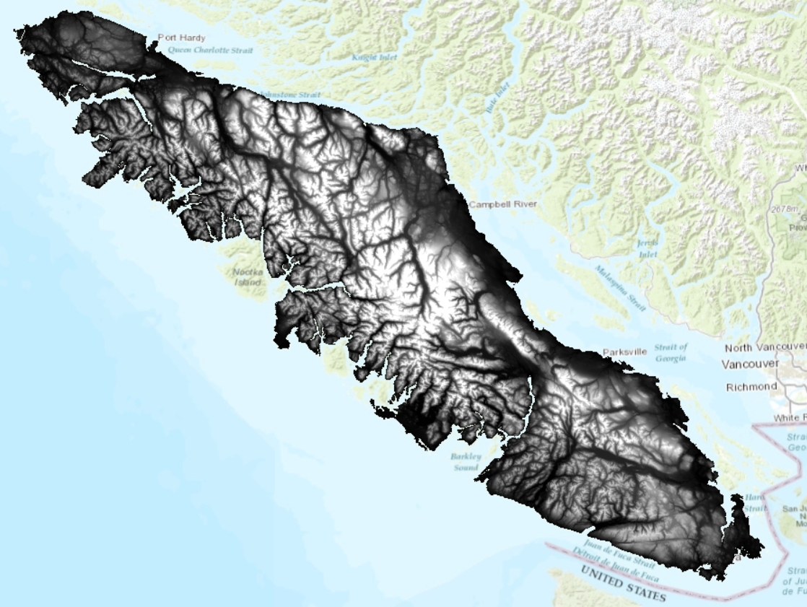
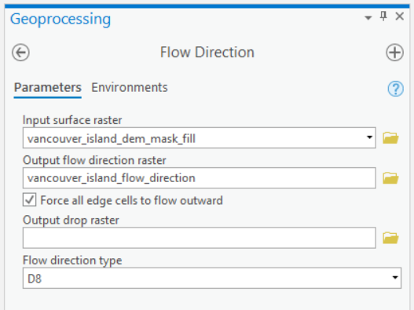
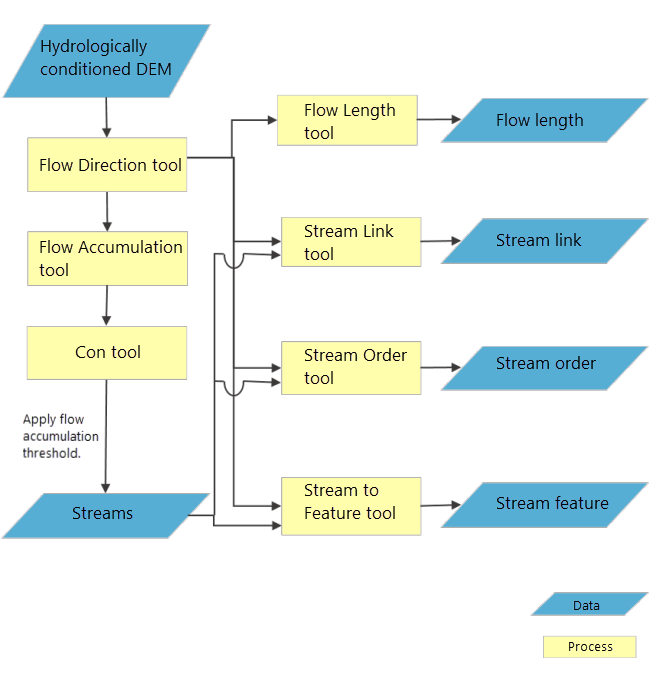
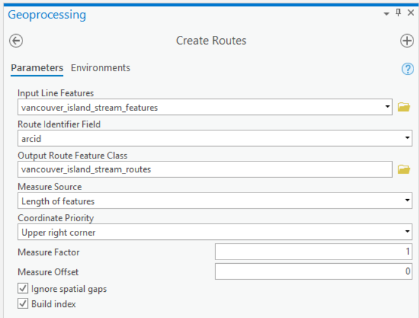
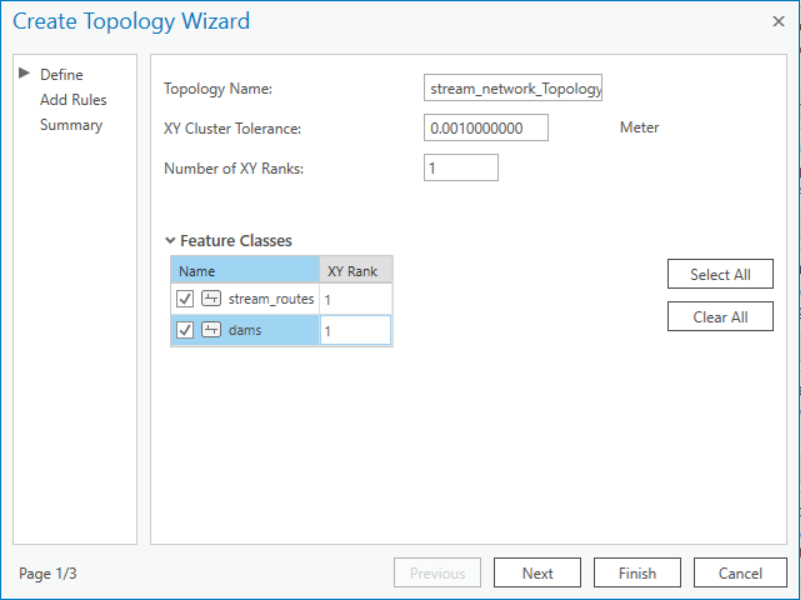
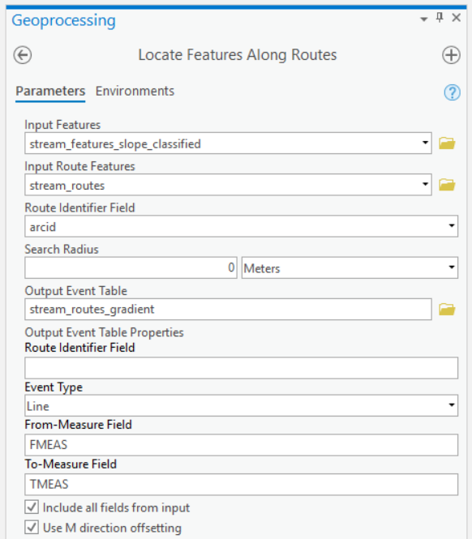
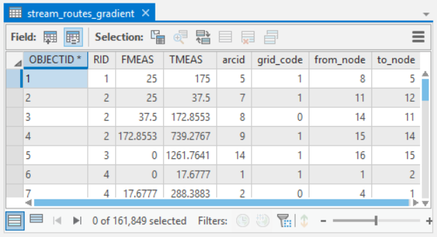
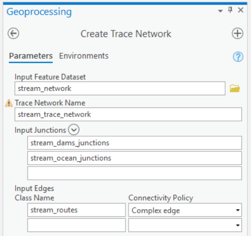
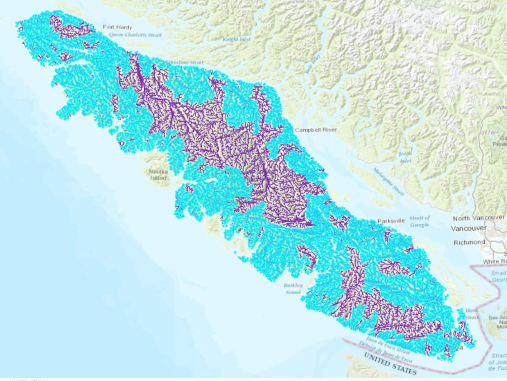

```{r echo=FALSE}
yml_content <- yaml::read_yaml("chapterauthors.yml")
author <- yml_content[["network-analysis"]][["author"]]
```

# Salmon Stream Network Analysis {#network-analysis}

Written by
```{r results='asis', echo=FALSE}
cat(author)
```

## Lab Overview {.unnumbered}

An important application of GIS for watershed management is characterizing the physical components of streams, rivers, and water bodies. In this lab, you will learn how to use the Hydrology, Network Analyst, and Linear Referencing toolsets in ArcGIS Pro to extract hydrologic information from a digital elevation model (DEM) in order to model a network of streams.

In British Columbia, salmon are an important species for economic, cultural, and ecological reasons. Thus, there is extensive research and management efforts to better understand and sustainably manage salmon populations. There are five Pacific salmon species, Chinook, Coho, Chum, Pink, and Sockeye salmon. Salmon are diadromous species, spending their lifecycle in both freshwater and the ocean. We are particularly interested in habitat for salmon spawning. Salmon return to freshwater habitats to spawn and there are various requirements for salmon spawning that differ by species:

-   Stream order

-   Proximity to a lake

-   Upwelling/downwelling

-   Water quality

-   Water depth

-   Water velocity

-   Substrate material

-   Slope gradient

-   Land cover

For this lab, you will identify the preferred habitat for salmon spawning based on proxy measures and how it corresponds to our stream network that we have derived from the DEM. This lab will walk you through how to measure stream order and slope. For your final report, you will also be expected to analyze an additional habitat requirement for salmon spawning. (Note: if you use some information that is not on the aforementioned list, please describe how it is a habitat requirement for salmon spawning in your report.)

In this lab, we will focus on Vancouver Island for a few reasons. First, islands make it possible to calculate flow accumulation exactly, which is important for creating a (nearly) topologically correct stream network. Second, Vancouver Island is large, which will enable us to look at natural sources of topological errors. Third, many species of Pacific salmon return to highly developed Vancouver Island to spawn and often come into conflict with human development.

------------------------------------------------------------------------

## Learning Objectives {.unnumbered}

-   Derive hydrology layers from a DEM

-   Model dams on streams as barriers by applying network topology

-   Evaluate a capability model of salmon habitat along stream segments using linear referencing

-   Trace a stream network and calculate reachable upstream salmon habitat

------------------------------------------------------------------------

## Deliverables {#lab2-deliverables .unnumbered}

Lab report with the following specification:

<input type="checkbox" unchecked> 6 pages maximum PDF including figures, tables and references (5 points). Single-spaced, 12-point Times New Roman font (1 point). All figures and tables should be properly captioned (1 point).</input>

<input type="checkbox" unchecked> Results should address the following questions and requirements (25 points):</input>

- **You are only expected to comment on a single conservation unit.**

-   Map showing the reach of your streams from the ocean with dams as barriers

-   How many dams/ocean outlets are in your conservation area? 

-   How much of the stream network is accessible and inaccessible? 

-   How well do the streams you created line up with the mapped streams in the ArcGIS basemap?

-   Zoom to Lake Cowichan. What is going on here? What could you do to automatically fix this for all large lakes?

-   Report any other metrics that you calculated that might be useful for making your arguments in the Discussion section.

-   Comment on both small and large scale observations that you made throughout the process. Small scale observations would be investigating the behavior/structure of individual routes, while large scale observations would be the overall differences between total salmon habitat (all streams) and habitat that can actually be reached unimpeded from the ocean.

<input type="checkbox" unchecked> Discussion should address the following questions and requirements (20 points):</input>

-   Why are reach and connectivity important for salmon conservation? 

-   What are some approaches to modelling reach within networks? Connectivity?

-   Consider how you might model the other salmon habitat requirements laid out at the beginning of the lab. Give brief examples for how you would model at least [three of the criteria]{.underline} that we [did not]{.underline} consider in the lab (i.e., do not discuss stream order, stream gradient). Assume that you have access to any typical data source (e.g., LiDAR, optical satellite, RADAR, land inventory, gauge stations, weather stations, etc).

-   How would you expect the stream network to change if you used a raster with a cell size of 5 m or 100 m?

-   How might additional topological errors and unidentified/unfilled sinks in the DEM impact your analysis?

-   Discuss any limitations to the analysis based on your observations and suggest how the modelling process might be improved further. 

-   What are your final recommendations to the province for conservation of spawning salmon habitat in Vancouver Island streams?

-   Reference any peer reviewed sources as needed.

------------------------------------------------------------------------

## Data {.unnumbered}

All data for this lab are accessible via the UBC PostgreSQL server. Instructions for connecting to the server are given in prior labs. We will be using data from the `salmon` database. To save time for this lab, the data have already been assembled and pre-processed for you, but below are some details about how that was achieved.

**vancouver_island_dem**

This was the general process applied to create the DEM in case you want to reproduce it or apply the same method for another project:

1.  Download all the tiles for Vancouver Island from the B.C. Government here
2.  Mosaic the rasters together using the "Mosaic to new raster" tool
3.  Buffer a polygon shapefile of Vancouver Island by 25 m
4.  Convert the result of step 3 to a raster with cell size 25 m and project to NAD 1983 BC Environment Albers. This is a mask that extends just beyond the shore of Vancouver Island to account for mapping errors.
5.  Extract the DEM from step 2 by the mask in step 4 to produce a DEM for only Vancouver Island that excludes all other nearby islands:

```{r 02-vancouver-island-dem, out.width= "100%", echo = FALSE}
    
```

The DEM above was filtered several times for sinks. Generally, you can use the "Fill" tool to achieve this. However, Vancouver Island has many naturally-occurring geomorphic features that can cause real sinks (as opposed to random errors). In order to create a depressionless DEM, the DEM was iteratively put through the following process:

1.  Calculate flow direction
2.  Calculate sinks
3.  Calculate watersheds using the flow direction raster and the sinks raster as pour points
4.  Calculate minimum elevation of the sinks using the "Zonal statistics" tool
5.  Calculate maximum elevation of the watershed for the sink using the "Zonal fill" tool
6.  Subtract result of step 4 from result of step 5 for the sinks mapped in step 2. This is the depth of each sink.
7.  Add the sink depth to the DEM to fill the sink
8.  Repeat steps 1-7 several times until you remove all sinks or achieve a stopping criterion

The original DEM contained >3,000 sinks. After iterating the above 12 times, there were fewer than 300 sinks. You can subtract the DEM from the filled DEM to observe where fill was added. Notice any patterns for where sinks are located on the island?

**dams**

The dams were acquired from the BC Government [here](https://catalogue.data.gov.bc.ca/dataset/bc-dams). These data were clipped to Vancouver Island and represent dam structures as polyline features.

**Salmon conservation units (CU)**

Conservation units for Chinook, Chum, and Coho were acquired from Oceans and Fisheries Canada [here](https://open.canada.ca/data/en/dataset/1ac00a39-4770-443d-8a6b-9656c06df6a3#wb-auto-6). These polygon areas were mapped considering ecology, life history, and molecular genetics ([Waples et al 2001](https://onlinelibrary.wiley.com/doi/abs/10.1111/j.1095-8649.2001.tb01376.x)).

------------------------------------------------------------------------

## Task 1: Create stream segments {.unnumbered}

**Step 1**: Before starting the lab, you will need to download all of the data from the `salmon` database on the UBC PostgreSQL server. Currently, ArcGIS Pro cannot read Post GIS raster datasets so we will first open the Vancouver Island DEM in QGIS and Export it as a GeoTiff, which can be opened in ArcGIS Pro. 

Open QGIS and connect to the `salmon` PostgreSQL server. Expand the `salmon` database in the Browser pane and right-click on "vancouver_island_dem" > Add Layer to Project. 

Right click on the DEM layer in the Layers pane >  Export > Save as. Save the file as a GeoTiff in your Lab 2 project folder. Leave the default settings. Close QGIS. 

**Step 2:** In ArcGIS Pro, add the Vancouver Island DEM to your map project. Clip the DEM to the"vancouver_island_boundary" using the clip raster tool, toggle on "use input features for clipping geometry".  

You should save all of your outputs from the tools in this lab directly into your ArcGIS Pro project geodatabase. The reasoning for this is because we will only be working in ArcGIS Pro for this lab and also because the ArcGIS Pro topology tools only work with data inside an ArcGIS Pro geodatabase.

Calculate the flow direction of the filled DEM, using the "Flow Direction" tool. The flow direction tool determines which raster cells flow into other cells based on the elevation difference the immediate neighborhood. Keep the defaults of the tool. Ensure that "Force all edge cells to flow outward" is toggled on and leave all other parameters with the default value. The cell values in the output raster represent the steepest down slope direction of each pixel. 

```{r 02-flow-direction, out.width= "50%", echo = FALSE}
    
```

**Step 3:** Use the output from the "Flow Direction" tool as an input into the "Flow Accumulation" tool. Again, use the defaults within the tool, but select integer as the output data type because the output of this tool is a count. This tool will create a raster that represents the number of pixels that will accumulate into any given pixel. You may need to zoom into the output to be able to see these streams. Play around with the symbology to visualize the stream network. (Hint: try using classify and various methods within symbology).

**Step 4:** To define streams, you need to set a threshold for the flow accumulation. Open "Con"(Image Analyst Tools). This tool allows you to set a true/false condition and assign values to a new raster based on whether the condition is met. Set the expression so that a pixel that has a count equal to or more than 1000 will be assigned a value of 1. For "Input true raster or constant value", use value 1. For "Input false raster or constant value", use value 0.

```{r 02-con, out.width= "50%", echo = FALSE}
    knitr::include_graphics("images/02-con.png")
```

**Step 5:** Next, you will create a grid of stream links, which assigns unique values to each stream segment, so that the user can see how the streams are connected. Open the "Stream Link" tool and use the output from the "Con" tool and the flow direction raster here. 

**Step 6:** You will also use the "Stream Order" tool using the same inputs as in step 4 and the default parameters. The "Stream Order" tool assigns a numeric order to segments of the raster, essentially classifying branches of the stream network. The lowest order streams do not have any other streams that flow into it, while higher order streams can have multiple levels of tributaries that flow into it. This tool will take some time to run on the whole island. Take a moment to stretch and hydrate!


**Step 7:** You will also convert your raster into polylines using the stream links raster and flow direction raster as inputs for the "Stream to Feature" tool. Toggle off "Simplify polylines". 

Below is a useful flowchart of the process of creating a stream network from a DEM ([ArcGIS Pro](https://pro.arcgis.com/en/pro-app/tool-reference/spatial-analyst/deriving-runoff-characteristics.htm)).

```{r 02-flow-chart, out.width= "75%", echo = FALSE}
    
```

------------------------------------------------------------------------

## Task 2: Create routes and apply topology {.unnumbered}

At this point, you have only created polyline features representing streams. Next will convert those segments to routes and apply topology for our streams, as well as incorporate dams into the network.

```{r 02-create-routes, out.width= "75%", echo = FALSE}
    
```

**Step 1:** Create a blank feature dataset and name it "stream_routes_dams". To do this, right-click the geodatabase in the Catalog pane and select New Feature Dataset. For the projection, use NAD 1983 BC Environment Albers (EPSG: 3005).

**Step 2:** Convert your stream features into routes using the "Create routes" tool. Set the Route ID field to "arcid". The coordinate Priority parameter can be set to any corner. When you go to save your output, navigate into your feature dataset (it "feels" like entering another folder from the Catalog view), and save the output as "vancouver_island_stream_routes".

**Step 3:** Right-click on the feature dataset, select "Import", and then navigate to the **dams** layer on the UBC PostgreSQL server and import this layer into your feeature dataset.

The dams are modelled as polylines. We need to identify where these dams intersect the stream routes. We want to return a single point for that location so that we can properly model the dams in our network, which act as barriers to salmon as they travel through the stream network. We will use topology to achieve this.

```{r 02-example-dam, out.width= "100%", echo = FALSE}
    knitr::include_graphics("images/02-example-dam.png")
```

**Step 4:** Right-click the feature dataset and select "New" and "Topology". This will open the Create Topology Wizard dialogue box.

**Step 5:** On the first page of the wizard, toggle on the dams and stream routes feature classes.

```{r 02-create-topology-1, out.width= "100%", echo = FALSE}
    
```

**Step 6:** On the second page of the wizard, add a new rule so that the stream polylines must not intersect with the dam polylines.

```{r 02-create-topology-2, out.width= "100%", echo = FALSE}
    knitr::include_graphics("images/02-create-topology-2.png")
```

Once done, click "Finish". Refresh the feature dataset in the Catalog pane to see the new Topology.

**Step 7:** Validate the topology by right-clicking the topology in the feature dataset and clicking "Validate".

```{r 02-topology-errors, out.width= "25%", echo = FALSE}
    knitr::include_graphics("images/02-topology-errors.png")
```

**Step 8:** You can click and drag the topology into the map to view any errors. We expect there to be errors because we know that the dams should intersect with our stream routes. You should see red squares all over the island. In the Contents Pane, right-click the "Point Errors" layer, select "Data", and select "Export Features". Save the points to your feature dataset as "stream_dam_junctions".

At this point, take a moment to appreciate where we are in this problem. We have modelled streams as routes and we now know where dams intersect with those routes. Salmon are diadromous species, they swim from the saltwater ocean up the freshwater streams to spawn. Therefore, we need one more piece of information in order to model how salmon swim upstream. We need to know where the streams meet the ocean.

**Step 9:** Take the Vancouver Island boundary polygon provided and perform a negative buffer, called a nibble. Use -25 meters for the buffer distance. We are doing a negative buffer because we want to ensure that this edge intersects with the streams that terminate at the ocean. Remember that the streams were generated by an imperfect and imprecise DEM, therefore this process will ensure that every stream that reaches the ocean will intersect this boundary.

**Step 10:** Convert the nibbled Vancouver Island boundary to a polyline using the "Polygon to line" tool. Be sure to toggle off "Identify and store polygon neighboring information". **Save the result to your feature dataset with the stream links and dams.**

Next, we will use the same topology process to identify where the island boundary intersects the stream routes, representing where salmon enter the stream network from the ocean.

**Step 11:** Right-click the network topology in the Catalog and select "Properties". This will open the topology wizard dialogue again. On the left, select "Feature Class" and toggle on the nibbled Vancouver island boundary that you created in step 10 and the stream routes. Toggle everything else off. On the left, select "Rules". Highlight the previous rule and click the "Remove" button at the top. Then, add a rule so that the stream routes must not intersect with the nibbled island boundary. Refer to steps 5 and 6 above if you need clarification.

**Step 12:** Again, validate the topology, add the topology to the map view, and export the Point Errors to a point feature class in your feature dataset. Name it "stream_ocean_junctions". Refer to steps 7 and 8 if you need clarification.

```{r 02-ocean-stream-junctions, out.width= "100%", echo = FALSE}
    knitr::include_graphics("images/02-ocean-stream-junctions.png")
```

------------------------------------------------------------------------

## Task 3: Record stream attributes with linear referencing {.unnumbered}

Now that we have stream routes, we can calculate some information that relate to salmon habitat. Water quality is important for salmon spawning habitat. Steeper gradients (slope) may be more susceptible to erosion that could be one proxy for lower water quality. In this task, you will practice extracting information about the streams and storing that information in the routes using linear referencing.

**Important:** Some of these operations can be computationally intensive because we will be dealing with up to 10^5^ features for the entire island.

**Step 1:** Calculate the slope of the filled DEM using "Percent rise" as the output measurement and "Planar" as the Method. 

**Step 2:** Now use the "Extract by Mask" tool to extract the slope raster by the mask of the stream links raster you created back in Task 1. This will produce a raster with slope values only where our streams exist.

**Step 3:** In British Columbia, stream gradients \< 20% are generally considered to be fish-bearing. Therefore, use the "Reclassify" tool to classify slopes < 20% to a value of 1 and all other slopes to a value of 0 for the stream raster you created in the last step.

**Step 4:** Use the "Stream to Feature" tool to convert the classified slope raster to line features. Parameterize this tool as follows:

-   Input stream raster is the classified slope raster you just made in step 3

-   Input flow direction raster is the original flow direction raster you made in Task 1

-   Name the output "stream_features_slope_classified"

-   **Uncheck** "Simplify polygons"

Now you have another feature class of streams that should spatially match your stream routes, but these new polylines contain the gradient information. Now we will overlay this information with the routes. Open the attribute table of this layer, the field "grid_code" stores the value of the reclassified slope raster for each stream segment. 

**Step 5:** Use the "Locate Features Along Routes" tool to overlay the gradient information with the routes.

```{r 02-locate-features-along-routes, out.width= "75%", echo = FALSE}
    
```

This will produce a route event table that should look something like this:

```{r 02-stream-routes-gradient, out.width= "75%", echo = FALSE}
    
```

grid_code in the event table represents the classified stream gradient (0 is ≥20%, 1 is <20%). Note that you have more records in this table than you have routes, because many routes are being segmented based on the gradient. Thus, you see repeating route id"s (RID).

Add a Short field to the event table called "GRADIENT" and calculate this field as !grid_code! to transfer the grid_code values to a more meaningful field name.

**Step 6:** Repeat steps 4 and 5 above for the stream order raster that you generated in Task 1. Ensure that the stream_order raster is used as the "Input stream raster" and "Simplify polygons" is toggled off. In the end, you should have a second event table where the grid_code (values between 1 and 6) indicates the stream order for each route. Again, add a Short field to the event table called "SORDER" and calculate this field as !grid_code! to transfer the grid_code values to a more meaningful field name.

------------------------------------------------------------------------

## Task 4: Trace the network {.unnumbered}

Now we can create a network that will allow us to trace the routes from the ocean to the dams. The goal of this task is to identify routes through the stream network that flow to the ocean and are unimpeded by dams. The following link provides more information about trace networks in ArcGIS Pro: https://pro.arcgis.com/en/pro-app/latest/help/data/trace-network/what-is-a-trace-network-.htm

The following steps will use the "stream_dams_junction", "stream_ocean_junctions" and the "vancouver_island_stream_routes" layers. Before running the next steps save your ArcGIS Project. Ensure you have cleared any selected features from the map. 

**Step 1:** Open the "Create Trace Network" tool:

-   The Input Feature Dataset should point to your feature dataset in your geodatabase

-   Trace Network Name can be named "stream_trace_network"

-   Input Junctions should contain both the "stream_dams_junction" and "stream_ocean_junctions" from the Topology geodatabase.

-   Input Edges should contain the clipped stream routes and set the Connectivity Policy to "Complex edge"

```{r 02-create-trace-network, out.width= "50%", echo = FALSE}
    
```

**Step 2:** Run the "Enable Network Topology" tool on the trace network you just created.

**Step 3:** Run the "Validate Network Topology" tool on the trace network you just created. You might receive a warning: \"A dirty area is not present within the specific extent.\" Ignore it.

**Step 4:** Open the "Trace" tool. This tool traces a path along a network the meets specified criteria. It also supports modelling barriers, so that the tracing terminates when a barrier feature is reached. Here is how we will parameterize this tool:

-   Input Trace Network is the trace network that you created earlier

-   Trace Type is "Connected"

-   Starting Points are the "stream_ocean_junctions" (make sure this is the layer stored in the Topology geodatabase)

-   Barriers are the "stream_dam_junctions" (make sure this is the layer stored in the Topology geodatabase)

-   Toggle on "Include Barrier Features"

-   Toggle off "Validate Consistency"

-   Toggle off "Ignore Barriers at Starting Points"

-   Leave all Advanced Options as defaults

After the tool has finished running, toggle off the stream trace network and toggle on the stream routes layer ("vancouver_island_stream_routes"). You should see some of the routes are now highlighted on your map. 

```{r 02-trace, out.width= "50%", echo = FALSE}
    knitr::include_graphics("images/02-trace.png")
```

**Step 5:** Add a Short field to the stream routes attribute table called "REACHED". Calculate this field with a value of "1" for the routes selected. Invert the selection and calculate the field again for the selected features with a value of "0". Finally, clear the selection and symbolize the routes based on the "REACHED" field. Congratulations! You have now modeled which route segments can be reached from the ocean and are not impeded by dams. Your stream_routes should look something like this (blue = unimpeded streams, yellow = stream reaches that are impeded by a dam):

```{r 02-traced-network, out.width= "100%", echo = FALSE}
    knitr::include_graphics("images/02-traced-network.png")
```

**Important:** If your map looks significantly different from above, like most of the streams are impeded, then try these fixes:

-   Zoom in closely to the ocean and dam junctions to ensure they are overlapping with the stream routes.

-   Apply a new topology rule that dam/ocean junctions must be coincident with the stream routes.

-   If there are any errors from above, then use the "Snap" tool to force the ocean and dam junctions to. The input features are the features that you want to move (snap), in this case the ocean and dam junction points. The type should be set to "Edge" and usually a distance of 25-30 meters is sufficient, but check the output

-   If you are still having trouble, try deleting the Trace Network from the feature dataset and rebuilding it ("Create Trace Network" + "Enable Network Topology" + "Validate Network Topology").

-   If you are unable to delete the trace network, your geodatabase may be corrupt. Try creating a new geodatabase and import or re-create the important feature classes. Then, re-create the feature dataset and rebuild the trace network.

------------------------------------------------------------------------

## Task 5: Overlay and query the network {.unnumbered}

Now you will practice doing an overlay with your route event tables to transfer all the attributes into a common linear referencing system. This will allow you to then query the network for stream segments that meet some basic conditions for salmon habitat.

**Step 1:** Parameterize the "Overlay Route Events" tool like below:

-   Input Event Table is your classified gradient event table from Task 3

-   Overlay Event Table is the stream order event table from Task 3

-   From-Measure Field is FMEAS

-   To-Measure Field is TMEAS for both input event tables and the output event table

-   Type of Overlay is Intersect

-   Name the Output Event Table "stream_route_overlay"

-   Leave the Route Identifier Field empty for the output, but ensure it is set to RID for both the input tables

```{r 02-overlay-route-events, out.width= "50%", echo = FALSE}
    knitr::include_graphics("images/02-overlay-route-events.png")
```

This will produce a new output event table that contains the intersection of stream gradient and stream order along the routes. As well, this event table should contain which routes can be reached from the ocean before running into a dam. Keep in mind that this is just a table, not a feature class. This is known as dynamic segmentation. Next we will add one last field, visualize the everything and do a simple query.

**Step 2:** Join the field "REACHED" from the original routes to the overlay event table you just created using the "Join Field" tool. The stream_routes layer should be the layer with the REACHED field:

```{r 02-join-field, out.width= "50%", echo = FALSE}
    knitr::include_graphics("images/02-join-field.png")
```

You should now have a table that has all the fields we need: SORDER, GRADIENT, and REACHED. (Note that some fields have been hidden from view in the table below.)

```{r 02-stream-route-overlay, out.width= "100%", echo = FALSE}
    knitr::include_graphics("images/02-stream-route-overlay.png")
```

**Step 3:** Use the "Make Route Event Layer" tool to convert the output event table to a feature class. Parameterize the tool as follows:

-   Input route features will be the routes you originally created in Task 1

-   Route identifier field is "arcid"

-   Input event table is the "stream_route_overlay" table that you created from step 1

-   From-measure field is "FMEAS"

-   To-measure field is "TMEAS"

-   Layer name or Table view is "stream_route_overlay_layer"

**Step 4:** Query the event layer from step 2 for stream segments with the following requirements:

-   [**Can**]{.underline} be reached from the ocean

-   Is 1^st^ or 2^nd^ order stream

-   Has a gradient not steeper than 20%

Export the selected features to a new feature class called "accessible_salmon_habitat".

**Step 5:** Repeat the query using the following requirements:

-   [**Cannot**]{.underline} be reached from the ocean

-   Is 1^st^ or 2^nd^ order stream

-   Has a gradient not steeper than 20%

Export the selected features to a new feature class called "inaccessible_salmon_habitat".

If everything goes *swimmingly*, then the selected stream segments that meet the habitat criteria and can be reached from the ocean will look something like this:

```{r 02-selected-streams, out.width= "100%", echo = FALSE}
    
```

**For your final report, you will clip these layers to one of the salmon conservation units.**

------------------------------------------------------------------------

## Summary {.unnumbered}

Would you have guessed that you could do all that analysis from a single DEM? That is the power of applying focal functions to the raster (flow direction, flow accumulation, slope) and deriving a network with topology. In this lab, we were principally concerned with events and attributes along the stream segments. Although we did not explicitly calculate connectivity measures, the connectivity of the network was implied through the modelling approach using flow direction from the filled DEM. If you attempted to perform this same analysis without the aid of a DEM, then you would need to take additional precautions to ensure that your polyline features have topological connectivity and valid junctions. Still, our approach using a DEM is prone to artifacts from the raster. Stream segments are limited to eight turning angles and the resolution of the DEM can impact stream attributes.

Return to the [**Deliverables**](#lab2-deliverables) section to check off everything you need to submit for credit in the course management system.
