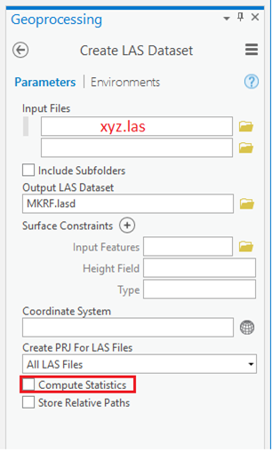
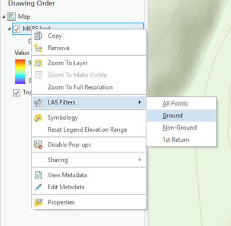
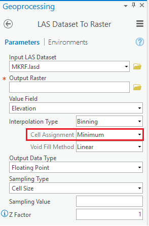
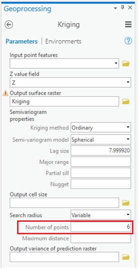
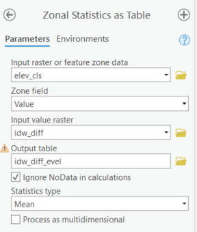
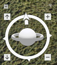
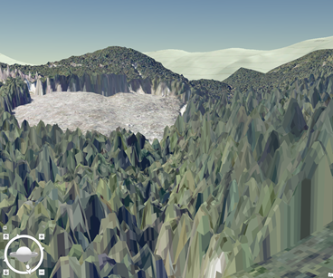

```{r echo=FALSE}
yml_content <- yaml::read_yaml("chapterauthors.yml")
author <- yml_content[["lidar-terrain"]][["author"]]
```

# LiDAR, terrain models and geovisualization {#lidar-terrain}

Written by
```{r results='asis', echo=FALSE}
cat(author)
```

## Lab Overview {.unnumbered}

The aim of this lab is to use LiDAR data from the Malcolm Knapp Research Forest (MKRF) to create digital terrain models (DTMs) using a variety of spatial interpolation techniques, such as inverse distance weighting (IDW), kriging, and spline. We will then investigate how these methods compare to one another, and explore their strengths and weaknesses. Additionally, we will explore 3D visualization in ArcGIS through creating Scenes.

------------------------------------------------------------------------

## Learning Objectives {.unnumbered}

-   TBD

------------------------------------------------------------------------

## Deliverables {#lab4-deliverables .unnumbered}

Lab report with the following specifications:

<input type="checkbox" unchecked> 2 pages maximum PDF including findings, with at least three maps comparing each FTM interpolation method and one scene visualizing the LiDAR DSM in the appendix (not counting toward the page count). you can add the tables separately in your appendix or place the maps at the end of the document </input>


<input type="checkbox" unchecked> Report should satisfy the following requirements:</input>

-   1" margins 
-   12 point font 
-   single spaced
-   maximum of two pages
-   use headings as needed
-   omit your name, student number, date

<input type="checkbox" unchecked> Answers to the questions posted below included in report (in addition to including relevant maps):</input>

-   Which interpolation method do you think worked best? Which method best suits the creation of DTMs in this forestry context, taking into account computing power?
-   What does the impact of cell size have on the surfaces that you created? If you had to redo the lab, would you choose a different resolution?
-   Did you ever capture the “real” ground?
-   Answer this scenario: A company approaches you and asks you to use this dataset to model tree height and variation in the area. How could you do this using the methods described in this lab? What would you do differently (imagine you do not have computation limitations)? Are there any issues that you foresee? Describe the process from receiving the raw data to the output of the surface model.
-   What environmental management applications could a 3D scene/visualization enhance and not merely supplement?


------------------------------------------------------------------------

## Data {#lab4-data .unnumbered}

We will be working with LiDAR data collected over the Malcolm Knapp Research Forest (MKRF) in Maple Ridge, BC. This is the same data as what you will be using in GEM 521. There are three files associated with this lab:

-   MKRF_Data_Specifications.pdf: A document describing the LiDAR data collection
-   MKRF_lidar.las: The LiDAR data file. LAS is the standard file type for LiDAR data
-   MKRF_Aerial_Photo.tif: An orthophoto of our study area, which was collected at the same time as the LiDAR data

------------------------------------------------------------------------

## Task 1: Load and explore the LiDAR data {.unnumbered}

**Step 1:** ArcGIS Pro has several tools that we can use to view and analyse LiDAR point clouds. In order to view the dataset, we need to import it as a LAS Dataset. On the analysis tab, click the tools button and type ‘Create LAS dataset’ in the search box. Specify your input file as the MKRF_lidar.las from the data folder for this lab. Make sure to name the output LAS Dataset and specify a coordinate system (hint: look in the specifications document). Check the ‘Compute Statistics box’. Surface Constraints can be left blank, and we want to make sure that ‘All LAS Files’ are selected for ‘Create PRJ For LAS Files’. 

```{r 04-creating-las-dataset, out.width= "40%", echo = FALSE, fig.align='center'}
    
```

##### Q1. What is the correct projection for this dataset? {.unnumbered}

**Step 2:** We can now add our LAS Dataset to a Map document (insert New Map). Depending on the zoom extent, you may only see the red bounding box of the las file; this isn’t an error, you just need to zoom in to see the actual points. Alternatively, you can open the dataset in a ‘Global Scene’, although due to the size of the point cloud this might cause some lag. The default display is that no point cloud filters are applied; if you want to view only ground points, right click on the file, navigate to ‘LAS Filters’, and click ‘Ground’. If you want to investigate what the forest looks like, you can add the MKRF orthophoto.

```{r 04-view-and-filter-dataset, out.width= "40%", echo = FALSE, fig.align='center'}
    
```

##### Q2. What is the average point spacing of the dataset? {.unnumbered}

##### Q3. What is the percentage of points that are ground points? {.unnumbered}

------------------------------------------------------------------------

## Task 2: Create a DTM using built-in ArcGIS functions {.unnumbered}

**Step 1:** Now that we are familiar with the dataset, we can create a DTM using the easy to use built-in functions. To do so, search for the ‘LAS Dataset to Raster’ tool, and use your LAS Dataset as the input. Since we are interested in creating a terrain model, we want to use the binning interpolation type, and make sure that we use the minimum (i.e. the lowest) points in each cell assignment. Sampling Value refers to the resolution of the raster that we are creating – we want our raster to be 30m x 30m. Name this raster **‘MKRF_DTM’**.

```{r 04-las-dataset-to-raster, out.width= "40%", echo = FALSE, fig.align='center'}
    
```

##### Q4. Why is it important to select the minimum value in the cell assignment selection? (2 sentence maximum) {.unnumbered}

Now that we have seen how to create a raster using the built-in functions, we can look at other methods and compare them to what we just created

------------------------------------------------------------------------

## Task 3: Pre-process data for interpolation {.unnumbered}

In order to access the raster interpolation toolset, we need to carry out some intermediate steps before we can treat the LAS Dataset as individual points. 

**Step 1:** Extract LAS

This is where we extract only the ground points to be used for our interpolation. Make sure the **ground filter** is applied on our LAS Dataset, and then search for the ‘Extract LAS’ tool. We can produce an output LAS Dataset to view on the Map, as well as a LAS file that we will use for the following steps. The result of this tool will be a new .las file with the suffix ‘_ground’ 

We can test that this step has worked by looking at the properties in the catalog. We should have significantly fewer points in the ground dataset than the full dataset.

```{r 04-extract-ground-points, out.width= "40%", echo = FALSE, fig.align='center'}
    knitr::include_graphics("images/04-extract-ground-points.png")
```


**Step 2:** LAS to Multipoint

We need to convert our newly extracted LAS file to a multipoint feature class before we can use the multi	 to singlepart tool. In the ‘LAS to Multpoint’ tool, input your new LAS file (the .las you created, not the .lasd). You will notice that there is a box asking for the ‘Average Point Spacing’. This is where we can use the LAS Dataset we created in the previous step to look up the statistics. Use this value, as well as the Coordinate System that we used previously, and run the tool. 

**Step 3:** Multipart to Singlepart.

Search for the ‘Multipart to Singlepart‘ tool, and use your multipoint feature class as the input. This might take a little while, so be patient!

**Step 4:** Add Z values 

We can now add our height values to be used for interpolation. Search for the ‘Add Z Information’ tool, and use your output from the ‘Multipart to Singlepart’ process. The only output option available should be ‘Spot Z’, make sure it is checked. We have now created a point feature class to test our interpolation on!

------------------------------------------------------------------------

## Task 4: Raster interpolation {.unnumbered}

If you haven’t done so, now is a good time to save your project as creating these rasters can sometimes be tough on MGEM laptops. Since we now have points representing height values, we can use the raster interpolation toolset to experiment with 3 different interpolation techniques; Kriging, Inverse Distance Weighting (IDW), and Spline. To help understand more about these techniques, have a look at the online help section for the [interpolation toolset]( https://pro.arcgis.com/en/pro-app/tool-reference/spatial-analyst/an-overview-of-the-interpolation-tools.htm) (see each tool in the left hand menu):

##### Q5. When looking at semivariogram properties what does 'major range' and 'nugget' refer to? (two sentence maximum) {.unnumbered}

**Step 1:** Enter the name of each interpolation technique in the geoprocessing search window individually and explore their parameters. In order to make the comparison straightforward, make sure that the output raster is the same resolution as the DTM created in Task 2. Create 3 rasters: one using Spline, one using IDW, and one using Kriging. Note, when creating the rasters, keep the default settings, except for Kriging. For this tool, change the number of points in the search radius to 6. This will increase the speed of the tool, although it will still take a while! 

```{r 04-dtm-using-kriging, out.width= "40%", echo = FALSE, fig.align='center'}
    
```

------------------------------------------------------------------------

## Task 5: Visually interpret differences {.unnumbered}

So far, we have created 4 rasters. Take some time to inspect each raster, and look at their similarities and differences (make sure that you are using a common symbology when comparing). If we consider the first raster that we created (MKRF_DTM) as the ‘truth’, we can compare the differences between our interpolated rasters in Task 4 with this DTM. 

**Step 1:** In order to compare the rasters, we will make a raster of the differences between the interpolated surface and that of the ‘truth’. You will use the Raster Calculator tool to do this. We will calculate the absolute value of the difference of the two rasters. The statement in the Raster Calculator tool should look something like this:

**Abs("MKRF_DTM" - "IDW_DTM")**

Repeat this for all three interpolation methods (Spline, Kriging, and IDW), naming the results something like “spline_diff”, “krig_diff”, and “idw_diff”.

##### Q6. Which interpolation technique most closely resembles the default raster (MKRF_DTM) from Task 2? {.unnumbered}

------------------------------------------------------------------------

## Task 6: Quantitatively interpret the differences and calculate statistics for each zone {.unnumbered}

To do this, we will look at the differences in terms of the landscape. We will look to see if there are any patterns between areas of high, medium, and low elevation as well as areas of high, medium, and low slope.

**Step 1:**: First, you will need to reclassify the DTM into high, medium, and low areas. To do this, you will use the Reclassify tool. Use the MKRF_DTM as the input and call the output elev_cls. Use the following values for reclassification: 200-400, 400.00001-600, 600.00001-900.

```{r 04-reclassify-dtm, out.width= "40%", echo = FALSE, fig.align='center'}
    knitr::include_graphics("images/04-reclassify-dtm.png")
```

**Step 2:** Next, make and reclassify a slope feature class. Use the Slope tool to create a raster called mkrf_slope from MKRF_DTM. Next, use the Reclassify tool again to reclassify the mkrf_slope and create a raster called slope_cls using the following values: 0-15, 15.00001-30, 30.00001-90 

```{r 04-reclassify-slope-raster, out.width= "40%", echo = FALSE, fig.align='center'}
    knitr::include_graphics("images/04-reclassify-dtm.png")
```

We will use these reclassified areas as zones to calculate statistics about the difference between the interpolated surface and the actual DTM. In both cases (slope_cls and elev_cls), higher values correspond to higher elevations and slopes.

**Step 3:** Calculate statistics for each zone

We will use Zonal Statistics to help us compare the differences between interpolation techniques. Search for ‘Zonal Statistics as Table’ to have a cleaner output on our final map document.

We’ll start with the elevations and IDW first. Open the Zonal Statistics as Table tool. The input raster or feature zone data is that which defines the zones. For us, this is elev_cls, and the zone field is Value. The input value raster is going to be idw_diff. Call the output table idw_diff_elev, and for Statistics type, only calculate the mean.

```{r 04-zonal-statistics, out.width= "40%", echo = FALSE, fig.align='center'}
    
```

Repeat this step for both topography classes (elevation and slope) as well as all three interpolation methods (IDW, Kriging, Spline). It can be useful to use the ‘History’ button (in the Analysis tab), or ModelBuilder if you’d like.

In the end, you will make six tables called idw_diff_elev, idw_diff_slope, krig_diff_elev, krig _diff_slope, spline_diff_elev, and spline_diff_slope.

------------------------------------------------------------------------

## Task 7: Create a map document {.unnumbered}

**Step 1:** Switch ArcPro to layout view. You may change the page orientation to landscape instead of portrait if you’d like. To do so, go to File -> Page and Print Setup, and change the orientation to landscape. 

**Step 2:** : In ArcGIS Pro, we can insert as many map frames as we want into our map layout. In our case, we will need 6 maps in our layout, as well as some free space for legends and text. There will be one interpolated surface and one difference raster for each of the three interpolation methods. Display each of these layers in their own map and place them appropriately in the layout. Each map should include only one raster, one of the following: DTMs using Spline, Kriging, and IDW, “spline_diff”, “krig_diff”, and “idw_diff”. Arrange the data frames by row and column so that the layout makes sense (that is, so each interpolation method is near one another.

**Step 3:** Add all of the tables from the previous step into one of the data frames. When you open these tables, you can add them to the map by clicking the Table Options selecting “Add Table to Layout”. You can also remove unimportant columns from the display by right clicking the column name in the attribute table and clicking Turn Field Off. Place the tables in the layout view a way that makes sense (near their respective difference raster). Label what each of the values means with a text box (Insert -> Text).

**Step 4:** Change symbology for both the overall and difference layers. Use the same one for all of them.

Start with the elevations. Click on one of the layers representing the interpolated surfaces (Spline, for example) and select the the Symbology tab. Change the Primary symbology to ‘Classify’. Set the number of classes to 7. You may change the color ramp to one that makes sense to you, but make sure that there is enough contrast between classes. Change the symbology of the other two interpolated surfaces to match the first one (i.e. make sure to match break classes). Hint: you can investigate the ‘Apply Symbology from Layer’ tool to do this quickly. 

Repeat the same process for the difference rasters. This time, use 8 classes and set the breaks so that they make sense (e.g. 2, 4, 6, 8, 10, 12, 14, and 50). 

Add a legend for each symbology definition (Elevation and Difference) to the map layout by clicking on a data frame and selecting Insert -> Legend from the top menu bar. Place them on the map layout in a way that makes sense (near the respective layers). 

Finally, put some text on the layout to communicate which data frame is which, and what each table represents. You can either label every data frame or label the columns and rows (“Interpolated Surface” and “Difference to DTM” as rows and “Spline”, “Kriging”, and “IDW” as columns). Make sure you communicate what each aspect of the map is effectively!

Save the ArcMap document and export the map document to a PNG (Share -> Export Layout). When you’re all done, it should look something like this:

```{r 04-map-document, out.width= "75%", echo = FALSE, fig.align='center'}
    knitr::include_graphics("images/04-map-document.png")
```

------------------------------------------------------------------------

## Task 8: Exploring Scenes {.unnumbered}

**Step 1:** The first thing that we will do is add a Local Scene (Insert New Map -> New Local Scene). Add the MKRF_Aerial_Photo to the scene. We can navigate through the scene using the mouse, or the [on-screen navigator](https://www.youtube.com/watch?v=vMLG3iduw50). You can learn more about navigation in Pro [here](https://pro.arcgis.com/en/pro-app/help/mapping/navigation/navigation-in-arcgis-pro.htm).

```{r 04-on-screen-navigator, out.width= "15%", echo = FALSE, fig.align='center'}
    
```

Take some time to play around and explore the scene. One thing we notice is that the imagery does not match the ‘ground’. This is because the ground in the scene is using the default global service, which has a resolution of between 10 and 30 meters. We need to create a custom ground surface to elevate the forest.

**Step 2:** In order for the data to more accurately reflect the real world, we can add a higher resolution digital surface model (DSM) to the area of interest. In Task 2, Step 1, we saw how to make a simple DTM using the LAS Dataset to Raster tool. We are now going to create a DSM to help us visualize our data in three dimensions. Using the same tool, create a raster called ‘MKRF_DSM’ with a resolution of 2 meters, binning the data by ‘Maximum’.

**Step 3:** In the Contents pane, right-click Ground, located below the Elevation Surfaces group layer. Click ‘Add Elevation Source’.  Browse to the location of your newly created DSM and select it. You can now start to see how the surface features have been incorporated into the surface. Make sure to zoom in to look at areas with high relief and roads. Look at the cut block in the in the center of the scene. Why might these trees look strange? 

**Step 4:** Sometimes it might be useful to exaggerate height differences to show a particular aspect of your dataset. To do this, click on ‘ground’ and navigate to the ‘Appearance’ tab (on the top bar). You can play around with the vertical exaggeration here and see how data is displayed differently. You might also be interested in changing the lighting of the scene in order to show what your data looks like at a certain time. Right click on ‘Scene’ and select ‘Properties’ (on the left side of the screen) to access illumination properties. This section is where you can experiment with the lighting of your scene (for example you can set a date and time). 

**Step 5:** Export a scene of your choice. With a figure caption, describe what we are looking at, and whether you changed the vertical exaggeration or illumination in the scene.

```{r 04-example-scene-MKRF, out.width= "75%", echo = FALSE, fig.align='center'}
    
```


## Summary {.unnumbered}

## fix this {.unnumbered}
There are many things to consider when undertaking machine learning with geospatial data. Although we only practiced with the random forest algorithm, many of these considerations are important for other methods as well. Machine learning algorithms work well for large datasets where you can randomly apportion testing, training and validation datasets. When applying these algorithms to spatial data, we often need to consider data density in the spatial and sometimes temporal domains. Interrogating spatial and temporal autocorrelation can help to identify the appropriate sampling strategy for your problem. As you learned in this lab, even the type of variable that you are predicting (continuous vs discrete) can require completely different methods for data handling, testing, and validation. Keep in mind that most of the data pre-processing was removed from the lab (see [Data](#lab4-data)) so that you could focus on the analysis, though these efforts remain some of the most time-consuming to ensure a successful analysis.

Return to the [**Deliverables**](#lab4-deliverables) section to check off everything you need to submit for credit in the course management system
