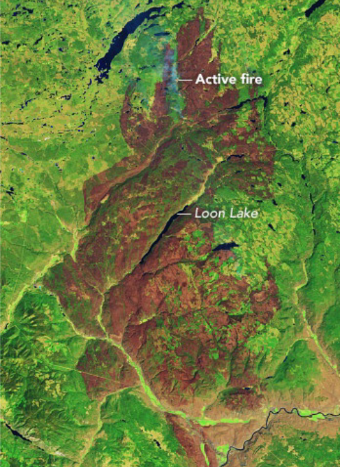
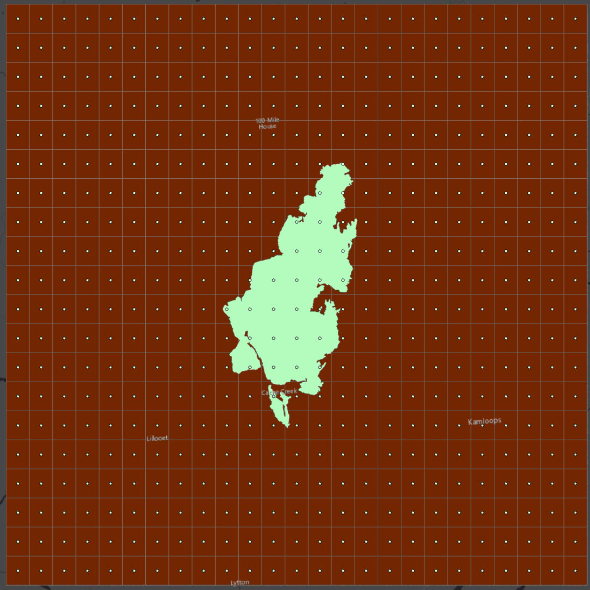

```{r echo=FALSE}
yml_content <- yaml::read_yaml("chapterauthors.yml")
author <- yml_content[["machine-learning"]][["author"]]
```

# Machine Learning with Geospatial Data {#machine-learning}

Written by
```{r results='asis', echo=FALSE}
cat(author)
```

## Lab Overview {.unnumbered}

In this lab, we will be using simple machine learning tools in ArcGIS Pro to predict two variables related to fuel in a post-burn scenario. In Task 1, you will check for spatial autocorrelation in our data and select a subset of input variables which will be most useful in predicting the outcome variables. In Task 2, you will create three different sample datasets using three types of sampling. In Task 3, you will be using a Random Forest classifier to create prediction surfaces for the two variables.

Our area of interest is a large rectangular area in southern British Columbia containing the burn boundary from the 2017 Elephant Hill wildfire. The fire began on July 6th, 2017 and burned 191,865 ha in the south-central Interior region of BC, just northeast of Cache Creek. It was the largest fire by area in the record-breaking 2017 BC wildfire season and was likely started by smoking materials (matches, cigarettes, etc.).

```{r 04-elephant-hill-fire, out.width= "75%", echo = FALSE}
    
```

------------------------------------------------------------------------

## Learning Objectives {.unnumbered}

-   Compare and contrast sampling designs on machine learning predictions

-   Train, test, and predict a continuous variable (crown closure) and a categorical variable (fuel type) using the random forest algorithm

-   Evaluate models by interpreting model statistics like R^2^, AIC, VIF, and confusion matrices

------------------------------------------------------------------------

## Deliverables {#lab4-deliverables .unnumbered}

Lab report with the following specification:

<input type="checkbox" unchecked> 6 pages maximum PDF including figures, tables and references (3 points). Single-spaced, 12-point Times New Roman font (1 point). All figures and tables should be properly captioned (1 point).</input>

<input type="checkbox" unchecked> Results should address the following questions and requirements (25 points):</input>

-   How many fuel types are there in the VRI dataset? Which fuel type has the fewest number of points?

-   What are the results of the spatial autocorrelation (SA) tool and what do they tell us? Why do we test CROWN_CLOS for spatial autocorrelation but not FUEL_TYPE?

-   Report the diagnostic results of the Exploratory Regression (R^2^, AIC, VIF, variable significance) **for three of best models**. What model had the highest R^2^? Based on this, what variables did you choose to include in your final model? Use the statistical terms in the results  to justify your choice.

-   Select the best model for FUEL_TYPE and CROWN_CLOS and briefly justify your choice. Map one of the FUEL_TYPE rasters and one of the CROWN_CLOS rasters. Be sure to specify in a caption or title what sampling design / parameter settings you are displaying in each. 

<input type="checkbox" unchecked> Discussion should address the following questions and requirements (20 points):</input>

-  For the fuel type model discuss the performance of each model. Were there large differences in model performance among the three sampling strategies? What are the benefits and drawbacks of using each sampling design, both in terms of statistical power and the limits of field data acquisition?

- For the crown closure model discuss the impact of changing the Random Forests parameters on the model performance. What parameters should be optimized and why?

-   We used the Exploratory Regression tool to select our input variables. Discuss why you think these variables were important in predicting crown closure. We used the same variables for both the crown closure and fuel type models, what variables might be better for predicting fuel type that we didn't include?  

-   What are the advantages and limitations of using remote sensing data to predict crown closure and fuel types? What about climate data? Terrain data? Why should we use these data for this problem?

-   Reference to any peer reviewed sources as needed.

------------------------------------------------------------------------

## Data {#lab4-data .unnumbered}

All data for this lab are accessible via the UBC PostgreSQL server. Instructions for connecting to the server are given in the tasks below. We will be using data from the `elephanthill` database.

The data for this lab comes from several different sources, including the Landsat archive and Landsat-derived indices, the ClimateNA program, the Vegetation Resources Inventory (VRI) from the BC Ministry of Forests, and the ASTER (Advanced Spaceborne Thermal Emission and Reflection Radiometer) sensor on the Terra satellite. The VRI is a polygon dataset with hundreds of attributes describing harvest, disturbance, species, volume, etc., for all of BC. The individual rasters and their descriptions are listed on below.

+--------------------------------------------------------------+---------------------------------------------------------------------------------------------------------------------------------+-----------------+
| Variable Name                                                | Formula or Description                                                                                                          | Raster Name     |
+==============================================================+=================================================================================================================================+=================+
| Elevation                                                    | Elevation above vertical datum (meters)                                                                                         | ASTER_DEM       |
|                                                              |                                                                                                                                 |                 |
|                                                              | Source: Advanced Spaceborne Thermal Emission and Reflection Radiometer (ASTER) Global Digital Elevation Model Version 3         |                 |
+--------------------------------------------------------------+---------------------------------------------------------------------------------------------------------------------------------+-----------------+
| Aspect                                                       | Azimuth direction, measured clockwise from North (degrees)                                                                      | ASTER_Aspect    |
|                                                              |                                                                                                                                 |                 |
|                                                              | Source: ASTER_DEM                                                                                                               |                 |
+--------------------------------------------------------------+---------------------------------------------------------------------------------------------------------------------------------+-----------------+
| Slope                                                        | Vertical angle from horizontal datum (degrees)                                                                                  | ASTER_Slope_Deg |
|                                                              |                                                                                                                                 |                 |
|                                                              | Source: ASTER_DEM                                                                                                               |                 |
+--------------------------------------------------------------+---------------------------------------------------------------------------------------------------------------------------------+-----------------+
| Topographic Radiation Solar Aspect Index (TRASP)             | Assigns a value of zero to the north-northeast direction:                                                                       | ASTER_TRASP     |
|                                                              |                                                                                                                                 |                 |
|                                                              | $TRASP=\frac{1-cos(\frac{\pi}{180}(\alpha-30))}{2}$                                                                             |                 |
|                                                              |                                                                                                                                 |                 |
|                                                              | Source: ASTER DEM                                                                                                               |                 |
+--------------------------------------------------------------+---------------------------------------------------------------------------------------------------------------------------------+-----------------+
| Mean Annual Precipitation (MAP)                              | Millimeters                                                                                                                     | CNA_MAP         |
|                                                              |                                                                                                                                 |                 |
|                                                              | Source: ClimateNA                                                                                                               |                 |
+--------------------------------------------------------------+---------------------------------------------------------------------------------------------------------------------------------+-----------------+
| Mean Annual Temperature (MAT)                                | Degrees Celsuis                                                                                                                 | CNA_MAT         |
|                                                              |                                                                                                                                 |                 |
|                                                              | Source: ClimateNA                                                                                                               |                 |
+--------------------------------------------------------------+---------------------------------------------------------------------------------------------------------------------------------+-----------------+
| Precipitation as Snow (PAS)                                  | Millimeters                                                                                                                     | CNA_PAS         |
|                                                              |                                                                                                                                 |                 |
|                                                              | Source: ClimateNA                                                                                                               |                 |
+--------------------------------------------------------------+---------------------------------------------------------------------------------------------------------------------------------+-----------------+
| Summer Heat Moisture Index (SHM)                             | $\frac{mean\text{ }warmest\text{ }month\text{ }temperature}{\frac{May\text{ }to\text{ }September\text{ }precipitation}{1000} }$ | CNA_SHMz        |
|                                                              |                                                                                                                                 |                 |
|                                                              | Source: ClimateNA                                                                                                               |                 |
+--------------------------------------------------------------+---------------------------------------------------------------------------------------------------------------------------------+-----------------+
| Temperature Difference (TD)                                  | $mean\text{ }warmest\text{ }month-mean\text{ }coldest\text{ }month$                                                             | CNA_TD          |
|                                                              |                                                                                                                                 |                 |
|                                                              | Source: ClimateNA                                                                                                               |                 |
+--------------------------------------------------------------+---------------------------------------------------------------------------------------------------------------------------------+-----------------+
| Normalized Difference Vegetation Index (NDVI)                | $NDVI=\frac{NIR-Red}{NIR+Red}$                                                                                                  | Landsat_NDVI    |
|                                                              |                                                                                                                                 |                 |
|                                                              | Source: Landsat                                                                                                                 |                 |
+--------------------------------------------------------------+---------------------------------------------------------------------------------------------------------------------------------+-----------------+
| Normalized Difference Burn Ratio (NBR)                       | $NBR=\frac{NIR-SWIR}{NIR+SWIR}$                                                                                                 | Landsat_NBR     |
|                                                              |                                                                                                                                 |                 |
|                                                              | Source: Landsat                                                                                                                 |                 |
+--------------------------------------------------------------+---------------------------------------------------------------------------------------------------------------------------------+-----------------+
| Tasseled Cap Brightness (TCB), Wetness (TCW), Greeness (TCG) | $TCB=Band1*coeff1$                                                                                                              | Landsat_TCB     |
|                                                              |                                                                                                                                 |                 |
|                                                              | $TCW=Band1*coeff1$                                                                                                              | Landsat_TCW     |
|                                                              |                                                                                                                                 |                 |
|                                                              | $TCG=Band1*coeff1$                                                                                                              | Landsat_TCG     |
|                                                              |                                                                                                                                 |                 |
|                                                              | Source: Landsat                                                                                                                 |                 |
+--------------------------------------------------------------+---------------------------------------------------------------------------------------------------------------------------------+-----------------+

The data have been processed ahead of time so that you may focus more on machine learning and sampling design. If you wanted to replicate this workflow in another area of your work, here are the steps we used:

1.  Obtained the ClimateNA, ASTER, VRI, and Landsat data appropriate to the study area/time period.
2.  Projected all the data to NAD 1983 BC Environmental Albers geographic coordinate system and clipped it to the study area boundary.
3.  Calculated Normalized Difference Vegetation Index (NDVI), Normalized Burn Ratio (NBR), and Tasseled Cap Wetness (TCW), Greenness (TCG), and Brightness (TCB) using the appropriate bands from the Landsat image.
4.  Normalized all the rasters (including the indices) using the standard formula where x is a pixel value, mu is the mean pixel value of the raster, and omega is the standard deviation of the raster.
5.  Cleaned the VRI data by removing all unneeded fields and records with `<Null>` values for our variables of interest.
6.  Used the "Extract Multi Values to Points" tool to extract the values of all our rasters to our VRI point feature class (similar to a Spatial Join). Checked for `<Null>` or values again and removed.

------------------------------------------------------------------------

## Task 1: Exploratory Regression in ArcGIS Pro {.unnumbered}

**Step 1:** Start ArcGIS Pro and create a new project with a map template.

**Step 2:** Connect to the UBC PostgreSQL database and import all of the data from the `elephanthill` database into your project geodatabase. This should include 14 rasters, the Vegetation Resource Inventory (VRI) point feature class, and the Elephant Hill (EH) boundary. Open the attribute table for the VRI and see what fields are there. We will not be using the EH boundary for any analysis but it is interesting to see where the fire took place. It truly is a megafire!

**Step 3:** Set the "Primary symbology" on the VRI feature class to "Graduated Colors" and choose "CROWN_CLOS" as the field to display. Take a look at the results and then set "FUEL_TYPE" as the field to display. These are the two variables we will be predicting -- crown closure (also known as canopy cover) and fuel type. CROWN_CLOS is continuous and FUEL_TYPE is categorical. You will notice there are quite a few VRI points (over 84,000), so save your laptop the extra rendering work and turn off this layer unless you are actively looking at it.

**Step 4:** Open the "Spatial Autocorrelation (Global Moran's I)" tool. Use the VRI feature class as the input and set the input field to "CROWN_CLOS". Change the "Conceptualization of Spatial Relationships" parameter to "K Nearest Neighbours" and set the "Number of Neighbors" to "20". Check the box that says "Generate Report". Leave the rest of the tool parameters with the default values and run the tool. Observe the results by viewing the generated report (found in your default folder/geodatabase) or by selecting "View Details".

**HINT: Due to the constraint of completing this lab in ArcGIS Pro, we are unable adjust our sampling parameters to account for spatial autocorrelation. Fortunately, this is a learning exercise, so you will get to discuss this conundrum in your report!**

Next, we are going to use Exploratory Regression to determine which of our rasters will be most effective in predicting our variables of interest.

**Step 5:** Open the "Exploratory Regression" tool and set the VRI feature class as your "Input Features". Select "CROWN_CLOS" as your "Dependent Variable". Remember that as part of the pre-processing, all raster data were extracted at the VRI points. Select the fields corresponding to the rasters in the VRI feature class as your "Candidate Explanatory Variables". Leave out the original Landsat bands. Save the "Output Report File" as "regression_results.txt". This will create a text file in your default folder with the results of the tool, which can also be viewed under "View Details". Leave the rest of the tool parameters as the default values and run the tool.

```{r 04-exploratory-regression, out.width= "75%", echo = FALSE}
    knitr::include_graphics("images/04-exploratory-regression.png")
```

**Step 6:** Select the equation you think will work best. Remember to look at all the different measures of model "goodness" (R^2^, AIC, VIF, multicollinearity, etc.). Our variable rasters fall into three categories: terrain, spectral, and climate. Our final equation should include at least one variable from each category. Write down the variables from your chosen equation somewhere as you will have to re-enter them later.

------------------------------------------------------------------------

## Task 2: Sampling for Training Datasets {.unnumbered}

As noted earlier, the VRI feature class is enormous, and it is an outlier regarding the typical number of field samples we would have to work with. Training on 80,000+ points would also require an equally vast amount of computing power, so we are going to cull this dataset into a more manageable 500 points. This also gives us the opportunity to create and compare sampling designs: random sampling, stratified random sampling, and fixed interval point sampling.

**Step 1:** First, we will make a randomly sampled dataset. Open the tool "Subset Features" and set the VRI feature class as the "Input features". Name your "Output training feature class" as "random_sample" and leave the "Output test feature class" blank (this option creates a second feature class for testing but we do not need that). Change the "Subset size units" to "ABSOLUTE_VALUE", as we want a specific number of points and not a percentage of the dataset. Set the "Size of training feature subset" to 500 and run the tool. View the output on your map.

**Step 2:** Next, we want to make a stratified randomly sampled dataset. There are four major categories of fuel types in our dataset and their distribution is highly uneven. This design will ensure the rarest class is as equally represented as the most abundant class in our sample. As there are four categories (fire, non-vegetated, vegetated non-forest, and forest), we will sample 125 points from each. The list below tells you what fuel type codes correspond to each category:

-   Fire -- "N-fire"
-   Non-vegetated -- "N"
-   Vegetated non-forest -- all fuel types starting with "S" or "O" (as in octopus).
-   Forest -- all fuel types starting with "M", "C", or "D".

Open the attribute table for the VRI dataset, right-click on the "FUEL_TYPE" field, and select "Summarize". Set the "Field" to "FUEL_TYPE" and the "Statistic Type" to "Unique". Leave "Case Field" as is and select "OK". Inspect the output statistics table in your Contents Pane.

**Step 3:** Using the "Select by Attribute" tool, select all the features in the VRI feature class that have a "FUEL_TYPE" of "N-fire". Right-click the feature class, select "Selection", then select "Make Layer from Selected Features".

**Step 4:** Using the "Subset Features" tool again, set your parameters to subset 125 points from the layer you created in the previous step. Name the output "fire_sub_sample" and check the attribute table to make sure all of the records in this feature class have a fuel type of "N-fire".

**Step 5:** Clear your selection. Right-click "VRI", select "Selection", then select "Clear Selection" and repeat steps 3 and 4 for the remaining three categories. Give the outputs logical names and clear your selection/delete the selection layer between each.

**HINT: Use the "begins with" operator to select all fields with a certain letter rather than "is", but beware that both "N" and "N-fire" begin with the same letter.**

Double-check that your sub-samples have the correct number and fuel types in them.

**Step 6:** Using the "Merge" tool, combine your four sub-sample data sets and call the output "stratified_sample". This sample should have 500 points.

**Step 7:** To make the fixed interval point (FIP) sampled dataset, we will create a regularly spaced grid from which to sample our points by creating a fishnet of polygons, converting those polygons into centroid points, and then sampling the closest VRI point to our fishnet points. Open the "Create Fishnet" tool and name your "Output Feature Class" "fishnet". Under "Template Extent" click "Browse" and select the vri shapefile. The X and Y Extents and Origin Coordinates should automatically populate. Set the “Number of Rows” to 20 and the “Number of Columns” to 25. This divides the extent into 20x25 (500!) identical segments. Change the “Geometry” to “Polygon” and run the tool. Your output feature class should look like the grid below. 

```{r 04-elephant-hill-fishnet, out.width= "75%", echo = FALSE}
    knitr::include_graphics("images/04-elephant-hill-fishnet.png")
```

**Step 8:** The tool will also create a point layer called "fishnet_label" with points in the center of each polygon (shown below). 

```{r 04-elephant-hill-fishnet-points, out.width= "75%", echo = FALSE}
    
```

**Step 9:** We have a nice lattice of points across our study area, and we have a point feature class to sample from, but we need to put them together. Open the "Spatial Join" tool and set "fishnet_label" (points not the polygons!) as the "Target Features" and your VRI point feature class as the "Join Features". Set "Closest" as the "Match Option". This will find the closest VRI point to the fishnet and join it to the table. The "Join Operation" should be "Join one to one" and your "Search Radius" can be left blank. Name your "Output Feature Class" "FIP_sample" and run the tool.

```{r 04-spatial-join, out.width= "75%", echo = FALSE}
    knitr::include_graphics("images/04-spatial-join.png")
```

You now have three sampling sets to try your machine learning with!

------------------------------------------------------------------------

## Task 3: Forest-Based Classification {.unnumbered}

Our last task will be using the "Forest-based Classification and Regression" tool to run our machine learning. ESRI provides a helpful overview of the tool [here](https://pro.arcgis.com/en/pro-app/latest/tool-reference/spatial-statistics/how-forest-works.htm). 

We will be running it a total of nine times (three with FUEL_TYPE, six with CROWN_CLOS) and it can be slow, so please be patient and leave yourself lots of time.

**Step 1:** Open the "Forest-based and Boosted Classification and Regression" tool. When you search for the tool, check that it is from the "Spatial Statistics" toolbox and NOT the "GeoAnalytics Desktop" toolbox as they have different inputs. Parameterize the tool as follows:

-   **Prediction Type:** Predict to Raster
-   **Input Training Features:** random_sample
-   **Variable to Predict:** FUEL_TYPE
-   **Treat Variable as Categorical:** check this box (our variable is categorical)
-   **Explanatory Training Rasters:** drag in your variable rasters that you selected from Exploratory Regression in Task 1. The screenshot below shows one potential raster but you should have a maximum of 5.
-   **Output Prediction Surface:** random_output_FT (CC for CROWN_CLOS, FT for FUEL_TYPE)
-   **Match Explanatory Rasters:** they should already match, but double check the prediction rasters are matched to the correct field in the training data.
-   **Additional Outputs \> Output Classification Performance Table (Confusion Matrix):** random_matrix_FT
-   **Validation Options \> Training Data Excluded for Validation:** set to 30%
-   **Validation Options \> Number of Runs for Validation:** set to 2

Leave all other parameters as the default value or blank. Run the tool. You may get a warning about low numbers of certain fuel types -- ignore it (for now...). When the tool finishes, click "View Details" and copy/paste the info under "Messages" into a text file. This is where you can find the regression statistics (R^2^, RMSE, etc) for the training and validation data for your report.

**Step 2:** Run the tool again, but this time use "stratified_sample" as your "Input Training Features". Change the name of your outputs accordingly, but keep everything else the same. When this is finished, run the tool a third time with "FIP_sample" as the input. Remember to keep your regression results in a text file. If you do forget, just go to "History" under the "Analysis" tab and hover over the tool.

You should now have three Random Forests outputs for fuel type from the three sampling strategies:
- random_output_FT
- stratified_output_FT
- FIP_output_FT

**HINT: Under the "Analysis" tab, view your tool "History". Double-click the "Forest-based Classification and Regression" tool and it will pop up in your geoprocessing pane with the same inputs and settings you used for that particular run -- this way, you can just edit the inputs that are changing between runs rather than having to reenter the settings each time.**


**Step 3:** For CROWN_CLOS, instead of changing the sampling design, we are going to experiment with different parameter settings on the tool for a total of **6 runs** (three different parameters, two settings each).

Open the "Forest-based Boosted Classification and Regression" tool again and set these inputs which will act as our control:

-   **Prediction Type:** Predict to Raster
-   **Input Training Features:** random_sample
-   **Variable to Predict:** CROWN_CLOS
-   **Treat Variable as Categorical:** Uncheck this box (our variable is continuous interval)
-   **Explanatory Training Rasters:** same as FUEL_TYPE
-   **Output Prediction Surface:** control_output_CC
-   **Match Explanatory Rasters:** same as FUEL_TYPE
-   **Advanced Forest Options \> Number of Trees:** set to 50
-   **Validation Options \> Training Data Excluded for Validation:** set to 30%

Leave all other parameters as the default value or blank. Run the tool. When it is finished, click "View Details" and copy/paste the info under "Messages" into your text file.

**Step 4:** We are going to run the "Forest-based Classification and Regression" tool six more times. For each time, the inputs should be identical to those in Step 3 except for a single parameter which we will change each time:

-   **Run 1 of 6:** Change Advanced Forest Options \> Maximum Tree Depth to 5. Name the output "depth_5_output_CC"
-   **Run 2 of 6:** Change Advanced Forest Options \> Maximum Tree Depth to 15. Name the output "depth_15_output_CC"
-   **Run 3 of 6:** Change Advanced Forest Options \> Number of Randomly Sampled Variables to 1. Name the output "var_1_output_CC"
-   **Run 4 of 6:** Change Advanced Forest Options \> Number of Randomly Sampled Variables to 2. Name the output "var_2_output_CC"
-   **Run 5 of 6:** Change Validation Options \> Number of Runs for Validation to 2. Name the output "runs_2_output_CC"
-   **Run 6 of 6:** Change Validation Options \> Number of Runs for Validation to 10. Name the output "runs_10_output_CC"

**DO NOT FORGET TO CHANGE YOUR OTHER SETTINGS BACK TO THE DEFAULT BETWEEN EACH RUN.** If you want to be extra sure, open the "Forest-based Classification and Regression" tool from "History" where you ran your CROWN_CLOS control (which has all the defaults) and do each run from there. You can check your inputs under "View Details" if you want to double-check.

When you are finished you should have 10 output rasters, 3 output confusion matrices, and 7 text files with your regression results.

**Step 5:** View all of your new rasters in your map and inspect the results. Symbolize them in a logical manner.

Your output rasters for FUEL_TYPE may be numbers, even though the variable was a string! If your fuel type prediction rasters show numbers, do the following: on each of your sample feature classes, open the attribute table and summarize the unique values in the FUEL_TYPE field using the same method as Task 2 Step 2. The OID in the summary table and the value in your corresponding output raster refer to the same fuel type, e.g., 0 is C-2, 1 is C-3, etc, as seen to the left. Change the labels for the legend in raster Symbology to the fuel type instead of the number when you make the map.

------------------------------------------------------------------------

## Summary {.unnumbered}

There are many things to consider when undertaking machine learning with geospatial data. Although we only practiced with the random forest algorithm, many of these considerations are important for other methods as well. Machine learning algorithms work well for large datasets where you can randomly apportion testing, training and validation datasets. When applying these algorithms to spatial data, we often need to consider data density in the spatial and sometimes temporal domains. Interrogating spatial and temporal autocorrelation can help to identify the appropriate sampling strategy for your problem. As you learned in this lab, even the type of variable that you are predicting (continuous vs discrete) can require completely different methods for data handling, testing, and validation. Keep in mind that most of the data pre-processing was removed from the lab (see [Data](#lab4-data)) so that you could focus on the analysis, though these efforts remain some of the most time-consuming to ensure a successful analysis.

Return to the [**Deliverables**](#lab4-deliverables) section to check off everything you need to submit for credit in the course management system
