```{r echo=FALSE}
yml_content <- yaml::read_yaml("chapterauthors.yml")
author <- yml_content[["remote-sensing-image-analysis"]][["author"]]
```

# Remote Sensing Imagery Analysis {#remote-sensing-image-analysis}

Written by
```{r results="asis", echo=FALSE}
cat(author)
```

## Lab Overview {.unnumbered}

The aim of this lab is to learn about the electromagnetic spectrum (EMS), understand spectral properties of different surfaces, and get comfortable using ArcGIS Pro to load and explore different types of remotely sensed images, display individual spectral bands, make different colour composites, and view spectral signatures. In addition, you will calculate two difference spectral indices representing built up areas and green vegetation.

------------------------------------------------------------------------

### Learning Objectives {.unnumbered}

-   Differentiate regions of the electromagnetic spectrum for urban applications
-   Use Landsat 9 spectral reflectance to map vegetation and urban areas
-   Composite bands together to create true colour and false colour visualizations
-   Analyze spectral signatures of different land cover types

------------------------------------------------------------------------

### Deliverables {#lab4-deliverables .unnumbered}

<input type="checkbox" unchecked> Answers to the questions posed throughout the lab. (31 points)</input>

<input type="checkbox" unchecked> Screenshot of your spectral plot. (2 points)</input>

<input type="checkbox" unchecked> Screenshot of you band arithmetic equation for NDVI. (2 points)</input>

<input type="checkbox" unchecked> Four screenshots of your false-colour composites. (40 points)</input>

<input type="checkbox" unchecked> Map that shows your High_Vegetation_Areas and Urban_area layers overtop the provided Landsat Imagery. Pick appropriate colours and transparency for each layer. (25 points)</input>

------------------------------------------------------------------------

### Data {.unnumbered}

We will be working with a multispectral image of Vancouver from the Landsat 9 satellite that is available to download from the course management system or you download it yourself from [EarthExplorer](https://earthexplorer.usgs.gov/) using the scene id: LC09_L2SP_047026_20260807_20260808_02_T1. This is a [Collection 2, Level 2 Science Product](https://www.usgs.gov/centers/eros/science/usgs-eros-archive-landsat-archives-landsat-8-9-olitirs-collection-2-level-2), which means that the provider has already processed the raw satellite imagery and corrected for atmospheric effects.

------------------------------------------------------------------------

## Task 1: The EMS {.unnumbered}

The electromagnetic spectrum (EMS) is the distribution of electromagnetic radiation according to wavelength/frequency, and includes radio waves, visible and infrared light, x-rays, gamma rays, and more. In remote sensing, we use the reflective, absorptive, and emissive properties of terrestrial features to identify and measure them (i.e., how do different wavelengths in the EMS interact with the surface of the Earth?).

Note: It is important to recognize that the visible part of the EMS is the only section that humans can see. All colours in the visible spectrum are wavelengths, but not all wavelengths in the EMS are colours.

**Spectral Reflectance**

Figure 1 shows the reflective characteristics of various features of the earth's surface. Use this figure to answer **Q1 -- Q4.**

```{r 04-em, out.width= "60%", echo = FALSE}
    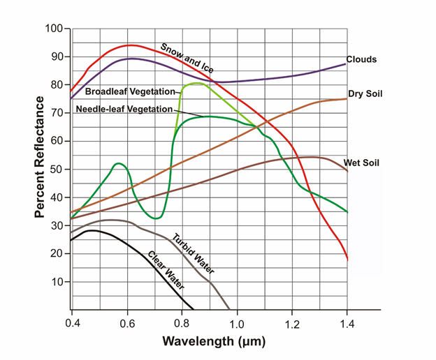
```

Figure 1: Reflectance characteristics of various features at different wavelengths.

##### Q1. For broadleaf and needle-leaf vegetation, what is the approximate wavelength that is reflected most, and what section of the ems does this range belong to? (1 point) {.unnumbered}

##### Q2. Soil and vegetation reflect roughly the same proportion of blue light. (1 point) {.unnumbered}

##### Q3. Give a wavelength (in microns) at which snow and ice, dry soil, and vegetation are indistinguishable by their reflectance. In other words, at which wavelength is the proportion of radiation reflected the same (+/- 10%) for these features? (1 point) {.unnumbered}

##### Q4. Broadleaf and needle leaf vegetation reflect the same amount at 0.7 microns. What causes this? Is there something contained in the foliage of both types of vegetation which causes identical spectral signatures? How does this pattern in spectral reflectance affect how we see live vegetation? (4 points) {.unnumbered}

```{r 04-em2, out.width= "60%", echo = FALSE}
    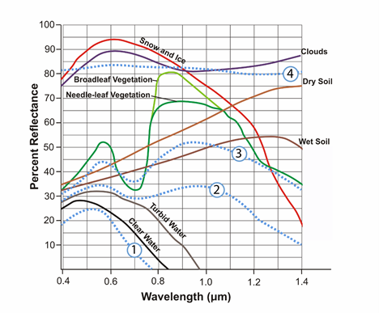
```

Figure 2: Reflectance characteristics of unknown features.

##### Q5. Figure 2 contains 4 additional spectra, belonging to unknown surface features. Hypothesize about what these spectra might be and provide your reasoning. Use the known features (broadleaf vegetation, wet soil, etc.) and what you have learned from class/readings to inform your choices. This is a difficult task, and educated guesses are all that is asked for. Do a bit of research, put some thought into it, and explain the reasoning for your guesses. These spectra do not represent the features which are already labeled. You must think of new features which could be observed with remote sensing. (4 points) {.unnumbered}

------------------------------------------------------------------------

## Task 2: Landsat 9 Bands, the EMS & ArcGIS Pro Software {.unnumbered}

Table 2: Parameters of Landsat 9's Operational Land Imager (OLI) sensor

```{r echo = FALSE}
Band = 1:11
wl = c('0.43-0.45', '0.45-0.51', '0.53-0.59', '0.64-0.67', '0.85-0.88', 
       '1.57-1.65', '2.11-2.29', '0.50-0.68', '1.36-1.38', 
       '10.60-11.19', '11.50-12.51')
sp = c('Coastal/Aerosol', 'Blue', 'Green', 'Red', 'Near Infrared', 
       'Short-wave Infrared 1', 'Short-wave Infrared 2', 'Panchromatic', 'Cirrus',
       'Thermal Infrared 1', 'Thermal Infrared 2')
r = c(30, 30, 30, 30, 30, 30, 30, 15, 30, 100, 100)
app = c('Coastal and aerosol studies; improved coastal water mapping.',
        'Coastal water mapping, differentiation of vegetation and soils.',
        'Assessment of vegetation vigor.',
        'Chlorophyll absorption for vegetation differentiation.',
        'Biomass surveys and delineation of water bodies.',
        'Vegetation and soil moisture measurements; differentiation of ice and clouds.',
        'Hydrothermal mapping.',
        'Sharper imagery; used to pan-sharpen multispectral bands to 15 m.',
        'Detection of cirrus cloud contamination.',
        'Thermal mapping, soil moisture studies, plant heat stress measurement.',
        'Improved thermal mapping and atmospheric correction (split-window technique).')
df = data.frame(Band, wl, sp, r, app)
colnames(df) <- c('Band', 'Wavelength Range (microns)', 'Spectral Region', 'Spatial Resolution (meters)', 'Applications')
library(knitr)
kable(df, align = 'c')

```

##### Q6. Each pixel of the thermal infrared bands 10-11 covers \_\_\_ pixels of the other bands. If it helps, draw a picture of the two pixel resolutions. (1 point) {.unnumbered}

##### Q7. Bands 10-11 are recorded with a coarser resolution because thermal radiation has a very \_\_\_ wavelength. Therefore, there is \_\_\_ energy available to sense. (1 point) {.unnumbered}

**Step 1:** Start a new ArcGIS Pro Project. Download the zip data from the course management system and unzip the LC09_L2SP_047026_20260807_20260808_02_T1.zip file into your new ArcGIS Pro project folder. This location is usually C:\Users\yourusername\Documents\ArcGIS\Projects. Look at the contents that have been extracted. These are all the files that you would receive if you downloaded the image yourself, but we will not use all of them for this lab. Importantly, you should notice that the files follow a naming convention. Use the tables below to reference the correct files in later steps. Note that Band 8 (Panchromatic), Band 9 (Cirrus Cloud), and Band 11 (TIRS 2) are not processed for surface reflectance, so you will not see them here.

```{r echo = FALSE}
Segment = c('Sensor', 'Processing level', 'WRS Path/Row', 'Acquisition date', 
            'Processing date', 'Collection', 'Tier')
Value = c('LC09', 'L2SP', '047026', '20260807', '20260808', '02', 'T1')
Meaning = c('Landsat 9, OLI-2/TIRS-2 sensor',
            'Level-2 Science Product (Surface Reflectance and Surface Temperature)',
            'Path 047, Row 026 (defines the scene\'s ground location)',
            'Date the image was captured (August 7, 2026)',
            'Date USGS generated this product (August 8, 2026)',
            'Collection 2 processing',
            'Tier 1 - highest quality, precision terrain-corrected')
df1 = data.frame(Segment, Value, Meaning)
colnames(df1) <- c('File Name Element', 'Value', 'Interpretation')
library(knitr)
kable(df1, align = 'c')
```

```{r echo = FALSE}
Suffix = c('MTL.txt / MTL.xml', 'ANG.txt', 'QA_PIXEL.TIF', 'QA_RADSAT.TIF',
           'SR_B1.TIF', 'SR_B2.TIF', 'SR_B3.TIF', 'SR_B4.TIF', 'SR_B5.TIF',
           'SR_B6.TIF', 'SR_B7.TIF', 'SR_QA_AEROSOL.TIF', 'ST_B10.TIF',
           'ST_ATRAN.TIF', 'ST_CDIST.TIF', 'ST_DRAD.TIF', 'ST_URAD.TIF',
           'ST_TRAD.TIF', 'ST_EMIS.TIF', 'ST_EMSD.TIF', 'ST_QA.TIF')
Description = c('Metadata file - sensor settings, corner coordinates, radiometric/reflectance rescaling factors, processing history',
                 'Angle coefficients file - used to derive per-pixel solar/sensor viewing angles',
                 'Pixel quality bitmask - quality assurance (QA) flags for cloud, cloud shadow, snow, water, cirrus, fill',
                 'Radiometric saturation QA - flags saturated pixels per band',
                 'Surface Reflectance, Band 1 (Coastal/Aerosol)',
                 'Surface Reflectance, Band 2 (Visible Blue)',
                 'Surface Reflectance, Band 3 (Visible Green)',
                 'Surface Reflectance, Band 4 (Visible Red)',
                 'Surface Reflectance, Band 5 (Near-Infrared)',
                 'Surface Reflectance, Band 6 (SWIR 1)',
                 'Surface Reflectance, Band 7 (SWIR 2)',
                 'Aerosol QA - flags used in the atmospheric correction for surface reflectance',
                 'Surface Temperature, Band 10 (Thermal, in Kelvin, scaled)',
                 'Atmospheric transmittance - used in the surface temperature algorithm',
                 'Pixel distance to nearest cloud',
                 'Downwelling radiance',
                 'Upwelling radiance',
                 'Thermal radiance (top-of-atmosphere, before surface temperature correction)',
                 'Emissivity, from ASTER Global Emissivity Database',
                 'Emissivity standard deviation',
                 'Surface Temperature uncertainty (in Kelvin)')
df2 = data.frame(Suffix, Description)
colnames(df2) <- c('File Suffix', 'Description')
library(knitr)
kable(df2, align = 'c')
```

**Step 2:** Add the geotiffs for Bands 1-7 to your map. Toggle them on/off, pan around, and zoom in to inspect different locations. Notice that each band is a grey scale image, even the images that represent the visible part of the spectrum. Notice how a land cover might appear bright in one band and dark in another. Pixels that are bright have high **reflection** of light back to the sensor in this band of the spectrum. Pixels that are dark have high **absorption** in this band of the spectrum.

We are going to composite these bands together into a new file, a process that is also known as raster stacking or layer stacking. The basic idea is to create a new image that has the same x and y dimensions as these individual images and a third dimension z that represents the different bands.

**Step 3:** Search for the "Composite Bands" tool in the geoprocessing pane. Under "Input Rasters", click the drop-down menu and select Bands 1-7, in that order, from top to bottom. Name the output "composite_bands" and let it save to your default geodatabase for the project. Do not add any file extension to the file name. Run the tool and inspect the output.

```{r 04-composite-bands, out.width= "75%", echo = FALSE}
    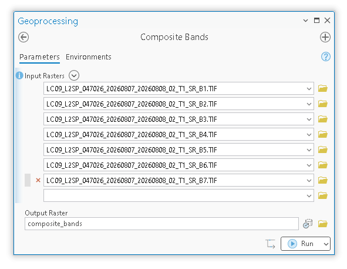
```

```{r 04-composite-bands-output, out.width= "100%", echo = FALSE}
    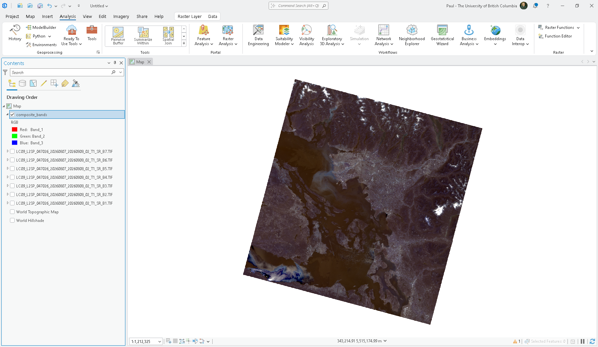
```

Notice that the new file that is added to your map has some colour, but it is dull.

**Step 4:** Right-click "composite_bands" in the Contents pane and select "Symbology". Notice the default symbology type is "RGB", which refers to the Red, Green, and Blue colour channels of your computer screen. We can map any combination of our 1-7 bands into these three colour channels to produce new colour visualizations. Create a true-colour image by selecting "Band_4" for the drop-down menu next to "Red", "Band_3" for "Green", and "Band_2" for "Blue". This has the effect of mapping the visible red band to the red colour channel, the visible green band to the green colour channel, and the visible blue band to the blue colour channel. The map automatically updates when you change the band combinations, and this combination is known as a **true colour** image.

```{r 04-composite-bands-rgb, out.width= "100%", echo = FALSE}
    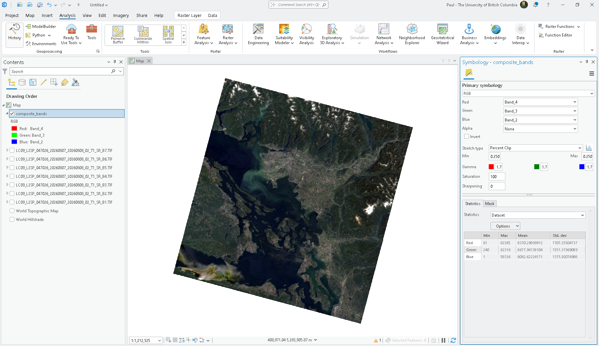
```

Remember that the colours that we see with our eyes are also a wavelength in the electromagnetic spectrum:

-   Red – 660 nm (Band 4)

-   Green – 560 nm (Band 3)

-   Blue – 480 nm (Band 2)

Note that these band number combinations (4-3-2) for true colour imagery are particular to Landsat 9 Operational Land Imager. Other satellite missions may use different band number designations, so when creating true colour imagery you must always pay attention to the bands designated to visible red, green and blue. The table below shows true colour band number combinations for other Landsat missions.

```{r echo = FALSE}
    Sensor = c('MSS', 'TM', 'ETM+', 'OLI / OLI-2')
    Missions = c('Landsat 1-5', 'Landsat 4-5', 'Landsat 7', 'Landsat 8-9')
    Red = c('Band 3', 'Band 3', 'Band 3', 'Band 4')
    Green = c('Band 2', 'Band 2', 'Band 2', 'Band 3')
    Blue = c('-', 'Band 1', 'Band 1', 'Band 2')
    Combo = c('3-2-1', '3-2-1', '3-2-1', '4-3-2')
    Notes = c('No true blue band exists; MSS band 1 is green, so this is a false-colour approximation, not true colour',
              'First Landsat sensor with a genuine visible-blue band, enabling true colour',
              'Same band definitions as TM',
              'Band numbering shifted due to added Coastal/Aerosol band (Band 1) at the front')
    df = data.frame(Sensor, Missions, Red, Green, Blue, Combo, Notes)
    colnames(df) <- c('Sensor', 'Missions', 'Red', 'Green', 'Blue', 'Band Combination (R-G-B)', 'Notes')
    library(knitr)
    kable(df, align = 'c')
```

In a true colour image, the computer screen visualizes objects the way we see them with our own eyes. In other words, in a true colour image, Landsat Band 2 (Blue – 480 nm) is displayed as blue, Band 3 (Green – 560 nm) is displayed as green, and band 3 (Red – 660 nm) is displayed as red. The mixing of these three primary colours in different intensities (i.e., reflection) produces all of the other colours that we can see.

Recall that each of these band images is just a grey scale image where the brightness of a pixel corresponds to the amount of reflectance that the surface returns to the sensor in that band of the spectrum. The "brightness" of any pixel is recorded using a **digital number**, higher digital numbers are brighter and digital numbers exactly equal to zero are black (i.e., no reflectance). If you look at the grey scale images in the Contents pane of your map (scroll up to the first screenshot in this Task), you will see that each band image has a different range of digital numbers. When we composited these bands together into an RGB image, we still have the same data (digital numbers), but now for every pixel we have three digital numbers (RGB) to display instead of one (single band).

**Step 5:** Find a feature or land cover in the true colour image with a distinct colour and zoom in closely until the pixels are easy to distinguish, usually less than 1:5000. With your cursor, click on one of the pixels and the resulting pop-up will display the digital numbers that appear in each of the RGB colour channels.

The screenshot below shows one of the many cargo ships that was anchored in English Bay at the time of the image. Notice how the digital number for the red colour channel (Band 4: 12,394) is much higher than the green (Band 3: 8,384) or blue (Band 2: 9,385) colour channels. The result is that the red light-emitting diodes that represents the pixel on your computer screen is brighter than the adjacent green and blue diodes, so the effect is that the cargo ship pixel appears distinctly red in the image.

```{r 04-digital-numbers, out.width= "75%", echo = FALSE}
    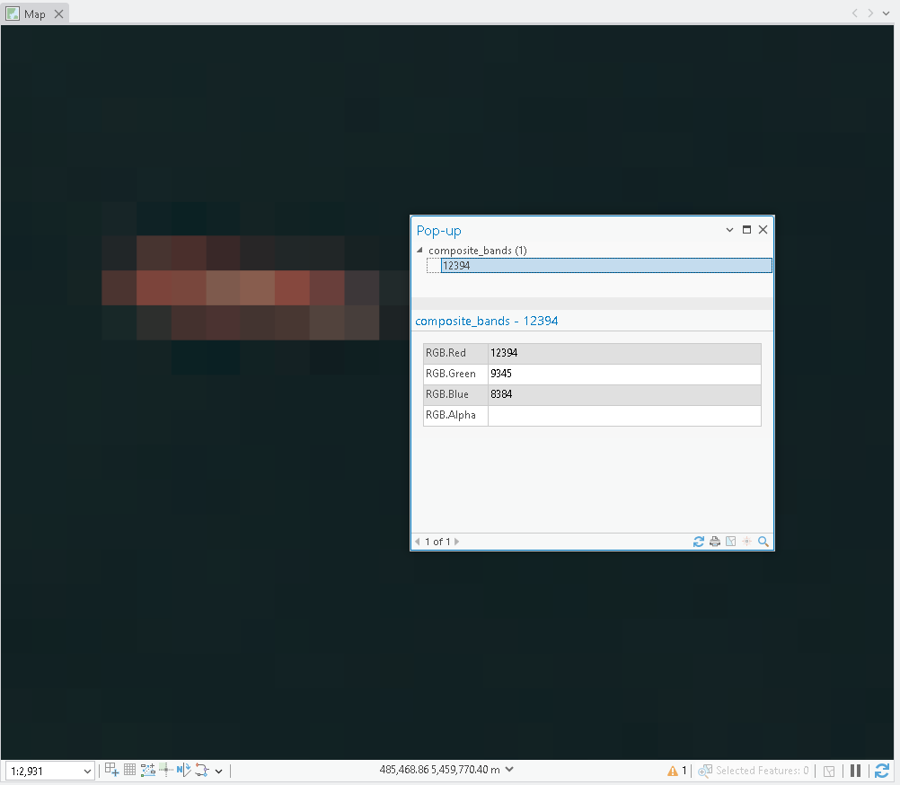
```

Note that colour vision deficiency affects about 300,000,000 people globally, and people assigned male at birth are up to 16 times more likely to experience some form of colour vision deficiency compared to people assigned female at birth.

**Step 6:** You can simulate different colour vision deficiencies in ArcGIS Pro by right-clicking on the RGB image in the map canvas, select "Color Vision Simulator", and then select any of the types of colour vision deficiencies. This is an especially important consideration when producing accessible remote sensing images and maps for reports or technical documents. If you experience a colour vision deficiency, then you should inform the instructor so that you can receive accommodations for some of the deliverables in this lab.

```{r 04-color-vision-simulator, out.width= "75%", echo = FALSE}
    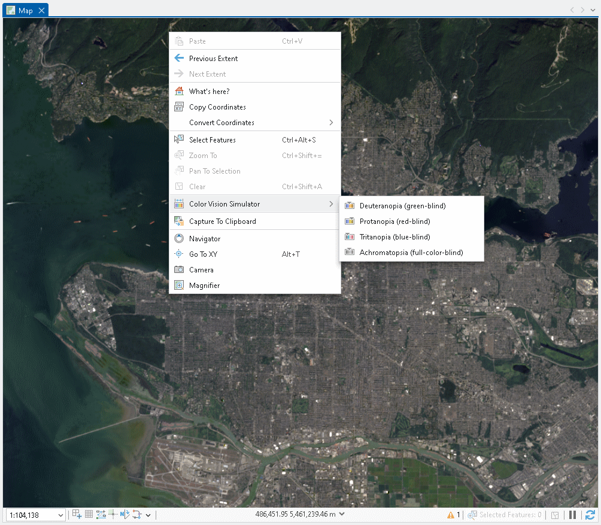
```

**Step 7:** Reset the Color Vision Simulator by navigating to the "View" tab on the top ribbon, and click on the coloured rectangle above "Color Vision Simulator".

```{r 04-color-vision-simulator-toolbar, out.width= "75%", echo = FALSE}
    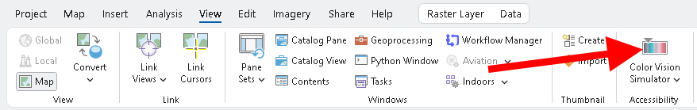
```

Any band combination where the visible red, green and blue bands are not mapped to the red, green, and blue colour channels, respectively, is called a **false colour** image. False colour images are necessary to visualize electromagnetic radiation that we can not perceive with our own eyes.

Consider the following synesthesia analogy. Your eyes can hear three notes at specific frequencies: R, G, and B. Any combination of these three notes with different volumes, produces all the sounds that you can hear. You look at the true colour pixel of the cargo ship above and you hear a "red" chord. How can your eyes hear and understand notes that that are beyond this range? You build microphones (sensors) that can detect and record these other frequencies (bands) and their volumes (digital numbers) and then you play back the recording in the tones that your eyes can hear with notes of R, G, and B (false colour).

Are you ready to visualize parts of the electromagnetic spectrum that are beyond your natural range of perception?

**Step 8:** Using what you learned in Step 4, experiment with other band combinations in the RGB symbology of composite_bands and examine all the different false colour images that you can create. Try these R-G-B band combinations in particular:

-   5-4-3

-   4-5-6

-   6-5-4

-   5-6-7

The image below is an example of the 6-5-4 band combination. Note that in the Symbology pane, you can change Statistics from "Dataset" to "DRA Dynamic Range Adjustment", which will stretch the range and brightness of the colours based on the range of digital numbers currently in view as you zoom in/out and pan around the map. This can make it easier to distinguish different land covers with different colours.

```{r 04-false-colour-654, out.width= "100%", echo = FALSE}
    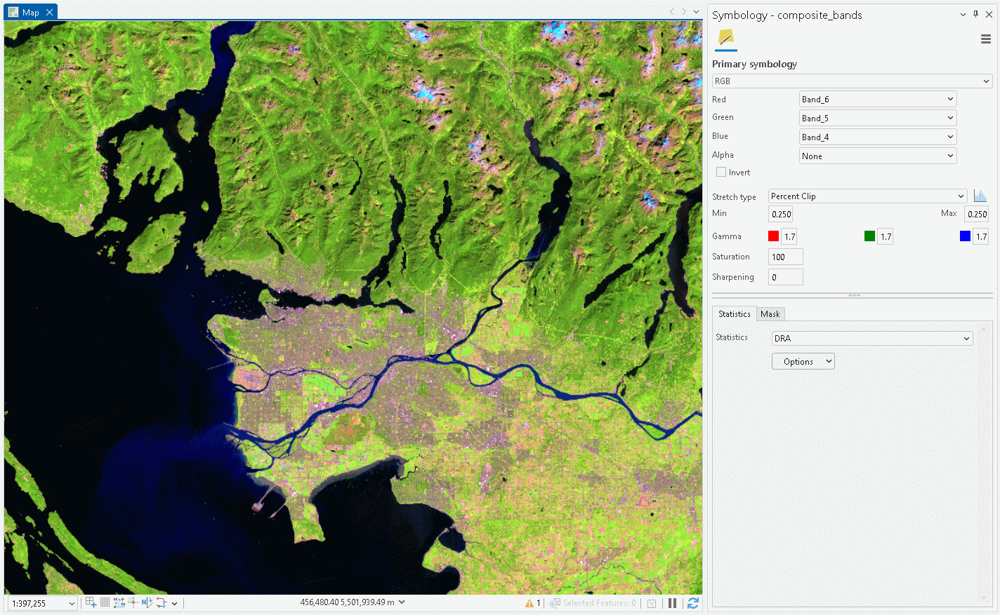
```

##### Q8. In the 6-5-4 band combination, match the following cover types to the colors that they appear in the image: healthy vegetation, urban cover, silty water, and clear water. (4 points) {.unnumbered}

##### Q9. Which band combination would you use to analyze vegetation? Do some light research on spectral properties and the applications of different Landsat 9 bands and write a sentence or two justifying each of your choices. Then, append a screenshot of your chosen band combination from ArcGIS Pro to your response. (10 points) {.unnumbered}

##### Q10. Which band combination would you use to analyze water quality? Do some light research on spectral properties and the applications of different Landsat 9 bands and write a sentence or two justifying each of your choices. Then, append a screenshot of your chosen band combination from ArcGIS Pro to your response. (10 points) {.unnumbered}

##### Q11. Which band combination would you use to analyze agriculture? Do some light research on spectral properties and the applications of different Landsat 9 bands and write a sentence or two justifying each of your choices. Then, append a screenshot of your chosen composite from ArcGIS Pro to your response. (10 points) {.unnumbered}

##### Q12. Which band combination would you use to analyze urban areas? Do some light research on spectral properties and the applications of different Landsat 9 bands and write a sentence or two justifying each of your choices. Then, append a screenshot of your chosen composite from ArcGIS Pro to your response. (10 points) {.unnumbered}

Next, we will view some spectral signatures across all bands. This is a bit different from visualizing the data with false colour images as our goal now will be to profile the intensity of all seven bands for a given pixel rather than just visualizing colour with three bands. Recall from Task 1 that different land covers can be distinguished by their spectral signatures. You will now use what you have learned from that Task to interpret profiles of pixels from different land covers in this Landsat 9 image.

**Step 9:** Right-click on the "composite_bands" item in the Contents pane and select "Create Chart", then "Spectral Profile". The Chart Properties pane should appear on the right side of your screen and the Spectral Chart on the bottom. In the Chart Properties pane under "Define an Area of Interest" select the point icon and then click a pixel of a land cover that you can see in the image. Repeat this until you have at least six different profiles. Note that it does not matter which band combination that you have displayed, but you might choose a false colour band combination that helps you to find land covers that are visually distinct. You can zoom in closely to place your points precisely. In the chart, you can change the colours of the lines/points to make them easier to distinguish and be sure to add descriptive labels in the Chart Properties pane. You can resize the chart as needed and then export the chart.

```{r 04-spectral-profile, out.width= "100%", echo = FALSE}
    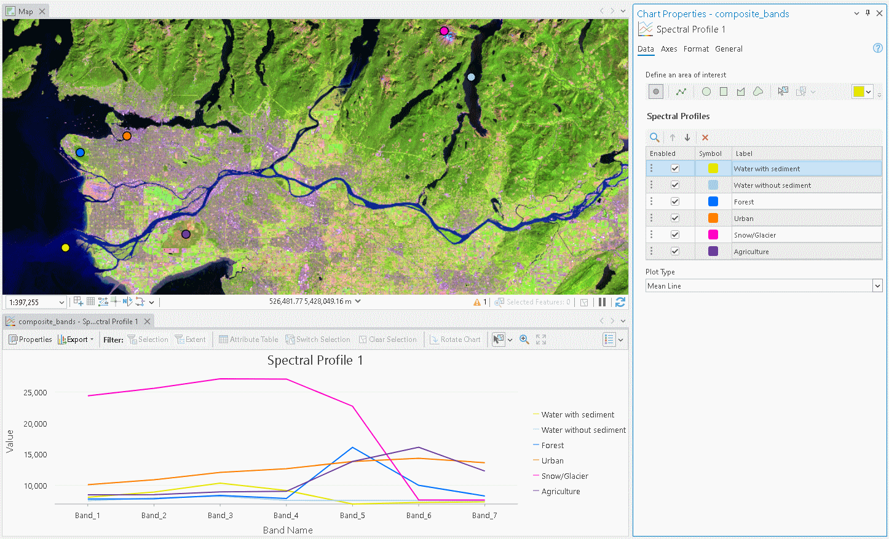
```

##### Q13. Examine your new spectral profile chart. Compare the different profiles you created to the spectral profiles in Task 1. What is different between them? Why might your spectral curves look different than those above? What does the y-axis of your chart represent? (4 points) {.unnumbered}

##### Screenshot 1. Upload a screenshot of your entire ArcGIS Pro window showing your spectral plot.  Your ArcGIS account username in the top right must be visible to receive credit. (2 points) {.unnumbered}

------------------------------------------------------------------------

## Task 3: Calculating NDVI and Built Up Index {.unnumbered}

Spectral indices are mathematical equations containing spectral reflectance values from two or more wavelengths used to highlight areas of spectral importance in an image. There are a wide variety of spectral indices used to highlight a variety of different land covers and image properties including burned Areas (Normalized Burn Ratio), urban/ built up areas (Normalized Difference Built-Up Index), and water (Normalized Difference Water Index) to name a few. The Normalized Difference Vegetation Index (NDVI) is a frequently used spectral index that takes advantage of the high near-infrared reflectance and high red absorption properties of healthy vegetation and is therefore often used to quantify vegetation in a remotely sensed multispectral image.

NDVI is calculated with the below formula:

$\ NDVI = \frac{(NIR - RED)}{(NIR+RED)}$

Where NIR is the near-infrared band (Landsat 9 Band 5) and Red is the red band (Landsat 9 Band 4). The results of this equation should be between -1 and 1 with values less than 0 representing water and values between 0-1 representing different levels of healthy vegetation.

**Step 1:** Navigate to the Imagery tab from the top ribbon and click the "Raster Functions" button.

```{r 04-raster-functions-toolbar, out.width= "75%", echo = FALSE}
    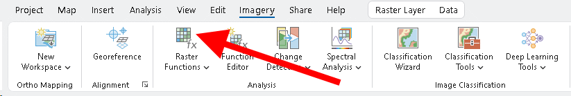
```

**Step 2:** The Raster Functions pane should appear. Expand "Analysis" and then select "NDVI" to open.

```{r 04-band-arithmetic, out.width= "40%", echo = FALSE}
    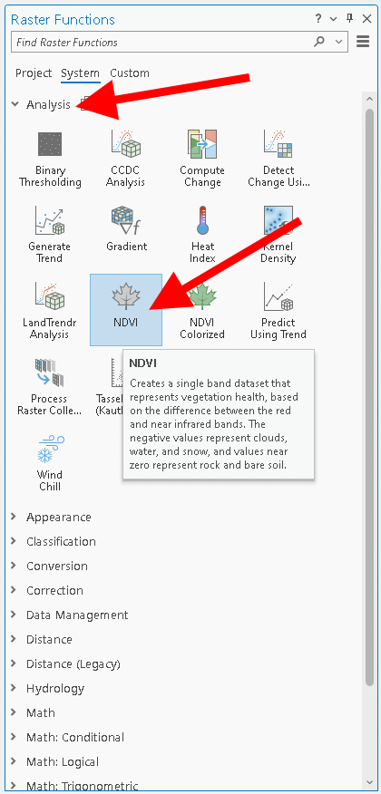
```

**Step 3:** The "NDVI Properties" dialogue should appear. Under "Raster" use the drop-down menu and select the "composite_bands" layer. If it is not currently in your map view and can use the folder button and navigate to your lab data folder and select the file from your geodatabase or wherever you saved it in Task 2. "Visible Band ID" corresponds to the red band number and "Near Infrared ID" corresponds to the NIR band number. Select the correct band numbers and then toggle on "Scientific Output" and run the tool.

**Step 4:** Adjust the symbology of your output NDVI layer so that it uses a diverging colour palette that is stretched between -1 and 1. Right-click the layer in the Contents pane, select "Symbology", and select a diverging colour from the drop-down list. Most of these will be towards the bottom of the list and will feature either white or yellow as the centre colour. All of the diverging colour palettes are shown in the image below, asterisks indicate palettes that are accessible for people with color vision deficiency.

```{r diverging-palettes, out.width="80%", echo=FALSE, warning = FALSE, message = FALSE}
library(RColorBrewer)
library(ggplot2)
library(dplyr)

div_palettes <- rownames(brewer.pal.info[brewer.pal.info$category == "div", ])

palette_names <- c(
  BrBG    = "Brown-Green",
  PiYG    = "Pink-Green",
  PRGn    = "Purple-Green",
  PuOr    = "Purple-Orange",
  RdBu    = "Red-Blue",
  RdGy    = "Red-Gray",
  RdYlBu  = "Red-Yellow-Blue",
  RdYlGn  = "Red-Yellow-Green",
  Spectral = "Spectral"
)

cb_safe <- brewer.pal.info[div_palettes, "colorblind"]
palette_labels <- ifelse(cb_safe, paste0(palette_names[div_palettes], "*"), palette_names[div_palettes])
names(palette_labels) <- div_palettes

n_levels <- 101

palette_df <- lapply(div_palettes, function(pal) {
  base_colors <- brewer.pal(brewer.pal.info[pal, "maxcolors"], pal)
  ramp <- colorRampPalette(base_colors)(n_levels)
  data.frame(
    palette = palette_labels[pal],
    position = seq_len(n_levels),
    color = ramp,
    stringsAsFactors = FALSE
  )
}) %>% bind_rows()

palette_df$palette <- factor(palette_df$palette, levels = rev(palette_labels[div_palettes]))

ggplot(palette_df, aes(x = position, y = palette, fill = color)) +
  geom_tile(color = NA, width = 1, height = 0.7) +
  scale_fill_identity() +
  labs(title = "Diverging Colour Palettes in ArcGIS Pro",
       x = NULL, y = NULL) +
  theme_minimal(base_size = 12) +
  theme(
    axis.text.x = element_blank(),
    axis.ticks = element_blank(),
    panel.grid = element_blank(),
    plot.title = element_text(face = "bold", hjust = 0.5),
    plot.subtitle = element_text(hjust = 0.5, size = 10, color = "gray40")
  )
```

**Step 5:** After you have selected a diverging colour palette, toggle off "Invert", ensure "Stretch Type" is set to "Minimum Maximum", toggle on "Edit min/max values", and then in the corresponding boxes just below, select two numbers that are symmetric about zero. In other words, one positive number and one negative number that are equidistant from zero. This symmetry will ensure that the diverging colour palette is applied correctly, so that white or yellow is exactly at the value of zero. The natural range of NDVI is -1 to 1, but this will not always produce the best visualization. The screenshot below shows an example using -0.5 and 0.5, which works well for the Lower Mainland. You may choose different values, based on the local range of NDVI for the area you are visualizing and the types of features that you want to emphasize.

```{r 04-ndvi-diverging-colour-symbology, out.width= "100%", echo = FALSE}
    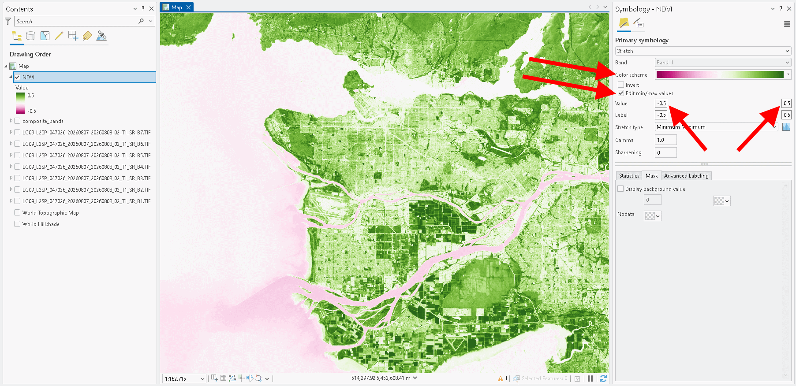
```

##### Screenshot 2. Upload a screenshot of your entire ArcGIS Pro window showing your NDVI image with the diverging colour palette applied. Your ArcGIS account username in the top right must be visible to receive credit. (2 points) {.unnumbered}

##### Q14. What are the minimum and maximum values of your new NDVI layer? (2 points) {.unnumbered}

##### Q15. What do the negative and positive values in the image represent? What about values near or at zero? (4 points) {.unnumbered}

##### Q16. What information does this type of analysis give us? When and why might this type of analysis be used? (4 points) {.unnumbered}

**Step 6:** Repeat the last step, but this time calculate the Normalized Difference Built-Up Index (NDBI). The NDBI highlights urban areas where there is typically a higher reflectance in the shortwave-infrared region compared to the near-infrared region. The equation is as follows:

$\ NDBI = \frac{(SWIR1-NIR)}{(SWIR1+NIR)}$

------------------------------------------------------------------------

## Task 4: Reclassifying Spectral Indices and Map Making {.unnumbered}

In this last Task, you will use a technique called "thresholding" and the reclassify tool to extract highly vegetated areas (High NDVI) and urban areas (High NDBI) and then create a map with these layers overlaid with the provided satellite imagery.

**Step 1:** Navigate to the "Analysis" tab on the top ribbon and select the "Tools" option. The geoprocessing window should appear in the search box type "Reclassify" and select the option with "(Spatial Analyst Tools)" beside it.

```{r 04-reclassify, out.width= "40%", echo = FALSE}
    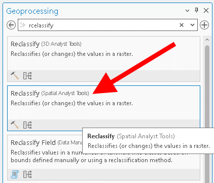
```

**Step 2:** Under "Input Raster" select the NDVI layer you created in the last Task. The "Reclass field" should automatically become completed and a "Reclassification" table should appear below.

```{r 04-class-tab, out.width= "75%", echo = FALSE}
    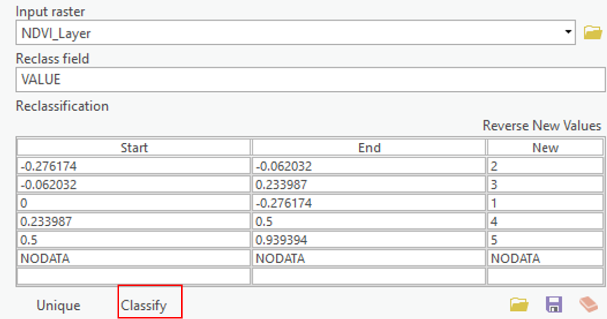
```

**Step 3:** Select the Classify button at the bottom of the table and enter "2" for number of classes. For the first row leave "Start" as is and enter 0.49999 under "End", change "New" to "NODATA". For the second row change "Start" to "0.5" and leave "End" as 1 and change "New" to "1". The Reclassify tool takes the old values from a raster and creates a new raster layer with updated values based on the Reclassification table. In this case we as saying take all pixels with values less than 0.5 and make them NODATA or blank and take all pixels with values greater than 0.5 and make their value 1. Under "Output Raster" save the file as "High_Vegetation_Areas" and press "Run" at the bottom of the window.

**Step 4:** Repeat the last step for NDBI where all you keep only pixels with values above 0 and change there value to 1. Save this layer as "Urban Areas".

##### Map 1. Upload a map that shows your High_Vegetation_Areas and Urban_area layers overtop of the provided Landsat Imagery. Pick appropriate colours and transparency for each layer. (25 points) {.unnumbered}

------------------------------------------------------------------------

## Summary {.unnumbered}

In this lab, you learned how to interpret the electromagnetic spectrum for urban and environmental applications, connect spectral behavior to what you see in imagery, and operationalize those ideas in ArcGIS Pro. You explored Landsat 9 bands, toggled single-band greyscale views, and built both true- and false-colour composites to emphasize specific surface properties. You examined spectral signatures for different land covers and compared them to reference curves to understand why materials separate (or do not) across wavelengths. You then calculated NDVI to highlight vegetation and NDBI to highlight built-up areas, and reclassified these indices to extract high-confidence classes. Finally, you synthesized your results into a clear map that overlays vegetation and urban masks on the base imagery. By the end, you could differentiate EMS regions, justify band choices for specific analyses, quantify patterns with indices, and communicate findings cartographically.

Return to the [**Deliverables**](#lab4-deliverables) section to check off everything you need to submit for credit in the course management system.
