```{r echo=FALSE}
yml_content <- yaml::read_yaml("chapterauthors.yml")
author <- yml_content[["remote-sensing-image-analysis"]][["author"]]
```

# Remote Sensing Imagery Analysis {#remote-sensing-image-analysis}

Written by
```{r results='asis', echo=FALSE}
cat(author)
```

## Lab Overview {.unnumbered}

The aim of this lab is to learn about the electromagnetic spectrum (EMS), understand spectral properties of different surfaces, and get comfortable using ArcGIS Pro to load and explore different types of remotely sensed images, display individual spectral bands, make different colour composites, and view spectral signatures. In addition, you will calculate two difference spectral indices representing built up areas and green vegetation.

------------------------------------------------------------------------

### Learning Objectives {.unnumbered}

-   Differentiate regions of the electromagnetic spectrum for urban applications
-   Use Landsat 5 spectral reflectance to map vegetation and urban areas 
-   Analyze spectral signatures of different land cover types

------------------------------------------------------------------------

### Deliverables {#lab4-deliverables .unnumbered}

<input type="checkbox" unchecked> Answers to the questions posed throughout the lab. (31 points)</input>

<input type="checkbox" unchecked> Screenshot of your spectral plot. (2 points)</input>

<input type="checkbox" unchecked> Screenshot of you band arithmetic equation for NDVI. (2 points)</input>

<input type="checkbox" unchecked> Four screenshots of your false-colour composites. (40 points)</input>

<input type="checkbox" unchecked> Map that shows your High_Vegetation_Areas and Urban_area layers overtop the provided Landsat Imagery. Pick appropriate colours and transparency for each layer. (25 points)</input>
 
------------------------------------------------------------------------

### Data {.unnumbered}

We will be working with a multispectral image of Vancouver from the Landsat 5 satellite (L5047026subset_19990922_7B.dat).

------------------------------------------------------------------------

## Task 1: The EMS {.unnumbered}

The electromagnetic spectrum (EMS) is the distribution of electromagnetic radiation according to wavelength/frequency, and includes radio waves, visible and infrared light, x-rays, gamma rays, and more. In remote sensing, we use the reflective, absorptive, and emissive properties of terrestrial features to identify and measure them (i.e. how do different wavelengths in the EMS interact with the surface of the Earth?).

Note: It is important to recognize that the visible part of the EMS is the only section that humans can see. All colours in the visible spectrum are wavelengths, but not all wavelengths in the EMS are colours.

**Spectral Reflectance**

Figure 1 shows the reflective characteristics of various features of the earth's surface. Use this figure to answer **Q1 -- Q4.**

```{r 04-em, out.width= "60%", echo = FALSE}
    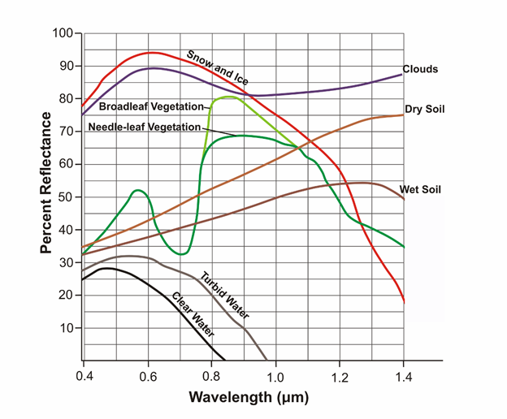
```

Figure 1: Reflectance characteristics of various features at different wavelengths.

##### Q1. For broadleaf and needle-leaf vegetation, what is the approximate wavelength that is reflected most, and what section of the ems does this range belong to? (1 point) {.unnumbered}

##### Q2. Soil and vegetation reflect roughly the same proportion of blue light. (1 point) {.unnumbered}

##### Q3. Give a wavelength (in microns) at which snow and ice, dry soil, and vegetation are indistinguishable by their reflectance. In other words, at which wavelength is the proportion of radiation reflected the same (+/- 10%) for these features? (1 point) {.unnumbered}

##### Q4. Broadleaf and needle leaf vegetation reflect the same amount at 0.7 microns. What causes this? Is there something contained in the foliage of both types of vegetation which causes identical spectral signatures? How does this pattern in spectral reflectance affect how we see live vegetation? (4 points) {.unnumbered}

```{r 04-em2, out.width= "60%", echo = FALSE}
    knitr::include_graphics("images/04-em2.png")
```

Figure 2: Reflectance characteristics of unknown features.

##### Q5. Figure 2 contains 4 additional spectra, belonging to unknown surface features. Hypothesize about what these spectra might be and provide your reasoning. Use the known features (broadleaf vegetation, wet soil, etc.) and what you have learned from class/readings to inform your choices. This is a difficult task, and educated guesses are all that is asked for. Do a bit of research, put some thought into it, and explain the reasoning for your guesses. These spectra do not represent the features which are already labeled. You must think of new features which could be observed with remote sensing. (4 points) {.unnumbered}

------------------------------------------------------------------------

## Task 2: Landsat 5 Bands, the EMS & ArcPro Software {.unnumbered}

Table 2: Parameters of Landsat 5’s Enhanced Thematic Mapper (ETM+) sensor

```{r echo = FALSE}
Band = 1:7
wl = c('0.45-0.52', '0.52-0.60', '0.63-0.69', '0.76-0.90', '1.55-1.75', '10.40-12.50', '2.08-2.35')
sp = c('Blue', 'Green', 'Red', 'Near Infrared', 'Middle Infrared', 'Thermal Infrared', 'Middle Infrared')
r = c(30, 0, 30 ,3 ,30 ,60, 30)
app = c('Coastal water mapping, differentiation of vegetation and soils.', 'Assessment of vegetation vigor.', 'Chlorophyll absorption for vegetation differentiation.', 'Biomass surveys and delineation of water bodies', 'Vegetation and soil moisture measurements. Differentiation of ice and clouds.', 'Thermal mapping, soil moisture studies, plant heat stress measurement', 'Hydrothermal mapping')

df = data.frame(Band, wl, sp, r, app)
colnames(df) <- c('Band', 'Wavelength Range (microns)', 'Spectral Region', 'Spatial Resolution (meters)', 'Applications')

library(knitr)
kable(df, align = 'c')

```
 
##### Q6. Each pixel of landsat’s thermal infrared band (band 6) covers ___ pixels of the other bands. If it helps, draw a picture of the two pixel resolutions. (1 point) {.unnumbered}

##### Q7. Band 6 is recorded with a coarser resolution because thermal radiation has a very ___ wavelength. Therefore, there is ___ energy available to sense. (1 point) {.unnumbered}

**Step 1:** Start ArcGIS Pro.

To start the lab, Open a new ArcPro map project and open the the L5047026subset_19990922_7B.dat  file into the map window. At this point, you should see an RGB satellite image of the city of Vancouver (Figure 3) if the mapview does not immediately pan to the image right click "L5047026subset_19990922_7B.dat" in the Contents pane and press Zoom to Layer.  

```{r 04-sat, out.width= "75%", echo = FALSE}
    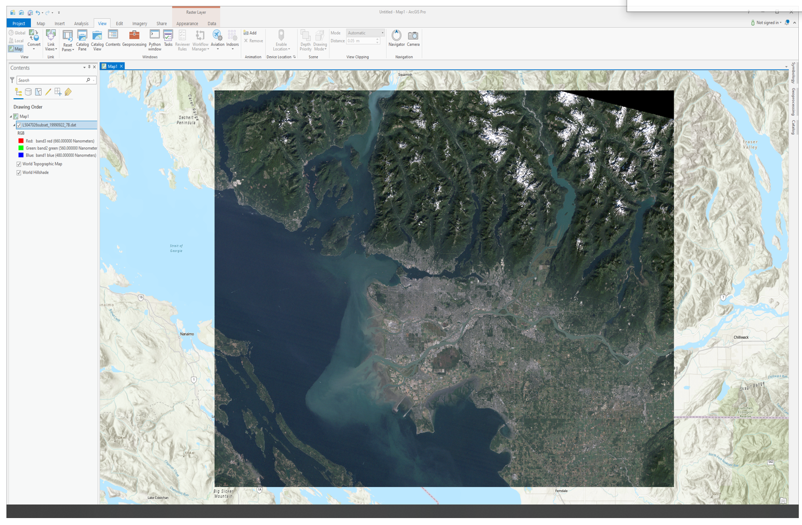
```

Figure 3: True colour composite of Vancouver. 

**Step 2:** Exploring the data

It is now time to explore your imagery. Right click the box beside the "L5047026subset_19990922_7B.dat"  file in the Contents pane and select "Properties". Use the menu on the left-hand side and select the Source page and the Raster Information drop down. 

```{r 04-source, out.width= "75%", echo = FALSE}
    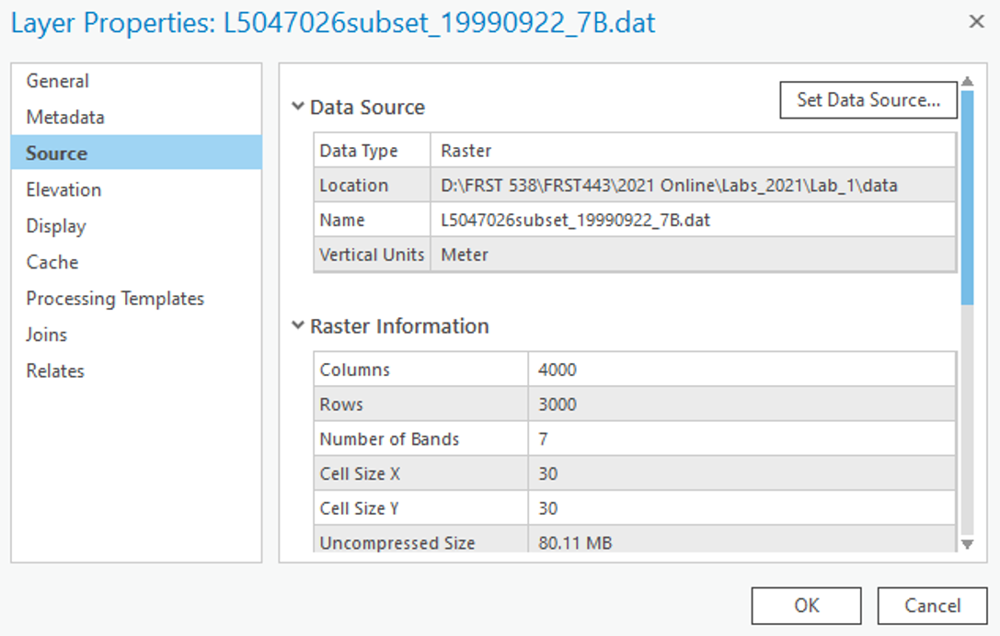
```

After clicking on the Raster Information, the tab should open up, and display important information about the image, such as dimensions (number of pixels in the X or Y directions), data types, projection, and resolution (listed as Projection/Pixel). This information can be useful when examining an image!

From the "Raster Information" you can see that the spatial resolution of this image is approximately 30 m by 30 m, square. That means that each pixel in the image represents an area of approximately 30 x 30 m on the ground, or 900 square meters. Furthermore, it is a Landsat 5 Thematic Mapper image of Vancouver and its surroundings taken at 22 September 1999 - Wow! Even more details are apparent – its size is 4000 by 3000 pixels, and has seven bands.

Scroll down and press on the "Spatial Reference" to see the projection information.

We will now use ArcGIS pro to zoom and pan our image. 

Navigate to the "Map" tab in the top ribbon and hover you mouse of the "Explore" tool:

```{r 04-explore, out.width= "75%", echo = FALSE}
    knitr::include_graphics("images/04-explore.png")
```

Use these controls to zoom in and out of the image and to pan around, try to zoom into the Fraser estuary and navigate upriver. Included in the Navigate pane there are also the fixed zoom tools the previous extent arrows and the small globe which will zoom to the full extent of your data. 

**Step 3:** Displaying Greyscale, True Colour, & False Colour Imagery.

Traditionally, single bands of imagery are shown in greyscale, with dark areas shown in black, and light areas shown in white, with anything else shown in shades of grey. Think of each pixel representing a number between 0-255 (byte data type range, the same one of this very imagery!), with areas colored pure black representing the number 0, and areas colored pure white representing the number 255, and everything else is a shade of grey increasing in lightness from 1-254. The figure below displays this concept. 

```{r 04-grey, out.width= "75%", echo = FALSE}
    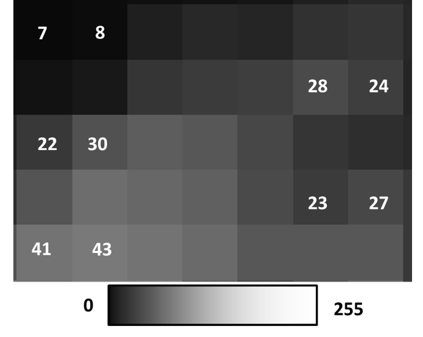
```

Right click on you data in the Contents pane and select "Symbology". The symbology pane should appear on the side of you window. Press the drop down menu and select "Stretch".

```{r 04-strech, out.width= "75%", echo = FALSE}
    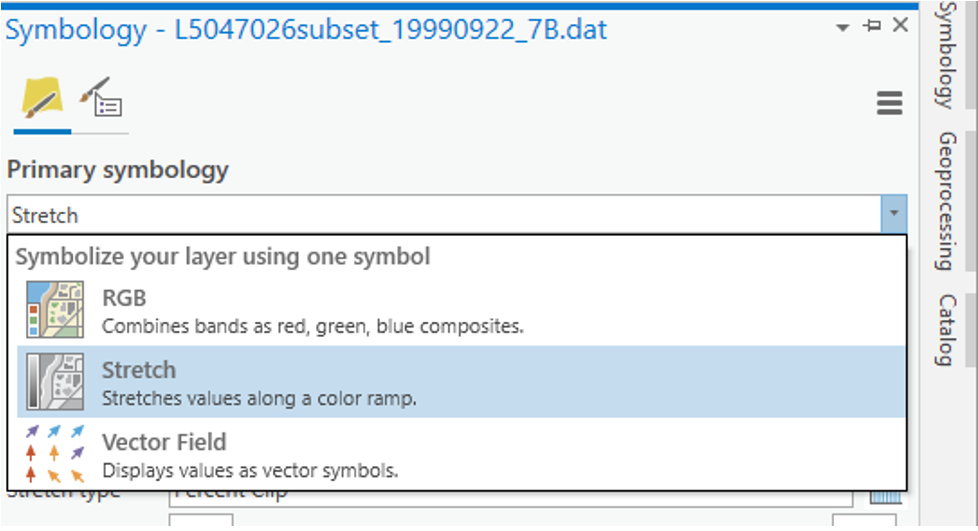
```

In the next dropdown menu labeled "Band" select "Band 4 NIR" you should see the same image as below. 

```{r 04-gorge, out.width= "75%", echo = FALSE}
    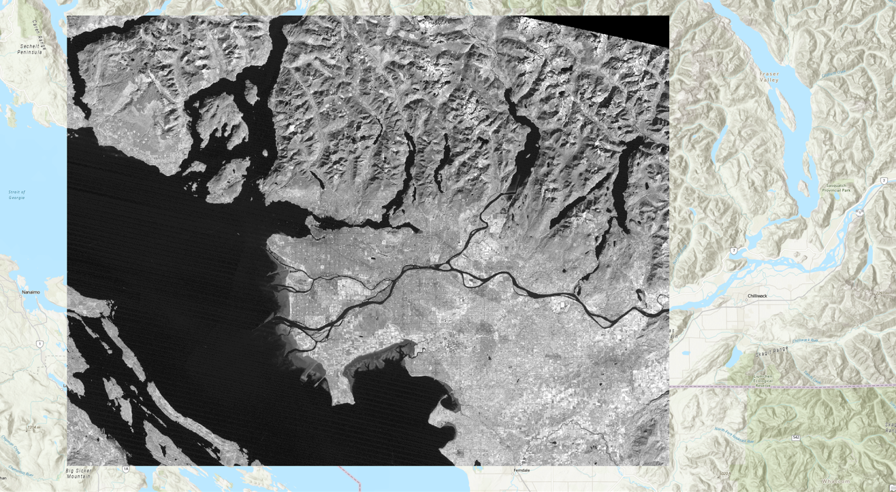
```

You have now displayed a single band of greyscale imagery. Pixels that are bright/light/white have high amounts of light being reflected back to the sensor in this section of the EMS. Pixels that are dark/black have high amounts of absorption in this section of the EMS. Behind the shades of grey are actual numeric values indicating how much reflected light the sensor detected (from 0-255), that indicate what shade of black/grey/white should be shown. This is a critical component to understand about remote sensing data sets.

When more than 1 spectral band is available for a given image (like the Landsat data provided), colours can be used for visualization. Computer monitors display visible light as combinations of red, green, and blue using the RGB colour model. 

**Remember that the colours we see are also a wavelength in the EMS. e.g. Red – 660 nm, Green – 560 nm, Blue – 480 nm**

In a true colour image, the computer display visualizes objects the way we see them in real life. In other words, in a true colour image, Landsat band 1 (Blue – 480 nm) is displayed as blue, band 2 (Green – 560 nm) is displayed as green, and band 3 (Red – 660 nm) is displayed as red.

Any combination where this is not the case is a false color composite, where the colours chosen to visualize the data are not true to life, i.e. Landsat band 1 (Blue – 480 nm) is displayed as red, band 2 (Green – 560 nm) is displayed as blue, and band 3 (Red – 660 nm) is displayed as green. Visualizing wavelengths outside of the visible spectrum (Landsat bands 4-7) automatically apply as false colour composites. False colour composites are necessary because many remote sensing devices can measure a broader range of wavelengths than humans can see. As a result, in order to display these data visually for humans, they must be displayed using a part of the spectrum that humans can see (Red, Green, Blue). 

In the Symbology pane navigate back to "RGB" in the first dropdown list. Your image should change back into a True Colour Landsat image where band3 red is visualised as red, band 2 green is visualised as green and band1 blue is visualised as blue. 

```{r 04-sat2, out.width= "75%", echo = FALSE}
    
```

By displaying false colour composites it is possible to display many band combinations of the image on our screen. This time you will create a false colour composite by selecting different wavelengths (bands) to be visualized using red, green and blue colours.

In the Symbology pane under their respective drop done lists visualize the following band combination. 

Band 4 using Red
Band 2 using Green 
Band 7 using Blue
You should see the following:

```{r 04-fc1, out.width= "75%", echo = FALSE}
    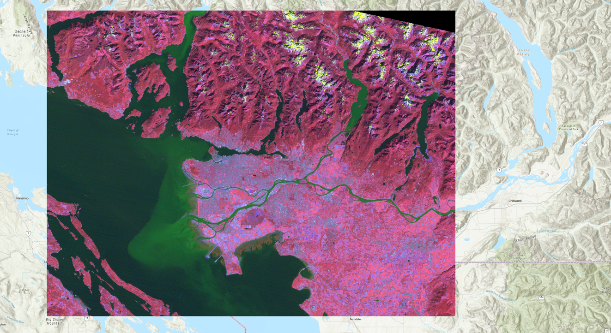
```

You can experiment with different band combinations by visualizing different bands using Red, Green and Blue. A standard false colour composite, for instance, has Band 4 visualized using Red, Band 3 visualized using Green and Band 2 visualized using Blue, as shown below:

```{r 04-fc2, out.width= "75%", echo = FALSE}
    
```

Right click the bands in the Contents pane, turn different layers on and off by clicking the check mark off and on in the IsVisible section. Zoom and pan around and investigate different areas of Vancouver that you may know. Feel free to use google maps or google earth to help you orient yourself. 

##### Q8. In a false color composite where near landsat band 5 is mapped to the red color channel, band 4 is mapped to the green color channel, and band 3 is mapped to the blue color channel, match the following cover types to the colors that they appear in the image: healthy vegetation, urban cover, silty water, and clear water. (4 points) {.unnumbered}

##### Q9. Experiment with many different false colour composites. Which 3 bands would you combine if you wanted to analyze vegetation? Do some light research on spectral properties and the applications of different landsat bands and write a sentence or two justifying each of your choices. Then, append a screenshot of your chosen composite to your response. (10 points) {.unnumbered}

##### Q10. Experiment with many different false colour composites. Which 3 bands would you combine if you wanted to analyze water quality? Do some light research on spectral properties and the applications of different landsat bands and write a sentence or two justifying each of your choices. Then, append a screenshot of your chosen composite to your response. (10 points) {.unnumbered}

##### Q11. Experiment with many different false colour composites. Which 3 bands would you combine if you wanted to analyze agriculture? Do some light research on spectral properties and the applications of different landsat bands and write a sentence or two justifying each of your choices. Then, append a screenshot of your chosen composite to your response. (10 points) {.unnumbered}

##### Q12. Experiment with many different false colour composites. Which 3 bands would you combine if you wanted to analyze urban areas? Do some light research on spectral properties and the applications of different landsat bands and write a sentence or two justifying each of your choices. Then, append a screenshot of your chosen composite to your response. (10 points) {.unnumbered}

**Step 4: Viewing Spectral Signatures**

Now it is time to examine your data set more thoroughly. At the beginning of this lecture we examined the spectral signatures of different materials. We will now do the same thing for the different sections of our Vancouver Landsat image. 

Right click on the "L5047026subset_19990922_7B.dat" file in the Contents pane and select Create Chart -> Spectral Profile. The Chart Properties pane should appear on the right side of your screen and the spectral chart on the bottom.

```{r 04-chart, out.width= "75%", echo = FALSE}
    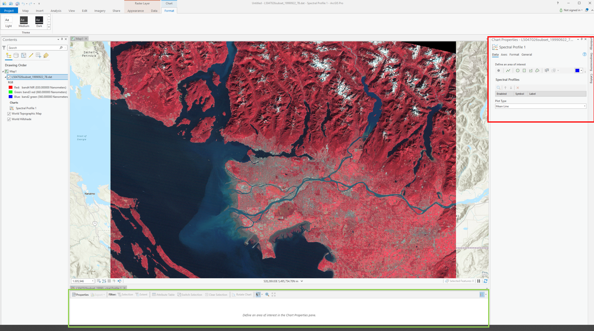
```

In the Chart properties pane under "Define an Area of Interest" select "point" and then click a pixel on your map. Change the colour and select a variety of different points representing different land cover types (Urban, forest, water, crops, snow). 

```{r 04-points, out.width= "75%", echo = FALSE}
    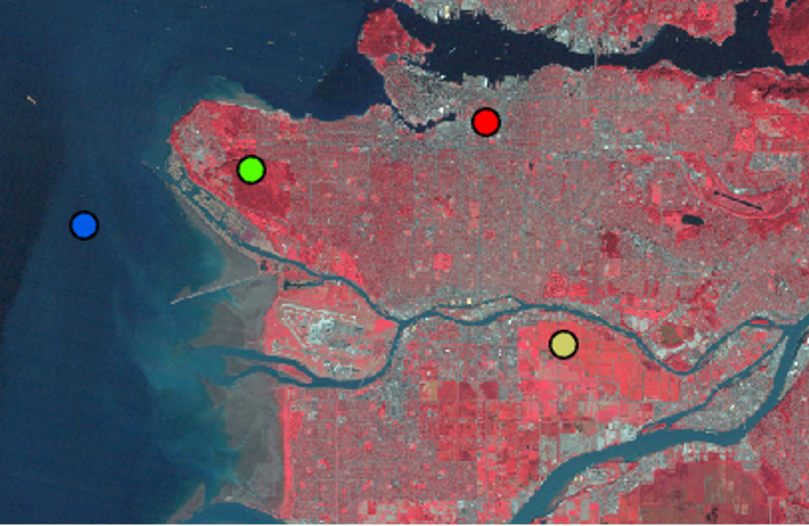
```

You might have to resize the spectral chart at the bottom of your screen in order to see the different profiles. Your chart should look something like this.

```{r 04-spectral, out.width= "75%", echo = FALSE}
    knitr::include_graphics("images/04-spectral.png")
```

##### Q13. Examine your new spectral profile chart, compare the different profiles you created to the spectral profiles in figures 1 and 2. What is different between them? Why might your spectral curves look different than the ones above? (4 points) {.unnumbered}

##### Screenshot 1. Upload a screenshot of your spectral plot. (2 points) {.unnumbered}

------------------------------------------------------------------------

## Task 3: Calculating NDVI and Built Up Index  {.unnumbered}

Spectral indices are mathematical equations containing spectral reflectance values from two or more wavelengths used to highlight areas of spectral importance in an image. There are a wide variety of spectral indices used to highlight a variety of different land covers and image properties including burned Areas (Normalized Burn Ratio), urban/ built up areas (Normalized Difference Built-Up Index), and water (Normalized Difference Water Index) to name a few. The Normalized Difference Vegetation Index (NDVI) is a frequently used spectral index that takes advantage of the high near-infrared reflectance and high red absorption properties of healthy vegetation and is therefore often used to quantify vegetation in a remotely sensed multispectral image. 

NDVI is calculated with the below formula: 

$\ NDVI = \frac{(NIR - RED)}{(NIR+RED)}$

Where NIR is the near-infrared band (Landsat 5 Band 4) and Red is the red band (Landsat 5 Band 3). The results of this equation should be between -1 and 1 with values less than 0 representing water and values between 0-1 representing different levels of green vegetation. 

While ArcGIS Pro contains a built-in tool to calculate NDVI and a series of other spectral indices, in this lab we will be using the "band arithmetic" function and the above equation to create our own NDVI tool. 

Navigate to the Imagery ribbon at the top of your ArcPro window and click the "Raster Function" button.

```{r 04-raster, out.width= "40%", echo = FALSE}
    knitr::include_graphics("images/04-raster.png")
```

The Raster Functions pane should appear, you can either navigate the drop down menus to "Math", "Band Arithmetic" or use the search function to find the "Band Arithmetic Tool" and click to open. 

```{r 04-raster-func, out.width= "75%", echo = FALSE}
    knitr::include_graphics("images/04-raster-func.png")
```

The "Band Arithmetic Properties" dialogue should appear. Under "Raster" use the drop down menu and select the "L5047026subset_19990922_7B.dat" layer. If it is not currently in your map view and can use the folder button and navigate to  your lab data folder and select the file. Under "Method" select "User Defined". It should look like the screen shot below. 

```{r 04-band-math, out.width= "75%", echo = FALSE}
    knitr::include_graphics("images/04-band-math.png")
```

Use your knowledge of spectral indices, the NDVI formula given above and the table below fill in the NDVI calculation for your data. 

##### Screenshot 2. Upload a screenshot of you band arithmetic equation for NDVI. (2 points) {.unnumbered}

##### Q14. What are the minimum and maximum values of your new NDVI layer? (2 points) {.unnumbered}

##### Q15. What do the dark areas in the image represent? The gray areas? The white? (4 points) {.unnumbered}

##### Q16. What information does this type of analysis give us? When and why might this type of analysis be used? (4 points) {.unnumbered}

We will now use the "Band Arithmetic" window to calculate the Normalized Difference Built-Up Index (NDBI). The NDBI highlights urban areas where there is typically a higher reflectance in the shortwave-infrared region compared to the near-infrared region. The equation is as follows: 

$\ NDBI = \frac{(SWIR-NIR)}{(SWIR+NIR)}$

Open the "Band Arithmetic" function and select the Landsat scene as your input raster. Under "Method" use the drop-down menu and navigate to NDBI. Using what you know about Landsat imagery select the proper bands for calculating NDBI under the "Band Indexes" box and then select "Create New Layer". 

------------------------------------------------------------------------

## Task 4: Reclassifying Spectral Indices and Map Making  {.unnumbered}

In the section you will use a technique called Thresholding and the reclassify tool to extract highly vegetated areas (High NDVI) and urban areas (High NDBI) and then create a map with these layers overlaid with the provided satellite imagery. 

Under the "Analysis" ribbon select the "Tools" option. The geoprocessing window should appear in the search box type "Reclassify" and select the option with (Spatial Analyst Tools) beside it. 

```{r 04-reclass, out.width= "75%", echo = FALSE}
    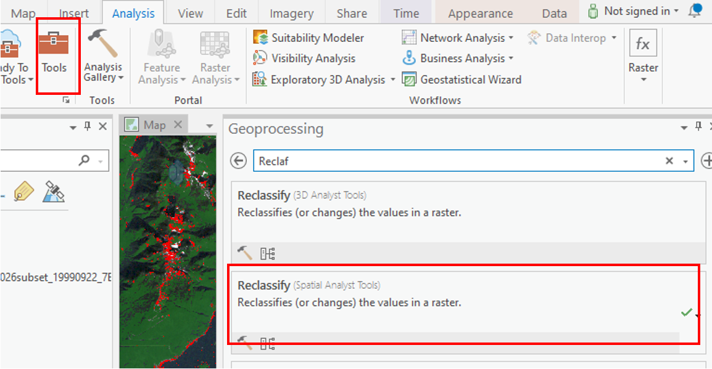
```

Under "Input Raster" select the NDVI layer you created earlier. The "Reclass field" should automatically become completed and a "Reclassification" table should appear below. 

```{r 04-class-tab, out.width= "75%", echo = FALSE}
    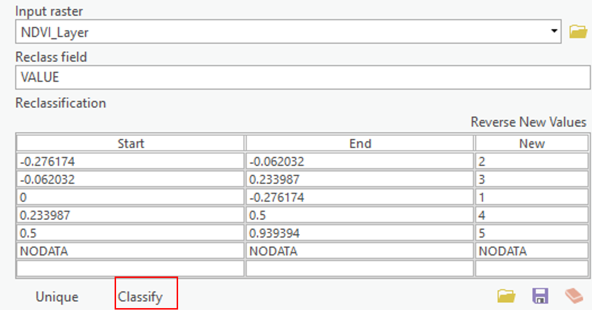
```

Select the Classify button at the bottom of the table and enter "2" for number of classes. For the first row leave "Start" as is and enter 0.49999 under "End", change "New" to "NODATA". For the second row change "Start" to "0.5" and leave "End" as 1 and change "New" to "1".  The Reclassify tool takes the old values from a raster and creates a new raster layer with updated values based on the Reclassification table. In this case we as saying take all pixels with values less than 0.5 and make them NODATA or blank and take all pixels with values greater than 0.5 and make their value 1. Under "Output Raster" save the file as "High_Vegetation_Areas" and press "Run" at the bottom of the window. 

Now use the Reclassify tool to create a new layer from the NDBI where all you keep only pixels with values above 0 and change there value to 1. Save this layer as "Urban Areas".

##### Map 1. Upload a map that shows your High_Vegetation_Areas and Urban_area layers overtop of the provided Landsat Imagery. Pick appropriate colours and transparency for each layer. (25 points)

------------------------------------------------------------------------

## Summary {.unnumbered}

In this lab, you learned how to interpret the electromagnetic spectrum for urban and environmental applications, connect spectral behavior to what you see in imagery, and operationalize those ideas in ArcGIS Pro. You explored Landsat 5 bands, toggled single-band greyscale views, and built both true- and false-colour composites to emphasize specific surface properties. You examined spectral signatures for different land covers and compared them to reference curves to understand why materials separate (or don’t) across wavelengths. You then calculated NDVI to highlight vegetation and NDBI to highlight built-up areas, and reclassified these indices to extract high-confidence classes. Finally, you synthesized your results into a clear map that overlays vegetation and urban masks on the base imagery. By the end, you could differentiate EMS regions, justify band choices for specific analyses, quantify patterns with indices, and communicate findings cartographically.

Return to the [**Deliverables**](#lab4-deliverables) section to check off everything you need to submit for credit in the course management system.