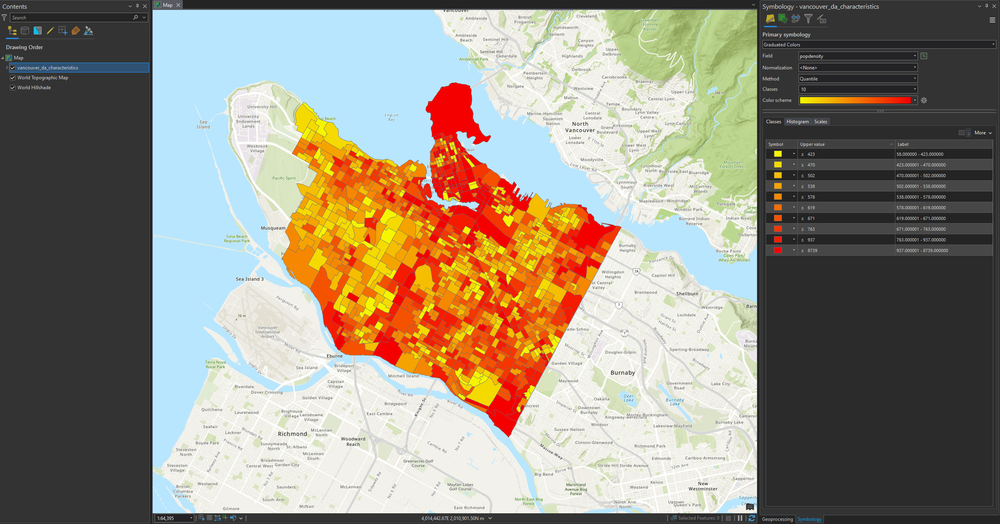
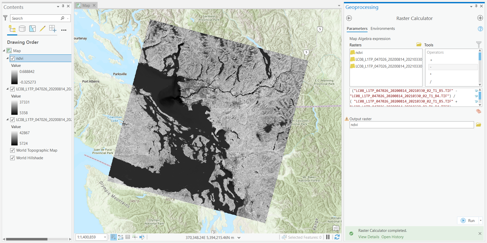
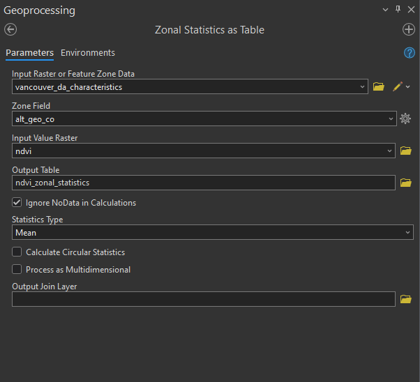

```{r echo=FALSE}
yml_content <- yaml::read_yaml("chapterauthors.yml")
author <- yml_content[["geographically-weighted-analysis"]][["author"]]
```

# Analyzing Green Equity Using Geographically Weighted Regression {#geographically-weighted-regression}

Written by
```{r results='asis', echo=FALSE}
cat(author)
```

## Lab Overview {.unnumbered}

In this lab, you will be exploring a two different statistical approaches to modelling geographic data, ordinary least squares regression (OLS) and geographically weighted regression (GWR).

Traditional regression analysis assumes that global statistics adequately describe local relationships that might exist in the data. For example, consider looking at the relationship between housing prices and the floor space of houses in the city of Vancouver. While we could develop a 'global' model that adequately describes the relationship between those variables, knowing whether a house is on the east or west side of Vancouver can dramatically impact the price. (e.g., that a house of similar dimensions, in the east side of Vancouver will sell for hundreds of thousands of dollars less than an identical house in the west), the utility of such a model when looking at neighborhood-level housing issues would be very doubtful. Nonetheless, for decades such models, such as hedonic models, have been normalized in real estate research.

Similarly, consider studying the relationship between rates of crime or diseases to environmental conditions, local conditions can be much more important than any global relationship. GWR is the spatial extension of aspatial regression analysis and allows us to model these local relationships. Using polygon or point data, GWR allows us to explore the local relationships amongst a set of variables and examine the results spatially using ArcGIS Pro. 

In this lab, you will explore the equity of green space for the city of Vancouver using Landsat imagery and demographic data from the 2021 Canadian census.

Why is access to green spaces so important? Human well-being, including physical and psychological well-being increase when residents are exposed to green space and urban forests. In addition, ecosystem services provided from green spaces include improved air quality, urban heat island mitigation, and opportunities for recreation. Yet, there is unequal access to green spaces across urban landscapes. The distribution of green space is often disproportionately present in affluent communities. So, you will test the hypothesis that there is less green space in marginalized communities. We cannot infer any causal relationships, but we can examine the relationship between the location of green spaces and demographic variables.

------------------------------------------------------------------------

## Learning Objectives {.unnumbered}

-   Calculate a vegetation index from Landsat imagery and report summary statistics over census dissemination areas

-   Interpret charts and statistics of ordinary least squares and geographically weighted regression

-   Map geographically weighted regression results and interpret and defend your conclusions

------------------------------------------------------------------------

## Deliverables {#lab4-deliverables .unnumbered}

Lab report with the following specification:

<input type="checkbox" unchecked> 6 pages maximum PDF including figures, tables and references. Single-spaced, 12-point Times New Roman font. Writing is clear and concise and the report is organized.

<input type="checkbox" unchecked> Results should address the following questions and requirements (55 points):</input>

-   A table with the ordinary least squares and geographically weighted regression results for the models. Include both R^2^ and AIC.

-   Maps illustrating standardized residuals, local R^2^and one model coefficient for the GWR model.

-   Provided rationale for 5 variable choices: (2 points each) Describe why you picked each of the 5 independent variables

-   Describe how to interpret standardized residuals, R^2^ and AIC. Which model had better performance, OLS or GWR? Use the table of summary statistics and maps of the standardized residuals to support your answer.

-   Describe the qualities of the census data and the Landsat image. Where did the data come from? How was it collected? What is the spatial resolution and date of acquisition for the Landsat image?

-   Interpret one of your independent variables in the GWR using the Std.Error and Coefficient map. What spatial patterns do you see? What do you think could be influencing this relationship?

<input type="checkbox" unchecked> Discussion should address the following questions and requirements (35 points):</input>

-   What other factors (spatial or aspatial) might be contributing or confounding your analysis? In other words, what other data sources might you add/calculate or what methods might you change to improve your results?

-   What can you conclude about green equity among dissemination areas in Vancouver?

-   What are your final recommendations to city council about green equity in Vancouver?

------------------------------------------------------------------------

## Data {#lab4-data .unnumbered}

All data for this lab are accessible from the course management system. The data provided on the course management system are a subset of the following public datasets:

Statistics Canada. 2022. Census Profile. 2021 Census. Statistics Canada Catalogue no. 98-316-X2021001. Ottawa. Released December 15, 2022. <https://www12.statcan.gc.ca/census-recensement/2021/dp-pd/prof/index.cfm?Lang=E>

We are using only a small subset of the national 2021 census data set for British Columbia: "Canada, provinces, territories, census divisions (CDs), census subdivisions (CSDs) and dissemination areas (DAs) - British Columbia only" (Statistics Canada Catalogue no. 98-401-X2021006).

The Statistics Canada 2021 spatial boundary files are maintained separately and available for download from here: <https://www12.statcan.gc.ca/census-recensement/2021/geo/sip-pis/boundary-limites/index2021-eng.cfm?year=21>

The spatial data from Statistics Canada that we will be using:

| Layer Name    | Description         |
|---------------|---------------------|
| lcsd000b21a_e | Census subdivisions |
| lda_000b21a_e | Dissemination areas |

If you are a student at UBC, these data have already been prepared and loaded into the course management system. The links above are only for reference.

Metadata for the 2021 spatial boundary files can be found here: <https://www150.statcan.gc.ca/n1/pub/92-160-g/92-160-g2021002-eng.htm>

The Dictionary for Census of Population 2021 can be found here: <https://www12.statcan.gc.ca/census-recensement/2021/ref/dict/index-eng.cfm>

------------------------------------------------------------------------

## Task 1: Visualize census data {.unnumbered}

Statistics Canada census data are distributed in tables. These data can be particularly challenging to work with because they span multiple geographical hierarchies (e.g., national, provincial, municipal, etc.), multiple dates (the Canadian census occurs every 5 years), many demographic dimensions (e.g., population, age, education, language, etc.), and there are an enormous amount of enumerated areas.

The smallest geographic unit that census data are enumerated over are known as Dissemination Areas (DA). Statistics Canada gives the definition:

> A dissemination area (DA) is a small, relatively stable geographic unit composed of one or more adjacent dissemination blocks with an average population of 400 to 700 persons based on data from the previous Census of Population Program. It is the smallest standard geographic area for which all census data are disseminated. DAs cover all the territory of Canada.

As of the 2021 Canadian census, there are 57,936 unique Dissemination Areas. Each Dissemination Area is described by 2,631 unique characteristics (total population, age, education, language, etc.). That is a whopping 152 million values for describing Canadians! Lucky for us, we will be working with DAs for Vancouver, British Columbia and only a handful of characteristics.

The census data that you have been provided with for this lab, available from the course management system, are the result of collating the values of some select characteristics from this massive census database for just the dissemination areas that cover the city of Vancouver. The characteristics are summarized in the table below:

| Characteristic                                                                   | Units                        | Name                   |
|-------------------|------------------|------------------|
| Population, 2021                                                                 | Persons                      | population             |
| Population density per square kilometre                                          | Persons per square kilometre | popdensity             |
| Total - Private households by household size - 100% data                         | Families                     | households             |
| Average household size                                                           | Persons                      | hhsize                 |
| Prevalence of low income based on the Low-income measure, after tax (LIM-AT) (%) | \%                           | lowincome              |
| Bachelor's degree or higher                                                      | Persons                      | education              |
| Average age of the population                                                    | Years                        | age                    |
| 0 to 14 years                                                                    | \%                           | children               |
| 65 years and over                                                                | \%                           | seniors                |
| Unemployment rate                                                                | \%                           | unemployment           |
| Median total income in 2020 among recipients (\$)                                | \$                           | medianincome           |
| First official language spoken is neither English nor French                     | Persons                      | neitherenglishorfrench |
| Mother tongue is a non-official language                                         | Persons                      | nonofficiallanguage    |
| Immigrants arriving in 2016-2021                                                 | Persons                      | immigrants             |

**Step 1:** Open a new ArcGIS Pro project and add the **vancouver_da_characteristics.shp** data to your map.

Take note of the coordinate reference system for these data. Why might Statistics Canada distribute data in this projection?

**Step 2:** Open the symbology for the layer and switch "Primary Symbology" from "Single Symbol" to "Graduated colors". Then pick a census characteristic from the drop-down menu for "Field" and play around with the symbology. Repeat this across all the characteristics listed in the table above. 

```{r 06-vancouver-2021-popdensity, out.width= "100%", echo = FALSE}
    
```

As you practice visualizing the various characteristics, make some observations and use your own knowledge about how green space in the city of Vancouver is distributed to develop some hypotheses that describe the relationship between these characteristics and green space. Which of these characteristics do you think will be more important or less important for describing the distribution of green space in Vancouver?

------------------------------------------------------------------------

## Task 2: Calculate NDVI from a Landsat satellite image {.unnumbered}

> The Normalized Difference Vegetation Index (NDVI) is one of the most frequently used spectral indices applied to satellite images. It is a measure of plant productivity that uses the Red and Near-Infrared bands of the image. In this lab you will use NDVI from a Landsat image as a proxy for green space. Higher NDVI within a dissemination area indicates more green space! 

In this task, we are going to calculate the Normalized Difference Vegetation Index (NDVI) of each dissemination area in Vancouver and then select characteristics from the census data that explain the local variation in vegetation greenness, as expressed by NDVI. So the census characteristics are going to be our independent (explanatory) variables $k$ and the mean NDVI is going to be the dependent (response) variable $y_i$ for our geographically weighted regression:

$$
y_i=𝛽_0(u_i,v_i)+\sum_{k}^{}𝛽_𝑘(u_i,v_i) 𝑥_{𝑖𝑘}+ε _𝑖
$$

$𝛽_0(u_i,v_i)$ is the local model intercept at position $(u_i,v_i)$

$𝛽_k(u_i,v_i)$ is the local coefficient (slope) of the $k$-th independent variable (census characteristic) at position $(u_i,v_i)$

$𝑥_{𝑖𝑘}$ is the local $i$-th observation of the $k$-th independent variable (census characteristic)

$ε _𝒊$ is the local error term (residual) for the $i$-th prediction

You have been provided two geotiffs, **LC08_L1TP_047026_20200814_20210330_02_T1_B4.tif** and **LC08_L1TP_047026_20200814_20210330_02_T1_B5.tif**, of Landsat 8 Operational Land Imager (OLI) images representing bands 4 (visible red) and 5 (near-infrared), respectively. These images were acquired on August 14, 2020, which is approximately when the 2021 census data were collected.

**Step 1:** Add the Landsat images to your ArcGIS Pro project. Open the "Raster Calculator" tool and calculate the Normalized Difference Vegetation Index (NDVI) and save the output in your project geodatabase simply as "ndvi":

$$
NDVI=\frac{Band5-Band4}{Band5+Band4}
$$

```{r 06-arcgis-ndvi, out.width= "100%", echo = FALSE}
    
```

**Step 2:** Now we need to summarize the NDVI values over the dissemination areas. Open the "Zonal Statistics as Table" tool and use "vancouver_da_characteristics" as the "Input raster or feature zone data", select "alt_geo_co" as the "Zone field", use "ndvi" as the "Input value raster", and name the "Output table" as "ndvi_zonal_statistics". Ensure that "Statistics type" is set to "MEAN", leave the other fields as default and run the tool.

```{r 06-arcgis-zonal-statistics, out.width= "50%", echo = FALSE}
    
```

This will produce a table that should look like the image below. The table contains summary statistics of NDVI calculated for each dissemination area. Now we need to join this table to the polygon feature class.

```{r 06-arcgis-zonal-statistics-table, out.width= "75%", echo = FALSE}
    knitr::include_graphics("images/06-arcgis-zonal-statistics-table.png")
```

**Step 3:** Right-click on the "vancouver_da_characteristics" layer in your Contents Pane and select "Joins and Relates", then "Add Join". The "Input Table" is "vancouver_da_characteristics" and the "Join Table" is "ndvi_zonal_statistics". Select the correct keys to join the tables. This is a one-to-one join. Map the output, below is an example of average NDVI.

```{r 06-arcgis-ndvi-mean, out.width= "100%", echo = FALSE}
    knitr::include_graphics("images/06-arcgis-ndvi-mean.png")
```

------------------------------------------------------------------------

## Task 3: Model NDVI using census characteristics {.unnumbered}

### Ordinary Least Square Regression {.unnumbered}

**Step 1:** Examine the list of census characteristics. Choose **5** independent variables that you think could be useful in explaining differences in green space across Vancouver. Consider socioeconomic relationships between income, housing security and age that might lead to some areas having more greenspace than others. 

**Step 2:** Once you have selected a model, write down the independent variables. Open the "Ordinary Least Squares (OLS)" tool. The "Input Feature Class" is "vancouver_da_characteristics", "Unique ID Field" is "vancouver_da_characteristcs.alt_geo_co", name the "Output Feature Class" as "ols_mean_ndvi", set the "Dependent Variable" to "ndvi_zonal_statistics.MEAN", and then select all of the independent variables that you wrote down from the last step. Run the tool, then click "View Details", select "Messages", and inspect the output. You will need to find this output again and reference it later in your report, so you may want to take a screenshot and save it somewhere.

```{r 06-arcgis-ols, out.width= "50%", echo = FALSE}
    knitr::include_graphics("images/06-arcgis-ols.png")
```

### Geographically Weighted Regression {.unnumbered}

**Step 3:** Open the "Geographically Weighted Regression (GWR)" tool and parameterize it the same as you did in the last step for OLS, but change "Neighborhood Type" to "Number of neighbors", change "Neighborhood Selection Method" to "Golden search", and set "Minimum Number of Neighbors" to 50 and "Maximum Number of Neighbors" to 250. Name the "Output Features" as "gwr_mean_ndvi". Again, select all of the independent variables that you wrote down from earlier then run the tool. The output will automatically be added to your map along with several charts. Doubling-clicking on a chart will open it.

```{r 06-arcgis-variable-chart, out.width= "100%", echo = FALSE}
    knitr::include_graphics("images/06-arcgis-variable-chart.png")
```

**Step 4:** Explore your GWR results and make maps of the following for mean NDVI that you will reference in your report:

- Standardized residuals 
- Local R^2^

**Step 5:** Explore your GWR results and make a map of one "Coefficient" and one "Std.Error" for one of your independent variables. Reference these maps when you are explaining your results in your report.

**Step 6:** Answer the following questions in your report and refer to all the maps, tables, and figures you made in the previous steps:

-   Interpret one of your independent variables in the GWR using the R2 and Coefficient map. What spatial patterns do you see? What do you think could be influencing this relationship?
-   What other factors (spatial or aspatial) might be contributing or confounding your analysis? In other words, what other data sources might you add/calculate or what methods might you change to improve your results?
-   What can you conclude about green equity among dissemination areas in Vancouver? What are your final recommendations to city council about green equity in Vancouver?

------------------------------------------------------------------------

## Summary {.unnumbered}

Geographically weighted regression can be a powerful tool for exploring spatial relationships. It takes some care and practice learning to interpret the many statistics along the journey, but it is one of the statistical methods that is rewarding to map and visualize. You should think of geographically weighted regression as a first approach at looking at a problem. It is great for exploring relationships, but not necessarily testing them. As you have seen, geographically weighted regression is a wonderful way to generate spatial hypotheses about data and explore the underlying tendencies of different relationships. Along the way, you have also learned how to wield high-dimensional census data in a database. Census data pair well with a wide variety of spatial analyses once you have decoded and unlocked their spatial mysteries.

Return to the [**Deliverables**](#lab4-deliverables) section to check off everything you need to submit for credit in the course management system.
