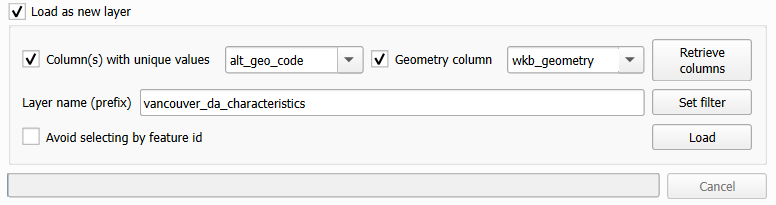

```{r echo=FALSE}
yml_content <- yaml::read_yaml("chapterauthors.yml")
author <- yml_content[["geographically-weighted-regression"]][["author"]]
```

# Analyzing Green Equity Using Geographically Weighted Regression {#geographically-weighted-regression}

Written by
```{r results='asis', echo=FALSE}
cat(author)
```

## Lab Overview {.unnumbered}

In this lab, you will be exploring a few different statistical approaches to modelling geographic data, including geographically weighted regression (GWR). GWR is the spatial extension of aspatial regression analysis and much more. Traditional regression analysis assumes that global statistics adequately describe local relationships that might exist in the data. For example, consider looking at the relationship between housing prices and the floor space, lot size, etc., of houses in the city of Vancouver. While we could develop a 'global' model that adequately describes the relationship between those variables, knowing what you do about housing prices in the city of Vancouver (e.g., that a house of similar dimensions, age, lot size, etc., in the east side of Vancouver will sell for hundreds of thousands of dollars less than an identical house in the west side of Vancouver), the utility of such a model when looking at neighborhood-level housing issues would be very doubtful. Nonetheless, for decades such models, such as hedonic models, have been normalized in real estate research.

Similarly, consider studying the relationship between rates of crime or diseases to environmental conditions, local conditions can be much more important than any global relationship that might be discovered via a traditional aspatial statistical approach. Using polygon or point data, GWR allows us to explore the local relationships amongst a set of variables and examine the results spatially using ArcGIS Pro. It should be noted that in R you can find more sophisticated approaches to GWR than what is provided by ArcGIS Pro.

In this lab, you will explore the equity of green space for the city of Vancouver using Landsat imagery and demographic data from the 2021 Canadian census. 

Why is access to green spaces so important? Human well-being, including physical and psychological well-being increase when residents are exposed to green space and urban forests. In addition, ecosystem services provided from green spaces include improved air quality, urban heat island mitigation, and opportunities for recreation. Yet, there is unequal access to green spaces across urban landscapes. The distribution of green space is often disproportionately present in affluent communities. So, you will test the hypothesis that there is less green space in marginalized communities. We cannot infer any causal relationships, but we can examine the relationship between the location of green spaces and demographic variables.

Vancouver is the most populous city in British Columbia, Canada with a population of 662,248 in 2021. Vancouver is an ideal study site because of the city's high level of heterogeneity among its demographic and green space structure.

------------------------------------------------------------------------

## Learning Objectives {.unnumbered}

-   Apply advanced SQL and PostGIS functions to a relational database to prepare high-dimensional census data for analysis

-   Calculate a vegetation index from Landsat imagery and report summary statistics over census dissemination areas

-   Evaluate different models and defend your model selection

-   Interpret charts and statistics of ordinary least squares and geographically weighted regression

-   Map geographically weighted regression results and interpret and defend your conclusions

------------------------------------------------------------------------

## Deliverables {#lab5-deliverables .unnumbered}

Lab report with the following specification:

<input type="checkbox" unchecked> 6 pages maximum PDF including figures, tables and references (3 points). Single-spaced, 12-point Times New Roman font (1 point). All 

<input type="checkbox" unchecked> Results should address the following questions and requirements (25 points):</input>

-   Describe the qualities of the census data and the Landsat image.

-   How did you evaluate your models and select your final model? Report any relevant statistics that you used in your judgement.

-   Why did you select the 10 characteristics that you choose in Task 3?

-   A table with the ordinary least squares and geographically weighted regression results for the models that used the best subsets of your 10 characteristics.

-   Describe all of the terms, coefficients, and explanatory variables of your selected GWR model.

-   Justify your choice of a final set of independent variables for your GWR model.

-   Compare and contrast the different NDVI statistics. Which statistic had the best model? What evidence do you have for that conclusion? Why do you think that relationship was the strongest?

-   Interpret one of your independent variables in one of your three NDVI statistics using the Std.Error and Coefficient map. What spatial patterns do you see? What do you think could be influencing this relationship?

-   Maps illustrating the standardized residuals and local R^{2} for each of your three different NDVI statistics.

<input type="checkbox" unchecked> Discussion should address the following questions and requirements (20 points):</input>

-   What other factors (spatial or aspatial) might be contributing or confounding your analysis? In other words, what other data sources might you add/calculate or what methods might you change to improve your results?

-   What can you conclude about green equity among dissemnination areas in Vancouver?

-   What are your final recommendations to city council about green equity in Vancouver?

-   Reference to any peer reviewed sources as needed.

------------------------------------------------------------------------

## Data {#lab5-data .unnumbered}

All data for this lab are accessible via the UBC PostgreSQL server. Instructions for connecting to the server are given in the tasks below. We will be using data from the `greenequity` database.

Statistics Canada. 2022. Census Profile. 2021 Census. Statistics Canada Catalogue no. 98-316-X2021001. Ottawa. Released December 15, 2022. <https://www12.statcan.gc.ca/census-recensement/2021/dp-pd/prof/index.cfm?Lang=E>

We are using only a small subset of the national 2021 census data set for British Columbia: "Canada, provinces, territories, census divisions (CDs), census subdivisions (CSDs) and dissemination areas (DAs) - British Columbia only" (Statistics Canada Catalogue no. 98-401-X2021006).

The Statistics Canada 2021 spatial boundary files are maintained separately and available for download from here: <https://www12.statcan.gc.ca/census-recensement/2021/geo/sip-pis/boundary-limites/index2021-eng.cfm?year=21>

The spatial data from Statistics Canada that we will be using:

| Layer Name    | Description         |
|---------------|---------------------|
| lcsd000b21a_e | Census subdivisions |
| lda_000b21a_e | Dissemination areas |

If you are a student at UBC, these data have already been prepared and loaded into the UBC PostgreSQL server, so there is no need to download anything. The links above are only for reference.

Metadata for the 2021 spatial boundary files can be found here: <https://www150.statcan.gc.ca/n1/pub/92-160-g/92-160-g2021002-eng.htm>

The Dictionary for Census of Population 2021 can be found here: <https://www12.statcan.gc.ca/census-recensement/2021/ref/dict/index-eng.cfm>

------------------------------------------------------------------------

## Task 1: Prepare census data {.unnumbered}

Statistics Canada census data are distributed in tables, which are great for working with in a relational database like PostgreSQL. These data can be particularly challenging to work with because they span multiple geographical hierarchies (e.g., national, provincial, municipal, etc.), multiple dates (the Canadian census occurs every 5 years), many demographic dimensions (e.g., population, age, education, language, etc.), and there are an enormous amount of enumerated areas.

The smallest geographic unit that census data are enumerated over are known as Dissemination Areas (DA). Statistics Canada gives the definition:

> A dissemination area (DA) is a small, relatively stable geographic unit composed of one or more adjacent dissemination blocks with an average population of 400 to 700 persons based on data from the previous Census of Population Program. It is the smallest standard geographic area for which all census data are disseminated. DAs cover all the territory of Canada.

As of the 2021 Canadian census, there are 57,936 unique Dissemination Areas. Each Dissemination Area is described by 2,631 unique characteristics (total population, age, education, language, etc.). That is a whopping 152 million values for describing Canadians! Lucky for us, we will be working with DAs for Vancouver, British Columbia and only a handful of characteristics.

To make this a realistic exercise, we will be working with the raw Statistics Canada table for British Columbia and the national set of dissemination areas, which have been loaded into the UBC PostgreSQL server. These data are also publicly available if you want to replicate the lab on your own (see [Data](#data) section)

**Step 1:** Open QGIS and connect to the `greenequity` database on the UBC PostgreSQL server using the credential that you have been provided. You might be tempted to add the layers **lda_000b21a_e** and **lcsd000b21a_e** to your map. You can do this, but it will probably slow down your computer as you are requesting all 57,936 dissemination areas and 5,161 census subdivisions from the server, respectively. Instead, we will use some PostGIS magic to filter on the server side before making our request for only the Vancouver DAs to our QGIS client.

Unfortunately, the only geographical identification attribute that Statistics Canada distributes with the dissemination areas layer (**lda_000b21a_e**) is "PRUID", which limits us to querying on provinces and territories [based on codes](https://www12.statcan.gc.ca/census-recensement/2021/geo/ref/domain-domaine/index2021-eng.cfm?lang=e&id=PRUID). Cities, like Vancouver, are available in the census subdivisions layer (**lcsd000b21a_e**), so we will need to do a simple overlay to extract only the dissemination areas in Vancouver.

**Step 2:** Open the Database Manager in QGIS ("Database" \> "DB Manager"). Expand the "PostGIS" source provider on the left, expand the "greenequity" database, and finally expand the "public" schema. Click the button at the top to open a new SQL window. In the empty query space, paste the following SQL query:

``` sql
WITH vancouver AS (
    SELECT wkb_geometry FROM lcsd000b21a_e  
    WHERE CSDNAME = 'Vancouver'
)
SELECT lda_000b21a_e.wkb_geometry
FROM vancouver, lda_000b21a_e
WHERE ST_Within(lda_000b21a_e.wkb_geometry, vancouver.wkb_geometry);
```

This syntax should look familiar if you have completed the previous PostGIS labs. A common table expression (CTE) is used to get the census subdivision representing Vancouver, which is then used to get all the dissemination areas that represent Vancouver. We are introducing a new [PostGIS function](https://postgis.net/docs/ST_Within.html) here called `ST_Within`, which simply tests if the geometry of `lda_000b21a_e` are completely within the geometry of `vancouver`. Click the "Execute" button and inspect the output on screen. You should see 1,016 rows returned. But in order to join the census data, which are stored separately, we will also need the DAUID and DGUID fields in this output layer.

**Step 3:** Modify the query above so that you return a table that holds the DAUID, DGUID, and the wkb_geometry fields. Once successful, your table should look like the image below.

```{r 05-qgis-query, out.width= "75%", echo = FALSE}
    knitr::include_graphics("images/05-qgis-query.png")
```

If you want, you can toggle on "Load as a new layer", set "Column(s) with unique values" to "dauid", set "Geometry column" to "wkb_geometry", and click the "Load" button to temporarily load the query into your map to inspect it. This is not going to be our final layer yet, as we still need to join the appropriate census data to the geographic features.

**Step 4:** Open the psql shell and connect to the `greenequity` database on the UBC PostgreSQL server using the credential that you have been provided. Use the following query to return the first 20 rows of the "census2021" table:

``` sql
SELECT * FROM census2021 LIMIT 20;
```

Do you notice that the data are oddly formatted? Notably, the first eight columns have repeating information, including the primary key "DGUID"! This data organization is known as **long-format** and is useful when storing highly-dimensional data, and the census data you are working with have 2,631 dimensions!

Think of long-format as a list. Each row represents a new entry that holds a value or several values for a given observation-dimension pair. The advantage here is that if we do not have a value for a particular dimension for a particular observation, then we do not need to record anything, the row does not exist. Another advantage is that most relational database management systems have a limit on the number of columns that can be stored in a single table. For PostgreSQL, that limit is 1,600 columns compared to 255 for Microsoft Access databases, 1,024 for Microsoft SQL Server databases, and 1,000 for Oracle databases, just to name a few. However, there is practically no upper limit to the number of rows that can be stored in any of these databases.

This is a bit odd, because for most data analysis we are accustomed to seeing **wide-format** data where each row represents a unique feature that is described by many dimensions across the columns.

**Step 5:** Use the following query to return a table of population in the first 10 DGUIDs:

``` sql
SELECT alt_geo_code, MAX(c1_count_total) FILTER (WHERE characteristic_id = 1) AS population 
FROM census2021 
GROUP BY alt_geo_code 
LIMIT 10;
```

In this query, we are aggregating and grouping the data values back into our customary wide-format. We use the `MAX` aggregation function, though any other aggregation function would work since for any given dimension-observation there is only one value, so nearly any aggregation function applied to a single value would return that value (e.g., `max`, `min`, `avg`, `sum`). The reason for using the aggregation function at all is because the `FILTER` keyword will only apply aggregation functions to the predicate that follows `(WHERE characteristic_id = 1)`. Finally, `GROUP BY alt_geo_code` ensures that the output table lists the populations for each `alt_geo_code`.

### A word about alt_geo_code {.unnumbered}

The `alt_geo_code` is an identifier for every unique geographic division for census data in Canada. Some codes are shorter or longer than others, and this signifies the level in the geographic division hierarchy. For example, `alt_geo_code = 1` is the code for the entire country of Canada. So the first row you see in the output table from the query you ran above is the total population `characteristic_id = 1` of Canada in 2021. Since the `alt_geo_code` is numeric, it is more flexible to query with than the DGUID, which is alphanumerical. `alt_geo_code = 59` is the code for the province of British Columbia. Remember that the data we are working with is only a subset of the national census representing the province of British Columbia, so there are no other provincial codes represented here. The code structure is pretty easy to follow from here. Every other geographic subdivision in British Columbia will begin with 59 and depending on the level of the hierarchy, will contain a different number of digits:

-   `alt_geo_code = 59` represents British Columbia in the **Provinces and Territories Unique Identifier (PRUID)**

-   `alt_geo_code = 5901` represents the first `01` **Census Division (CD)**

-   `alt_geo_code = 5901003` represents the third `003` **Census Subdivision (CSD)** in the first CD

-   `alt_geo_code = 59010100` represents the 100th `0100` **Dissemination Area (DA)** in the third CSD, in the first CD

Codes with 8 digits are therefore **Dissemination Area Unique Identifiers (DAUID)**, which you should recognize are the values we need to use to join the census data to the actual dissemination area polygons that we just extracted in QGIS.

**Step 6:** We can modify our earlier query slightly to ensure we are only dealing with DAs:

``` sql
SELECT alt_geo_code, MAX(c1_count_total) FILTER (WHERE characteristic_id = 1) AS population 
FROM census2021 
WHERE geo_level = 'Dissemination area' 
GROUP BY alt_geo_code 
LIMIT 10;
```

**Step 7:** Now modify the query above so that it will produce an output table that contains all of the characteristics listed in the table below. Some IDs are given in the table below. For the remainder, you are expected to find the correct ID. You may need to refer to the [readme file](./data/98-401-X2021006_English_meta.txt) that is distributed with the 98-401-X2021006 table in order to identify the correct characteristic_id, which is listed under "Definitions / Footnotes", "Characteristic (2631)", and "Member". The number appearing to the far left of the readme file corresponds to the `characteristic_id` in the database.

| Characteristic_ID | Characteristic                                                                   | Units                        | Name                   |
|------------------|-------------------|------------------|------------------|
|                   | Population, 2021                                                                 | Persons                      | population             |
|                   | Population density per square kilometre                                          | Persons per square kilometre | popdensity             |
|                   | Total - Private households by household size - 100% data                         | Families                     | households             |
|                   | Average household size                                                           | Persons                      | hhsize                 |
| 345               | Prevalence of low income based on the Low-income measure, after tax (LIM-AT) (%) | \%                           | lowincome              |
| 2008              | Bachelor's degree or higher                                                      | Persons                      | education              |
|                   | Average age of the population                                                    | Years                        | age                    |
| 35                | 0 to 14 years                                                                    | \%                           | children               |
| 37                | 65 years and over                                                                | \%                           | seniors                |
|                   | Unemployment rate                                                                | \%                           | unemployment           |
| 113               | Median total income in 2020 among recipients (\$)                                | \$                           | medianincome           |
| 392               | First official language spoken is neither English nor French                     | Persons                      | neitherenglishorfrench |
| 398               | Mother tongue is a non-official language                                         | Persons                      | nonofficiallanguage    |
| 1536              | Immigrants arriving in 2016-2021                                                 | Persons                      | immigrants             |

Your output table should look like the image below:

```{r 05-qgis-query-characteristics, out.width= "100%", echo = FALSE}
    knitr::include_graphics("images/05-qgis-query-characteristics.png")
```

**Step 8:** Finally, we are going to put everything together into a single SQL statement that will query, intersect, aggregate, group, and join the spatial data with the tabular data. Save your SQL query in QGIS Database Manager or copy it and paste it somewhere, then clear the SQL query area and paste the following statement:

``` sql
WITH 

-- Select the alt_geo_code and characteristics we want, aggregate and group them to convert to wide-format

characteristics AS (
  -- Insert your modified query from Step 7 here
),

-- Select the polygon geometry representing Vancouver from the Census Subdivisions (CSD)

vancouver AS (
  SELECT wkb_geometry 
  FROM lcsd000b21a_e 
  WHERE CSDNAME = 'Vancouver'
),

-- Select the Dissemination Areas (DA) that are within the Vancouver CSD

vancouver_da AS (
  SELECT lda_000b21a_e.DAUID, lda_000b21a_e.wkb_geometry
  FROM vancouver, lda_000b21a_e
  WHERE ST_Within(lda_000b21a_e.wkb_geometry, vancouver.wkb_geometry)
)

-- Perform the join of all the characteristics and the Vancouver DA geometries based on the DAUID

SELECT
  characteristics.alt_geo_code,
  characteristics.population,
  characteristics.popdensity,
  characteristics.households,
  characteristics.hhsize,
  characteristics.lowincome,
  characteristics.education,
  characteristics.age,
  characteristics.children,
  characteristics.seniors,
  characteristics.unemployment,
  characteristics.medianincome,
  characteristics.neitherenglishorfrench,
  characteristics.nonofficiallanguage,
  characteristics.immigrants,
  vancouver_da.wkb_geometry
FROM
  characteristics
JOIN
  vancouver_da ON characteristics.alt_geo_code::integer = vancouver_da.DAUID::integer;
```

Be sure to add your modified statement from Step 7 where it is indicated. Then, the statement above should produce the final table we are looking for: a layer of dissemination areas for Vancouver that contain the values for the 14 characteristics we are interested in.

```{r 05-qgis-final-query-load-layer, out.width= "100%", echo = FALSE}
    
```

**Step 9:** When you are satisfied, export the layer to your QGIS map and save it in your project folder (right-click the layer, "Export" \> "Save Features As..."). We suggest exporting as shapefile format to maintain compatibility with ArcGIS Pro.

You may also want to save your SQL statement somewhere, too. You can use it later to recover all of your work from this task at any time from the PostgreSQL server. In QGIS, you can now play around with symbolizing the different characteristics. The image below shows population density $\frac{persons}{km^2}$ of Vancouver dissemination areas in 2021 (projected coordinate system is Lambert Conformal Conic).

```{r 05-qgis-population-density-vancouver-2021, out.width= "75%", echo = FALSE}
    knitr::include_graphics("images/05-qgis-population-density-vancouver-2021.png")
```

**Step 10:** Save your QGIS project.

------------------------------------------------------------------------

## Task 2: Practice geographically weighted regression {.unnumbered}

In this task, we are going to calculate the Normalized Difference Vegetation Index (NDVI) of each dissemination area in Vancouver and then select characteristics from the census data that explain the local variation in vegetation greenness, as expressed by NDVI. So the census characteristics are going to be our independent (explanatory) variables $k$ and the calculated statistics of NDVI are going to be the dependent (response) variable $y_i$ for our geographically weighted regression:

$$
y_i=𝛽_0(u_i,v_i)+\sum_{k}^{}𝛽_𝑘(u_i,v_i) 𝑥_{𝑖𝑘}+ε _𝑖
$$

$𝛽_0(u_i,v_i)$ is the local model intercept at position $(u_i,v_i)$

$𝛽_k(u_i,v_i)$ is the local coefficient (slope) of the $k$-th independent variable (census characteristic) at position $(u_i,v_i)$

$𝑥_{𝑖𝑘}$ is the local $i$-th observation of the $k$-th independent variable (census characteristic)

$ε _𝒊$ is the local error term (residual) for the $i$-th prediction

All of the instructions that follow are written for ArcGIS Pro because we will be performing the geographically weighted regression in ArcGIS Pro. We suggest setting up a new project and copying the "vancouver_da_characteristics" shapefile that you produced in the previous task into that project folder.

**Step 1:** First we will save the Landsat tiles as tifs. Connect to the `greenequity` database on the UBC PostgreSQL server in QGIS. Add two Landsat raster images: **LC08_L1TP_047026_20200814_20210330_02_T1_B4** and **LC08_L1TP_047026_20200814_20210330_02_T1_B5**. You will need to set the CRS of the rasters to UTM Zone 10 (EPSG: 32610) and export to geotif. These images represent bands 4 (red) and 5 (near-infrared), respectively, and were acquired on August 14, 2020, which is approximately when the 2021 census data were collected.

**Step 2:** Now in ArcGIS, open the geotifs you just created. Open the "Raster Calculator" tool and calculate the Normalized Difference Vegetation Index (NDVI) and save the output in your project geodatabase simply as "ndvi":

$$
NDVI=\frac{Band5-Band4}{Band5+Band4}
$$

```{r 05-arcgis-ndvi, out.width= "100%", echo = FALSE}
    knitr::include_graphics("images/05-arcgis-ndvi.png")
```

**Step 3:** Now we need to summarize the NDVI values over the dissemination areas. Open the "Zonal Statistics as Table" tool and use "vancouver_da_characteristics" as the "Input raster or feature zone data", select "alt_geo_co" as the "Zone field", use "ndvi" as the "Input value raster", and name the "Output table" as "ndvi_zonal_statistics". Ensure that "Statistics type" is set to "All", leave the other fields as default and run the tool.

```{r 05-arcgis-zonal-statistics, out.width= "75%", echo = FALSE}
    knitr::include_graphics("images/05-arcgis-zonal-statistics.png")
```

This will produce a table that should look like the image below. The table contains summary statistics of NDVI calculated for each dissemination area. Now we need to join this table to the polygon feature class.

```{r 05-arcgis-zonal-statistics-table, out.width= "75%", echo = FALSE}
    knitr::include_graphics("images/05-arcgis-zonal-statistics-table.png")
```

**Step 4:** Right-click on the "vancouver_da_characteristics" layer in your Contents Pane and select "Joins and Relates", then "Add Join". The "Input Table" is "vancouver_da_characteristics" and the "Join Table" is "ndvi_zonal_statistics". Select the correct keys to join the tables. This is a one-to-one join. Map the output, below is an example of average NDVI.

```{r 05-arcgis-ndvi-mean, out.width= "100%", echo = FALSE}
    knitr::include_graphics("images/05-arcgis-ndvi-mean.png")
```

It is important to initially analyze our census characteristics $k$ to determine which independent variables and combination of these variables have the strongest relationship with our dependent variable, NDVI $y$. To conduct the initial analysis, we will use a tool called "Exploratory Regression", which is part of the Spatial Statistics Toolbox.

**Step 5:** Open the "Exploratory Regression" tool. Select "vancouver_da_characteristics" as your "Input Features" and "ndvi_zonal_statistics.MEAN" as your dependent variable. Select all of the census characteristics as your "Candidate Explanatory Variables", expand "Search Criteria" and change the "Maximum Number of Explanatory Variables" to 14 then run the tool with other fields as default.

```{r 05-arcgis-exploratory-regression, out.width= "50%", echo = FALSE}
    knitr::include_graphics("images/05-arcgis-exploratory-regression.png")
```

*NOTE:* *Some fields were truncated when we saved the "vancouver_da_characteristics" shapefile. It should still be apparent which fields to select, but some of the original names will not perfectly match.*

**Step 6:** When the tool has finished running, click "View Details" at the bottom and then click "Messages". Under the heading "Highest adjusted R-squared results", you can explore the modeled relationship between one or more independent variables and the dependent variable. You should see the adjusted R-squared plateau at 0.41 when using a model with seven independent variables. We can use the statistics like Akaike's Information Criterion (AICc), Jarque-Bera p-value (JB), and Max Variance Inflation Factor (VIF) to choose between similar models with different sets of independent variables. Be sure to copy-paste this output message to a notepad so that you can reference it later in your report.

```{r 05-arcgis-exploratory-regression-results, out.width= "100%", echo = FALSE}
    knitr::include_graphics("images/05-arcgis-exploratory-regression-results.png")
```

**Step 7:** Once you have selected a model, write down the independent variables that are used in the model. Open the "Ordinary Least Squares (OLS)" tool. The "Input Feature Class" is "vancouverda_characteristics", "Unique ID Field" is "vancouver_da_characteristcs.alt_geo_co", name the "Output Feature Class" as "ols_mean_ndvi", set the "Dependent Variable" to "ndvi_zonal_statistics.MEAN", and then select all of the independent variables that you wrote down from the last step. Run the tool, then click "View Details", select "Messages", and copy-paste the output to a notepad to reference it later in your report. 

```{r 05-arcgis-ols, out.width= "50%", echo = FALSE}
    knitr::include_graphics("images/05-arcgis-ols.png")
```

**Step 8:** Open the "Geographically Weighted Regression (GWR)" tool and parameterize it the same as you did in the last step for OLS, but change "Neighborhood Type" to "Number of neighbors", change "Neighborhood Selection Method" to "Golden search", and set "Minimum Number of Neighbors" to 50 and "Maximum Number of Neighbors" to 250. Name the "Output Features" as "gwr_mean_ndvi". Again, select all of the independent variables that you wrote down from earlier then run the tool. The output will automatically be added to your map along with several charts. Doubling-clicking on a chart will open it.

```{r 05-arcgis-variable-chart, out.width= "100%", echo = FALSE}
    knitr::include_graphics("images/05-arcgis-variable-chart.png")
```

**Step 9:** Save you ArcGIS Pro project.

------------------------------------------------------------------------

## Task 3: Analyze your own census characteristics {.unnumbered}

Your final task for this lab is to repeat Steps 8 and 9 of Task 1, but this time, select 10 of your own census characteristics and then perform your own analysis using what you have learned in Task 2. We strongly recommend referring to the readme file and other metadata that are linked in the [**Data section**](#lab5-data) of the lab.

**Step 1:** Select 10 different census characteristics other than the 14 we worked with and repeat Steps 8 and 9 of Task 1. You will be expected to rationalize why you selected these 10 characteristics in your report.

**Step 2:** Run all 10 characteristics through the "Exploratory Regression" tool. Repeat this process with three different NDVI statistics (e.g., mean, max, min, standard deviation, etc.). Record the output message and refer to any statistics here to justify your choice of a final set of independent variables for your regressions.

**Step 3:** Using your selected subset of independent variables, run the "Ordinary Least Squares (OLS)" tool for each of the three dependent variables, NDVI statistics that you chose in Step 2. Record the output message and refer to these statistics when you compare your OLS results to your GWR results.

**Step 4:** Using your selected subset of independent variables, run the "Geographically Weighted Regression (GWR)" tool for each of the three dependent variables, NDVI statistics that you chose in Step 2. Record the output message and refer to these statistics when you compare your GWR results to your OLS results.

**Step 5:** Explore your GWR results and make maps of the following for each of the three different NDVI statistics that you will reference in your report:
- Standardized residuals
- Local R^{2}

**Step 6:** Explore your GWR results and make a map of one "Coefficient" and one "Std.Error" for one of your independent variables. Reference these maps when you are explaining your results in your report.

**Step 7:** Answer the following questions in your report and refer to all the maps, tables, and figures you made in the previous steps:

- Compare and contrast the different NDVI statistics. Which statistic had the best model? What evidence do you have for that conclusion? Why do you think that relationship was the strongest?
- Interpret one of your independent variables in one of your three NDVI statistics using the Std.Error and Coefficient map. What spatial patterns do you see? What do you think could be influencing this relationship?
- What other factors (spatial or aspatial) might be contributing or confounding your analysis? In other words, what other data sources might you add/calculate or what methods might you change to improve your results?
- What can you conclude about green equity among dissemnination areas in Vancouver?

You will be expected to rationalize why you selected these 10 characteristics in your report.

------------------------------------------------------------------------

## Summary {.unnumbered}

Geographically weighted regression can be a powerful tool for exploring spatial relationships. It takes some care and practice learning to interpret the many statistics along the journey, but it is one of the statistical methods that is rewarding to map and visualize. You should think of geographically weighted regression as a first approach at looking at a problem. It is great for exploring relationships, but not necessarily testing them. As you have seen, geographically weighted regression is a wonderful way to generate spatial hypotheses about data and explore the underlying tendencies of different relationships. Along the way, you have also learned how to wield high-dimensional census data in a database. Census data pair well with a wide variety of spatial analyses once you have decoded and unlocked their spatial mysteries.

Return to the [**Deliverables**](#lab5-deliverables) section to check off everything you need to submit for credit in the course management system.