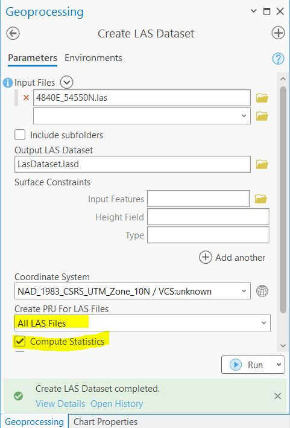
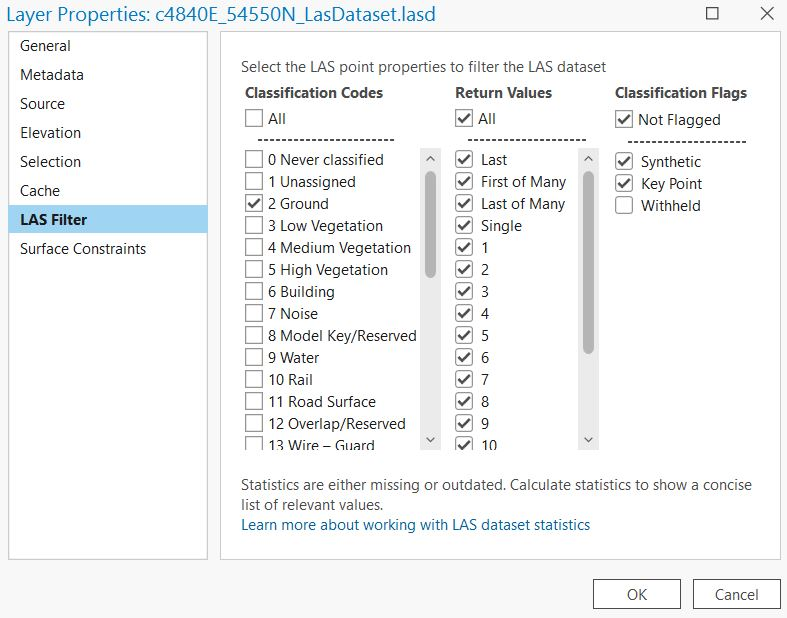
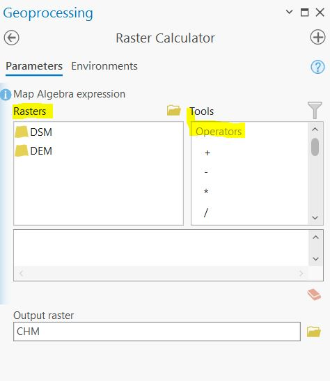
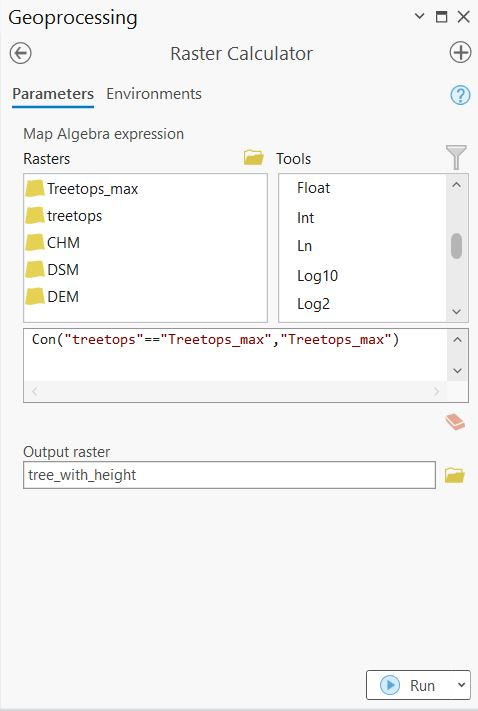

```{r echo=FALSE}
yml_content <- yaml::read_yaml("chapterauthors.yml")
author <- yml_content[["lidar-for-forest-management"]][["author"]]
```
# LiDAR for Forest Management {#lidar-forest-management}

Written by
```{r results='asis', echo=FALSE}
cat(author)
```

## Lab Overview {.unnumbered}

LiDAR, short for Light Detection and Ranging, is a remote sensing technology that uses laser pulses to measure distances and create detailed 3D maps of objects and environments. To map vegetation, LiDAR emits laser beams from an aircraft or ground-based system towards the vegetation canopy. The laser pulses bounce back upon hitting objects, including leaves, branches, and the ground. By measuring the time it takes for the pulses to return, LiDAR calculates the distance to each point, generating a "point cloud" of data. 

"Point clouds" can be used to create high-resolution maps depicting the vertical structure of vegetation, including tree heights, density, and ground cover. These maps are invaluable for understanding ecosystem health, biodiversity, carbon storage, and assisting in land management decisions such as forest monitoring, conservation planning, and urban development.

In this lab you will use high resolution LiDAR data collected by the City of Vancouver to create a model of terrain and vegetation for a forest located on UBC campus.

``` {r, echo=FALSE, fig.align = 'center'}
knitr::include_graphics('images/05-river_pointcloud.png')
```

------------------------------------------------------------------------

### Learning Objectives {.unnumbered}

-   Understand how LiDAR data is collected 
-   Learn how to model terrain and vegetation from a LiDAR point cloud
-   Visualize 3D data in a Scene

------------------------------------------------------------------------

### Deliverables {#lab5-deliverables .unnumbered}

<input type="checkbox" unchecked> Answers to the questions posed throughout the lab. (60 points) </input>

<input type="checkbox" unchecked> Screenshot of your Canopy Height Model (CHM). (15 points)</input>

<input type="checkbox" unchecked> Screenshot of final 3D ArcGIS Pro Scene. (15 points)</input>

------------------------------------------------------------------------

### Data {.unnumbered}

Lidar data collected by the City of Vancouver in .las format

------------------------------------------------------------------------

## Task 1: Load and understand LiDAR data in a Map Project {.unnumbered}

**Step 1**: Download the LiDAR data from the following link: https://opendata.vancouver.ca/explore/dataset/lidar-2018/information/

THe data is split up into a tiled grid system. You will download one tile covering a section of UBC. Use the "Table" view and search for the following tile and download it: "4840E_54550N" by clicking on the .zip link.

Use the metadata from the City of Vancouver data portal to answer the following questions: 

##### Q1. What is the horizontal and vertical datum of the LAS dataset? Why is it important for Lidar data to have both horiziantal AND vertical datums? (10 points) {.unnumbered}

##### Q2. What is the point density of the dataset (points per m^2^)? (4 points)  {.unnumbered}

**Step 2:** Create a new project in ArcGIS Pro.

ArcGIS Pro has several tools that we can use to view and analyse LiDAR point clouds. In order to view the dataset, we need to import it as a LAS Dataset. From the geoprcessing pane, search for the "Create LAS dataset" tool, then parameterize it as follows:

- Input File: 4840E_54550N.las
- Output LAS Dataset: LAS Dataset.lasd
- Coodinate System: Use the horizontal datum from the dataset specifications 
- Create PRJ for LAS Files: All LAS files
- Check the "Compute Statistics' box. 
- Surface Constraints can be left blank

``` {r, echo=FALSE, fig.align = 'center', out.width = "50%"}

```

**Step 3:** Depending on the zoom extent, you may only see the red bounding box of the las file; this isn"t an error, you just need to zoom in to see the actual points.

The points can be classified into the following categories: 

- Ground
- Non-Ground
- 1st Return (highest feature)

The default display is that no point cloud filters are applied. To quickly filter only ground points right click on the file in the Contents Pane, navigate to "LAS Filters", and click "Ground". 

There is also a more detailed classification system, which includes vegetation, water, noise, buildings etc. Right-click on the the file > Properties > LAS Filter. This menu gives you more control for which points you want to display from the dataset.    

``` {r, echo=FALSE, fig.align = 'center', out.width = "50%"}

```

------------------------------------------------------------------------

## Task 2: Create a DEM, DSM and CHM {.unnumbered}

In this task we will create 3 raster datasets by interpolating heights from the point cloud to create continuous surfaces: 

- Digitial Elevation Model (DEM) - sometimes referred to as a Digitial Terrain Model (DTM)
- Digital Surface Model (DSM)
- Canopy Height Model (CHM)

##### Q3. What does a DEM, DSM and CHM represent? How do you interpret the values in each one? (15 points) {.unnumbered}

**Step 1:** First, we will create a DEM from the .lasd point cloud. **Filter the point cloud so that only points labelled '02 Ground' are displayed.** 

Analysis > Tools > Search for "LAS Dataset to Raster". We will use the "Binning" method to interpolate elevation. This method works by dividing the point cloud into cells (pixels) and assigning a value to each cell based on the heights of all the points in the cell. For example, cell values could be assigned as the average height of all points within a 10x10m pixel.  

- Input LAS Dataset: LAS Dataset.lasd
- Output Raster: DEM
- Value Field: Elevation
  - Interpolation Type: Binning
  - Cell Assignment: Average
  - Void Fill Method: Linear
- Output Data Type: Floating Point
- Sampling Type: Cell size
  - Sampling Value: 10 (this defines the resolution of the output raster as 10m)
  - Z factor: 1

##### Q4. What is the minimum value of the DEM? (2 points) {.unnumbered}

##### Q5. What is the maximum value of the DEM? (2 points) {.unnumbered}

You should now have something that looks like this: 

``` {r, echo=FALSE, fig.align = 'center', out.width = "50%"}
knitr::include_graphics('images/05-DEM.jpg')
```

**Step 2:** Next, we will create a DSM. We need to ensure that all point labelled as 'Noise' are filtered out from the dataset, we will also filter out 'Ground' points and just retain points coming from vegetation/infrastructure. Navigate to the LAS Filter menu in the data Properties tab. 

**Uncheck the following codes:**

- 0 Never Classified
- 1 Unassigned
- 2 Ground
- 7 Noise 

Once you have correctly filtered the point cloud open the "LAS Dataset to Raster" tool. This time we will use the "Maximum" value as the Cell Assignment. Name the output raster "DSM". All other settings can stay the same as the DEM. > Run

##### Q6. Why might we want to use the Maximum value as the Cell Assignment method for a DSM? (5 points) {.unnumbered}

##### Q7. What features or land cover types can you idenify from the DSM? (5 points) {.unnumbered} 

**Step 3:** Finally, we will create a CHM using the DEM and DSM. Navigate to Analysis > Tools > Raster Calculator (Image Analyst Tools).This tool allows you to create a new raster by combining multiple rasters using simple mathematical operators (adding, subtracting etc). 

Calculate the CHM as: DSM - DEM

##### Q8. Explain why we need to subtract the DEM from the DSM to calculate canopy height. Describe potential sources of error in deriving a CHM from this method. (10 points) {.unnumbered}

``` {r, echo=FALSE, fig.align = 'center', out.width = "50%"}

```

##### Screenshot 1: Upload a screenshot of your final CHM. Change the default symbology to show unvegetated areas, medium vegetation <30m and tall vegetation >30m. (15 points) {.unnumbered}

------------------------------------------------------------------------

## Task 3: Mapping Tree Tops {.unnumbered}

Using what you learned in the last task, now you will create a point shapefile of treetops using a higher resolution canopy height model. 

**Step 1:** First, we will derive a DSM using points representing High Vegetation. Open the LAS Filter menu and make sure only points labelled "5 High Vegetation" are checked. 

Next, use the "LAS Dataset to Raster" tool to create a raster from the filtered point cloud with the following properties:

- **1m** spatial resolution
- the raster values should represent the highest point in each cell
- name the output "DSM_1m"

**Step 2:** Next, produce a DEM "DEM_1m" at the same spatial resolution of 1m using what you learned in the last task.

**Step 3:** Again following what you learned in the last task, subtract the 1m DEM from the 1m DSM and name the output file **TreeTops**.

##### Q9. What features are now visible in the 1m DSM that were not visible in the 10m DSM? (5 points) {.unnumbered}

**Step 4:** Next we will use the "Focal Statistics" tool to identify the maximum height of tree crowns across the forest. We will use a Circular Neighborhood with a Radius of 5. This will calculate the maximum elevation observed within a 11m circular moving window (5m is the radius, 10m is the diameter, plus one more cell for the focal cell = 11m). Use the following parameters: 

- Input raster: TreeTops
- Output raster: TreeTop_max
- Neighbourhood: Circle
  - Radius: 5
  - Unit type: Cell
- Statistic Type: Maximum
- Ignore no data in calculations: Checked

###### Q10. What is a moving window? If you are using a focal maximum, explain how cell values assigned in the final output. (5 points) {.unnumbered}

**Step 3:** Open the "Raster Calculator" tool. We will use this tool to find the pixels in the "TreeTops" raster that match the maximum focal height in the "TreeTops_max". To do this, we will use a True/False conditional statement using the `Con` syntax: 

`Con(statement, iftrue, if false)` - Essentially for each pixel the statement is evaulated and if it is true an action is taken, and if it is false a different action is taken.

Enter the following statement in the "Raster Calculator" tool:

`Con("TreeTops"=="TreeTops_max", "TreeTops_max")`

Basically, this is a calculation that evaluates the statement "where is the 
"TreeTops" raster equal to the maximum elevation value identified from the focal statistics?" Where these pixels match, write the maximum value to the output. Otherwise, write a value of NoData to the output. Save the output as "tree_with_height".

Refer to the screenshot below for writing this statement correctly.

``` {r, echo=FALSE, fig.align = 'center', out.width = "50%"}

```

Inspect the output. Zooming in reveals what we have done. Pixels that represent the maximum height in each focal window are assigned a value equal to the maximum height, while all other pixels have a NoData value.

``` {r, echo=FALSE, fig.align = 'center'}
knitr::include_graphics("images/05-treetops-raster.jpg")
```

**Step 4:** Open the "Raster to Point" tool. The input raster is the 
raster that you just made. Field is Value, and the output name should be "tree_with_height".

- Input: tree_with_height
- Field: Value
- Output: Final_treetops

##### Q11. How many tree tops are in the final output? (2 points) {.unnumbered}

------------------------------------------------------------------------

## Task 4: Visualization in 3D {.unnumbered}

So far we have worked with the point cloud data in flat, 2-dimensional space. In this task, you will explore the point cloud in 3-dimensions in a Scene.

On the top ribbon "Insert" > "New Map" > "New Local Scene".

**Step 1:** Practice using the On Screen Navigator to manipulate the scene. The first toggle let's you navigate in the normal directions and the second toggle (the person) let's you rotate the scene in 3D. 

``` {r, echo=FALSE, fig.align = 'center', out.width = "20%"}
knitr::include_graphics('images/05-nav1.jpg')
```
``` {r, echo=FALSE, fig.align = 'center', out.width = "20%"}
knitr::include_graphics('images/05-nav2.jpg')
```

**Step 2:** Navigate to the UBC campus study area and change the Basemap to "Imagery" in the Map tab located on the top ribbon. In the Contents pane, right-click Ground, located below the Elevation Surfaces group layer. Click "Add Elevation Source". Browse to the location of your 10m DSM and select it. You can now start to see how the surface features have been incorporated into the surface. Make sure to zoom in to look at areas with high relief and roads. 

Add the "TreeTops_Final" point shapefile to the Scene. 

**Step 3:**  Click on "Ground" underneath the Elevation Surfaces tab. On the top ribbon click 'Elevation Surface Layer. Set the Vertical Exaggeration to 2 - this will increase the contrast between high/low elevation in the scene. Finally, turn off the WorldElevation3D/Terrain3d layer to better see how the DSM. 

##### Screenshot 2: Upload a screenshot of the final Scene. Add the tree tops points to the visualization. (See example below, note that yours will also include the tree tops points). (15 points) {.unnumbered}

##### Q12. Experiment with the 10m and 1m DSM. How does the DSM resolution impact the 3D visualization? Which visualization is more realistic? (5 points) {.unnumbered}

``` {r, echo=FALSE, fig.align = 'center'}
knitr::include_graphics('images/05-example.jpg')
```

------------------------------------------------------------------------

## Summary {.unnumbered}

In this lab, you learned how LiDAR data is collected, structured, and used to model forested landscapes. You explored raw point cloud data in ArcGIS Pro, applied filters to distinguish between ground, vegetation, and other surface features, and generated continuous surfaces including a Digital Elevation Model (DEM), a Digital Surface Model (DSM), and a Canopy Height Model (CHM). By comparing these layers, you practiced interpreting terrain, vegetation structure, and potential sources of error in canopy height estimation.

You then worked at a finer resolution to map tree tops by applying focal statistics and raster-to-point conversion, creating a dataset of individual tree crown positions and heights. Finally, you visualized the forest in 3D using ArcGIS Pro"s Scene tools, experimenting with different resolutions to see how they influence realism and detail. Through these steps, you developed practical skills in working with LiDAR point clouds, learned how to transform raw 3D data into meaningful forest management layers, and gained an understanding of how spatial resolution impacts ecological interpretation.

Return to the [**Deliverables**](#lab5-deliverables) section to check off everything you need to submit for credit in the course management system.