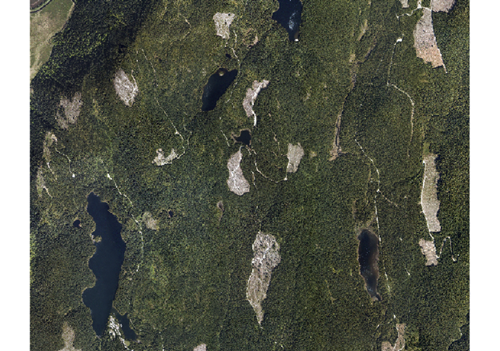

```{r echo=FALSE}
yml_content <- yaml::read_yaml("chapterauthors.yml")
author <- yml_content[["lidar-for-forest-management"]][["author"]]
```

# Lidar for Forest Management {#lidar-for-forest-management}

Written by
```{r results='asis', echo=FALSE}
cat(author)
```

## Lab Overview {.unnumbered}

The aim of this lab is to use LiDAR data from the Malcolm Knapp Research Forest (MKRF) explore a discrete return LiDAR dataset and become familiar with basic functions in the R package lidR and .las data sets. You will create digital terrain models (DTMs), digital surface models (DSM), canopy height models (CHMs) and visualize the point clouds in R.  Additionally, we will explore individual tree detection and examine how LiDAR can be used to model forest attributes.

------------------------------------------------------------------------

## Learning Objectives {.unnumbered}

-   Create a DEM from LiDAR point data in both 2D and 3D
-   Calculate meaningful metrics from points clouds
-   Apply individual tree detection using point and CHM 

------------------------------------------------------------------------

## Deliverables {#lab6-deliverables .unnumbered}

<input type="checkbox" unchecked> Turn in the answers to the questions given in the lab on Canvas.</input>

------------------------------------------------------------------------

## Data {.unnumbered}

We will be working with LiDAR data collected over the Malcolm Knapp Research Forest (MKRF) in Maple Ridge, BC.  There are three files associated with this lab:

- MKRF_Data_Specifications.pdf: A document describing the LiDAR data collection
- LAS folder: The LiDAR data files in  .LAS  format. .LAS is the standard file type for LiDAR data
- MKRF_Aerial_Photo.tif: An orthophoto of our study area, which was collected at the same time as the LiDAR data
- MKRF_lidar: a single lidar file of the MKRF
- Empty folders: you will save your outputs to these folders 
- Variety of CSVs used to create models 
- Lab6_Script.r: A script to process .las files using R and the lidR library. 

------------------------------------------------------------------------

## Software {.unnumbered}

- R/RStudio

For this lab you will need to download R and RStudio. Rstudio is an open source integrated development environment (IDE, think fancy notepad) for the R programing language. It includes a console, syntax editor for code execution and will generally improve your R programing experience. If you need to install [R](https://cran.rstudio.com/) and [R studio](https://posit.co/download/rstudio-desktop/) click the respective links or ask your TA. If you already have them installed on your computer continue to the next section of the lab. 

**Warning:** This lab (and LiDAR processing in general) is computationally demanding. I have reduced the study area and used less rigorous algorithms to speed up processing time. Generally speaking a single line of code should not take longer than 5 minutes to run.  

------------------------------------------------------------------------

## Lab Set up {.unnumbered}

For this lab we will use two R packages: lidR and tidyverse

LidR contains the functions used to process the lidar data, while tidyverse is a generic set of function to help with data wrangling and manipulation. 

To run lines of code within Rstudio you can use **ctrl+enter**. This will run either the highlighted text or the line of code your cursor is on. 

To begin open RStudio and check if the packages are installed 

```{r, echo=TRUE, eval=FALSE}
#Install and/or load packages 

#install.packages("lidR")# Run if not installed 
#install.packages("tidyverse")# Run if not installed

library(lidR)
library(tidyverse)

```

Set your working directory to the folder that contains your Lab 3 data using the setwd() function. Doing so will save you time during file uploading/exporting throughout the lab. If you forget your working directory after it is set, you can type getwd() into the console and R will print it for you.

```{r, echo=TRUE, eval=FALSE}
# This is the only section of the lab you will need to fill out yourself. 
# It should look something like this setwd("C:/Users/Spencer/FRST538/Lab6/Data") but using the path for your computer 
setwd("C:/{file_path}")
```

------------------------------------------------------------------------

## Task 1: Load RGB Imagery {.unnumbered}

When working with any airborne spatial data, it is useful to examine an RGB photo of the study site (MKRF_Aerial_Photo.tif). Take time to locate different land cover features (roads, lakes, streams, etc.) and to understand how vegetation structures are distributed. Is there wall-to-wall forest at the site? Are there any cut-blocks or major roads that could act as reference points during processing? Will the location of water bodies compromise random plot selection?

For this lab, these considerations have already been made. At the very least, you can use the RGB image of Malcolm Knapp Research Forest (MKRF) to gain perspective of our study area. We will use the brick function from the package raster, which was loaded automatically when we loaded lidR. This function creates a RasterBrick object from a multi-layer (or band) file (Figure \@ref(fig:03-rgb-malcolm-knapp)).

You can explore the details of any function that we use in this lab by typing a question mark `?` followed by the function name into the console: `?brick`. The information will appear in the Help pane of your RStudio interface.

Once the RasterBrick has been read into R, we will explore the objects structure using the `str()` function and plot the RGB image using the plot function. 

```{r, echo=TRUE, eval=FALSE}
#Load RGB image and explore structure
rgb_mkrf <- brick('Aerial_Photo/MKRF_Aerial_Photo.tif')
str(rgb_mkrf) 
plotRGB(rgb_mkrf)
```

```{r 03-rgb-malcolm-knapp, out.width= "100%", echo = FALSE, fig.align='center', fig.cap=fig_cap}
    
    fig_cap <- paste0("RGB image of the Malcolm Knapp Research Forest")
```

------------------------------------------------------------------------

## Task 2: Load and Explore the LiDAR Data {.unnumbered}

First, we need to load the file MKRF_lidar.las from your /Data folder. This file contains the lidar data you will need to complete this section of the lab. We will use the function `readLAS` to load the .las file. Once the file is loaded it should appear in your Environment as a ‘Large LAS’. It is best practice to use the function `lascheck` to conduct a deep inspection of a LAS object. This function will print a report for you to examine.

You can explore the structure of objects in your Environment using the `str()` base function in the Console. You can also explore the contents of a single column within the object by typing the objects name followed by a dollar sign and the column name: `object$column`.

_HINT: If you wish to learn the details of any function associated with your loaded packages, you can type a question mark followed by the functions name: `?function_name`_

```{r, echo=TRUE, eval=FALSE}
#Load lidar data
las_mkrf <- readLAS("./MKRF_lidar.las") #read the specified .las file  
las_check(las_mkrf) #check the LAS object
str(las_mkrf) #compactly display the internal structure of las_mkrf
print(las_mkrf)
```

##### Q1: Examine the lascheck output. Is the data normalized? Has a ground classification been completed already? {.unnumbered}

##### Q2: Examine the output of str(). How many first returns are there? What is the maximum z value? {.unnumbered}

##### Q3: Examine the output of print(). What is the density of this data? Is that high, low, or somewhere in the middle? {.unnumbered}

Upon exploring the lascheck output you will notice that there are some duplicated points. This is not a problem for our analyses, but it is worth noting. For example, the statement: There were 6 degenerated ground points. Some X Y coordinates were repeated but with different Z coordinates means that multiple pulses measured the same location and returned different Z, or elevation, coordinates. This could be caused by overlapping flight paths or pre-processing errors, but lidR has the capacity to deal with these issue. Overall, our lidar data looks good. Before moving on let us remove the duplicated points.

```{r, echo=TRUE, eval=FALSE}
#remove duplicated Z (eleavation) points
las_mkrf <- filter_duplicates(las_mkrf) #remove the duplicated points
#confirm duplicates removed
las_check(las_mkrf) #run lascheck a second time to ensure duplicates removed
```

Now that we have a general understanding of our lidar data, it is time to start visualizing! We will explore 2D and 3D plots of our data to gain an even deeper understanding of our study site before undergoing some basic manipulation. 

First, we will visualize the density of lidar points across our site. You will notice that some areas have a higher density than others. This is likely due to the flight path of the aircraft that collected our data and probably causes some of the duplicated points that were highlighted by `lascheck`. Next, we will plot las_mkrf in 3D using the plot function. In lidR, this function can produce plots in 2D or 3D, depending on structure of the input object. LASobjects are plotted in 3D, while Raster objects are 2D.

```{r, echo=TRUE, eval=FALSE}
#Visualize point density 
density_mkrf <- grid_density(las_mkrf, res = 2) #create a map of the point density
plot(density_mkrf) 

#Visualize las_mkrf in 3D 
plot(las_mkrf)
```

Wonderful! We can now explore lidar data in 3D by clicking and scrolling through the RGL plot. Due to the size of the file this exploration may be relatively slow (Figure \@ref(fig:03-rgl-plot)). 

```{r, 03-rgl-plot, out.width= "100%", echo = FALSE, fig.align='center'}
    knitr::include_graphics("images/03-rgl-plot.png")
```

------------------------------------------------------------------------

## Task 3: Read Multiple LAS Files into LAScatolog object  {.unnumbered}

Once you have a basic understanding of the study area, it is time to load your lidar data. The file type used in this course is LAS, which is an industry standard format for storing lidar data. In the future, you may also work with other file formats, such as LAZ. You can explore the differences between these formats [online](https://rapidlasso.de/five-myths-about-las-laz-and-optimized-las/).

In the last task, we loaded a single LAS object  and plotted it. For the remainder of this lab, we will load 20 tiles collected over MKRF into a LAScatalog object. This will enable us to manage and process our entire data set as one object, rather than 20 separate files. We can use lascheck to perform a deep inspection of the LASCatalog object or use `summary()` for a more succinct report.

We can also plot a LAScatalog object to observe how our tiles are arranged. Since the LASCAtalog object is a SpatialPolygonsDataFrame, it is possible to use the `spplot` function to visualize certain characteristics of our data. For example, the line `spplot(cat_mkrf, "Min.Z")` will plot catalog and color each tile based on it’s lowest elevation (Z) value (Figure \@ref(fig:03-rgl-plot)).

```{r, echo=TRUE, eval=FALSE}
#Create LAScatalog object from MKRF las tiles
cat_mkrf <- readLAScatalog("LAS")
las_check(cat_mkrf)
summary(cat_mkrf)
plot(cat_mkrf)
```

Notice that there are overlapping tiles. This indicates that there may be duplicate points within our data. We can confirm this by applying the `lascheck` function to a single tile.

```{r, echo=TRUE, eval=FALSE}
#Examine single .las tile to determine duplication
tile_1_mkrf <- readLAS("LAS/MKRF_Tile1.las")
lascheck(tile_1_mkrf)
```

It appears that there are 421 duplicate points. These may impact both the accuracy of our analysis and the processing speed. Let us remove them using the `filter_duplicates` function and store the filtered tiles in a new folder named ‘Filtered’ (this folder has already been created for you). Once complete, confirm that the duplicates were removed.

```{r, echo=TRUE, eval=FALSE}
#Set the output directory for the filtered .las data
work_dir = getwd() #create a filepath to your working directory
opt_output_files(cat_mkrf) <- paste(work_dir, "/Filtered/filtered_mkrf_{ID}", sep = "")#location to store duplicate points
cat_mkrf <- filter_duplicates(cat_mkrf) #remove duplicate points and speed up processing

#confirm that duplicates were removed for Tile 1
filtered_t1_mkrf <- readLAS("Filtered/filtered_mkrf_1.las") #load from stored file
lascheck(filtered_t1_mkrf)
```

Success! We can now proceed with our analysis. Let us read all filtered LAS data into a catalog and perform the usual checks.

```{r, echo=TRUE, eval=FALSE}
#read filtered .las into LAScatalog
filtered_cat_mkrf <- readLAScatalog("Filtered")
summary(filtered_cat_mkrf)
plot(filtered_cat_mkrf)
spplot(filtered_cat_mkrf, "Min.Z")
```

------------------------------------------------------------------------

## Task 4: Create Digital Elevation Model (DEM) {.unnumbered}

Now that we have practiced some of the basic visualization, reading, and cleaning techniques on raw lidar data it is time to move onto processing. The first thing we will do is create a digital elevation model (DEM). A DEM represents the Earth's surface without vegetation, which we will refer to as "ground". Although this seems like an intuitive statement, there is the potential for logs, rocks and other non-soil objects to be included as ground points. These won't cause issues for our analyses, but it is important to use precise language when working with common words like "ground". Never assume that your definition of something is a global truth. It is also important to consider that a DEM can also be referred to as a digital terrain model (DTM). Take time to understand that both terms refer to a surface model of only ground points. Instructors/colleagues could use DEM and DTM interchangeably.

We will create and visualize a DEM in both 2D and 3D. The 3D version will be created by filtering out all points that are not classified as ground (Classification: 2). For the 2D DEM, we will use the `grid_terrain` function on our LidR catalogue. This function enables the user to select the output resolution and the algorithm that computes spatial interpolation. It is recommended that you take time to understand the three algorithms in highlighted in the `grid_terrain` 'Help' file.

```{r, echo=TRUE, eval=FALSE}
#DEM
#3D
dem_3D_mkrf <- filter_poi(las_mkrf, Classification == 2)
plot(dem_3D_mkrf) #zoom in to notice no trees
plot(las_mkrf) # compare to dem_3dmkrf
#demCatalog
dem_allLAS_mkrf <- grid_terrain(filtered_cat_mkrf, 2, tin()) #why use this method? check warnings: why might points get degenerated DON'T PANIC AT 'WARNING'
# create Colour ramp for visualization 
col_1 <- height.colors(50)
plot(dem_allLAS_mkrf, col = col_1)
```

##### Screenshot 1: Submit the output of this plot() as a screenshot. {.unnumbered}

With the DEM complete we can normalize our LAScatalog. Each tile will be normalized separately, which means there will be one normalized output tile for each input. lidR requires an output directory to be specified. A folder named ‘Normalized’ has already been created for you. Once the output file directory is set we will use `lasnormalize` to conduct the normalization of all our MKRF lidar tiles.

```{r, echo=TRUE, eval=FALSE}
#Normalize catalog with DEM
norm_tiles_mkrf <- lasnormalize(filtered_cat_mkrf, dem_allLAS_mkrf)

#define LAScatalog engine options
opt_output_files(filtered_cat_mkrf) <- paste(work_dir, "/Normalized/norm_mkrf_{ID}", sep = "")

#normalize all tiles in cat_mkrf with the DEM 
norm_tiles_mkrf <- normalize_height(filtered_cat_mkrf, dem_allLAS_mkrf) #check your folder when complete 

#check to see if the normalization worked
norm_mkrf_1 <- readLAS("Normalized/norm_mkrf_1.las")
plot(norm_mkrf_1) 

```

Explore the 3D rgl plot that is produced by the last line in the above code block (Figure \@ref(fig:03-normalized-tile-mkrf)). Does anything look abnormal to you?

```{r 03-normalized-tile-mkrf, out.width= "100%", echo = FALSE, fig.align='center', fig.cap=fig_cap}
    knitr::include_graphics("images/03-normalized-tile-mkrf.png")
    fig_cap <- paste0("Normalized tile 1 from MKRF.")
```

##### Q4: There appears to be an outlying data point located high above the others. Explain why this would cause issues during our processing and an example of what would cause this outlier. {.unnumbered}

------------------------------------------------------------------------

## Task 5: Create a Canopy Height Model {.unnumbered}

We can explore the effect of this outlier by generating a canopy height model (CHM) with the grid_canopy function. Mathematically, a CHM is simply the DEM (or DTM, remember these terms are interchangeable!) subtracted from the DSM. This subtraction can be called 'normalization', differing from the normalization conducted using `lasnormalize` in the sense that the output is 2D. The CHM is an important surface model as it allows us to analyze objects above a common ground value (0m). This 2D output should have a maximum height around that of the highest tree on site (~ 60m).

The `grid_canopy` function is used to generate CHMs, which has three user defined arguments. The first, `las` refers to the input data (LAS or LAScatalog). The second, `res` refers to the spatial resolution. The third argument, `algorithm` specifies the algorithm that will be used to compute the digital surface model. There are three algorithms compatible with grid_canopy:

   `p2r` is a point-to-raster method. It returns the maximum height value of the point cloud for each area, which is defined by the spatial resolution. This is a relatively fast algorithm, but can generate 'pits', or areas of ‘NoData’ in the CHM where there are no returns present. You can add a subcircle argument within the p2r algorithm to try and remove pits. This method replaces each lidar point with a disk of a specified size and increases return coverage. If you use this method, be aware that issues related to computation speed may arise.
   
   `dsmtin` is a triangulation-based method that creates a triangular irregular network (TIN) by interpolating only the first returns before generating a 2D grid. This method eliminates empty pixels, but can still generate pits within crowns as some first returns inevitably reach the ground.
   
  `pitfree` is a triangulation-based method that conducts multiple triangulations at various heights. Developed by Khosravipour et al. (2014), the pitfree algorithm ensure there are no empty cells or deep pits. Shallow pits may remain, but can be removed by adding a subcircle argument. Although the most sophisticated, this algorithm is computationally intense.

Since we know that our lidar data has 3.1 returns · m^-2^, we can assume that a spatial resolution of 2 m will ensure that every cell in our raster contains at least one return. This, along with the advantage of quick processing (~1 min for entire site), allows us to use the stock `p2r` algorithm without worrying about pits. Feel free to use `dsmtin()` (~5 min) or `pitfree()` (~10 min) for the following steps, just ensure you annotate your code accordingly.

```{r, echo=TRUE, eval=FALSE}
#Create CHM for normalized Tile 1
chm_mkrf_1 <- grid_canopy(norm_mkrf_1, 2, p2r()) #las, resolution, algorithm
plot(chm_mkrf_1, col = col_1) #plot in 2D
plot_dtm3d(chm_mkrf_1) #plot in 3D
```

It is clear that the normalization was not perfect as the maximum height of the CHM is well above our expected maximum height. This issue is caused by the outlier visible in the 3D plot. It also looks like there are some points below 0m. To remedy these issues, we can use the LAScatalog options engine to filter out data points below 0 m and above 65 m.

```{r, echo=TRUE, eval=FALSE}
LAScatalog options engine to filter out data points below 0m and above 65m.
#read normalized las into catalog to continue processing
norm_cat_mkrf <- readLAScatalog("Normalized")

#add LAScatalog enginge option to filter undersired data points
opt_filter(norm_cat_mkrf) <- '-drop_z_below 0 -drop_z_above 65'

#ensure the entire study area was processed
plot(norm_cat_mkrf)
summary(norm_cat_mkrf)
```

It seems like all of the normalized LAS files were loaded correctly, but we still need to confirm that the outliers were removed by the filter we applied. To do this we will create another CHM. Instead of making the CHM for Tile 1, we will create a CHM for the entire site.

```{r, echo=TRUE, eval=FALSE}
#Create CHM for all normalized MKRF Tiles
chm_mkrf <- grid_canopy(norm_cat_mkrf, 2, p2r()) 
plot(chm_mkrf, col = col_1) #plot in 2D
#plot_dtm3d(chm_mkrf) #plot in 3D *DON'T RUN IF COMPUTER IS SLOW*
```

Excellent! The heights in our CHM are as expected. If you are interested in exploring how the CHM relates to the RGB image of the area, please compare the two now.

##### Screenshot 2: Include an image of your CHM. {.unnumbered}

##### Q5. What do you think the large empty locations in the CHM represent? {.unnumbered}

------------------------------------------------------------------------

## Task 6: Extract Metrics From the Point Clouds  {.unnumbered}

Now that we have confirmed that our filter works at the catalog level, it is time to extract some plots. First, let us extract a single plot. We use the lasclip function to do this. Specifically, we will use lasclipCircle to extract circular plots from our lidar data. Check out the details of this function in the lidR documentation provided at the start of the lab. We will extract a plot with the following characteristics:

**X = 530118.9**

**Y = 5462882.0**

**Radius = 25**

```{r, echo=TRUE, eval=FALSE}
#Extract single plot
single_plot_mkrf <- clip_circle(norm_cat_mkrf, 530118.9, 5462882.0, 25)
plot(single_plot_mkrf) 

```

Now we will extract multiple plots using a for loop. The location of each plots is provided in the ‘Plot_Table.csv’ within the ‘/Plots’ folder of your lab data. Plot radii should be 30 m. The for loop is annotated for you so you can understand what each line of code is doing.

```{r, echo=TRUE, eval=FALSE}
plot_table <- read_csv("Plots/Plot_Table.csv")
radius <- 30 #the radius for lasclipCircle()
for(i in 1:nrow(plot_table)){ #run the loop until i = the number of rows in 'plot_table' (20)
  plot_cent <- c(plot_table$X[i], plot_table$Y[i]) #extract plot center
  plot_las <- clip_circle(norm_cat_mkrf, plot_cent[1], plot_cent[2], radius) #clip plot from norm_cat_las
  output_file <- paste("Plots/MKRF_Plot_", i, ".las", sep = "") #output directory as string
  writeLAS(assign(paste("MKRF_Plot_", i, sep = ""), plot_las), output_file) #write'MKRF_Plot_i' to output dir.
}
```

At this point, you can explore individual plots in 3D, which should be loaded in your Environment, using `plot()`.

Now that we have extracted our plots it is time to compute some standard cloud metrics. To do this, we will need to analyze each plot individually. We also need to make sure that we are only including the first returns. This will ensure our metrics do not include points that have been scattered throughout the canopy. Let’s also remove all points below 2 m, as objects below this height could be non-tree (shrubs, fallen logs, etc.). We do not need to worry about outliers as we removed them during the normalization process. Explore the Console output of the line plot_1_metrics for a brief overview of the metrics being created.

```{r, echo=TRUE, eval=FALSE}
#Calculate cloud metrics for all plots
#there are special considerations: only first returns between 2m and 65m
#create empty dataframe
mkrf_plot_metrics <- data.frame() 

#For loop to calculate cloud metrics for all plots and add them to 'mkrf_cloud_metrics'
for(i in 1:nrow(plot_table)){ #for loop == number of rows in plot_table (20)
  plot <- readLAS(paste("Plots/MKRF_Plot_", i, ".las", sep= ""), filter = "-keep_first -drop_z_below 2")
  metrics <- cloud_metrics(plot, .stdmetrics) #compute standard metrics
  mkrf_plot_metrics <- rbind(mkrf_plot_metrics, metrics) #add the new 'metrics' to 'mkrf_cloud_metrics'
}
```

Take a few minutes to scroll through mkrf_cloud_metrics. You can export this dataframe to a .csv if you wish. There are many metrics calculate by this function and you can explore them in detail by typing `?cloud_metrics` into your console and navigating through the interactive Help page. Below are some basic details relating to cloud_metric notation that you can find by clicking on `stdmetrics` in the aforementioned Help page

```{r, echo=TRUE, eval=FALSE}
Details

The function names, their parameters and the output names of the metrics rely on a nomenclature chosen for brevity:

z: refers to the elevation

i: refers to the intensity

rn: refers to the return number

q: refers to quantile

a: refers to the ScanAngleRank or ScanAngle

n: refers to a number (a count)

p: refers to a percentage
```

Let us take a closer look at the metrics for plots 1 and 16. Use the code below to create a new table called ‘compare_metrics’ to make your exploration easier:

```{r, echo=TRUE, eval=FALSE}
#Compare Plots 1 and 16
compare_metrics <-  mkrf_plot_metrics[c(1,16),]#create df of plots1,16)
head(compare_metrics)

#Export mkrf_plot_metrics as .csv in Plots folder
write_csv(mkrf_plot_metrics, "Plots/mkrf_plot_metrics.csv")
```

##### Q6: Why is the 50th heigh percentile so different between the two plots while the 95th height percentile is so similar? {.unnumbered}

##### Q7: What are some metrics you would use if you were interested in measuring the vertical complexity of a stand? How would you expect these metrics to vary between an early successional stand and a mature stand in this environment? {.unnumbered} 

------------------------------------------------------------------------

## Task 7: Individual Tree Detection {.unnumbered}

#### Part A) Detect individual trees from a point cloud {.unnumbered}

For the first part of this task, we will detect individual trees using only the lidar point cloud data. To start, we will focus on Plot 1. This plot is located in a clearcut, where a number of trees were left standing. The crowns of these trees are clearly separated, so this plot is a good place to test our individual tree detection (i.e., we can compare detected trees against those we can see in the plot).

To detect individual trees, we will use the segment_trees function. There are multiple algorithms available in segment_trees and we recommend you explore each. For this section of the lab, we will use the li2012 algorithm. Please review the Li et al., 2012 paper if you wish understand how this algorithm works. 

To run, this function requires multiple arguments. The first arguments are the adaptive thresholds, or dt1 and dt2 . These thresholds determine the distance that one point can be from another to be included in the same tree. They are considered adaptive because the algorithm chooses to use dt1 or dt2 based on the height of the seed point, which is a technical term for tree top. To be accurate, it is necessary to determine the spacing of trees within the area being classified. This can cause challenges because it is difficult to calculate tree spacing without first accurately segmenting individual trees.

The argument R refers to the search radius for points around the local maxima, which has been determined by Li et al., 2012 to be 2m in most cases. 
The argument Zu determines which threshold is used by evaluating the height of the seed point. If Zu = 15 , then any seed point higher than 15m will use dt2 . Any seed point lower than 15m will use dt1. Li et al., 2012 have determined default values through trial and error: dt1 = 1.5 , dt2 = 2 , Zu = 15 , and R = 2

For this lab, we will use the default values determined by Li et al., 2012 for all arguments: dt1 = 1.5 , dt2 = 2 , R = 2 , Zu = 15 and speed_up = 10 . We will also use the default value for hmin , which is 2m, as it follows with previous labs in excluding points below 2m from our analyses.

Run **Part A** of the script now.

```{r, echo=TRUE, eval=FALSE}
#Part A) Point Cloud based 
norm_mkrf <- readLAScatalog("Normalized")
opt_filter(norm_mkrf) <- "-keep_z_above 2 -drop_z_above 65"
plot(norm_mkrf)

#Plot Extraction
#load csv
tree_meas <- read_csv("Tree_Measurements.csv")
plots <- read_csv("Lab6_Plots.csv")

#extract plots
radius <- 77 #the radius for clip_ircle()
for(i in 1:nrow(plots)){ #run the loop until i = the number of rows in 'plot_table' (20)
  plot_cent <- c(plots$X[i], plots$Y[i]) #extract plot center
  plot_las <- clip_circle(norm_mkrf, plot_cent[1], plot_cent[2], radius) #clip plot from norm_cat_las
  output_file <- paste("Plots_ITD/Plot_", i, ".las", sep = "") #output directory as string
  writeLAS(assign(paste("Plot_", i, sep = ""), plot_las), output_file) #write'MKRF_Plot_i' to output dir.
}
#calculate `cloud_metrics` for each plot
ITD_plot_metrics <- data.frame()
for(i in 1:nrow(plots)){ #for loop == number of rowns in plot_table (20)
  plot <- readLAS(paste("Plots_ITD/Plot_", i, ".las", sep= ""), filter = "-keep_first -drop_z_below 2") #keep only first returns and (65m > points > 2m)
  metrics <- cloud_metrics(plot, .stdmetrics) #compute metrics only on first return. Why?
  ITD_plot_metrics <- rbind(ITD_plot_metrics, metrics)
}
#segment each plot using li2012
p1_li = segment_trees(Plot_1, li2012())
plot(p1_li, color = 'treeID')
#segment each plot
p2_li = segment_trees(Plot_2, li2012())
plot(p2_li, color = 'treeID')
```

##### Q9: Describe a use case for delineating individual trees within a raw point cloud. {.unnumbered}

##### Screenshot 3: Include a figure of the output from segmenting each plot (p1, p2) {.unnumbered}

##### Table 1: Choose 3 of the cloud metrics from the ITD_plot_metrics that indicate structural differences between the two stands. Include a table showing these metrics to accompany Screenshot 3. {.unnumbered}

#### Part B) Detect individual trees using a CHM {.unnumbered}

In the previous section of this lab we used raw point cloud information to detect individual trees. Now, we will use a CHM in an attempt to increase classification accuracy. There are a variety of CHM-based segmentation algorithms within lidR, but we will use the one presented by Dalponte and Coomes 2016.

We will use the Dalponte et al., 2016 algorithm. Explore the Help page for this algorithm to understand it's details. You will notice that the arguments used in li2012 are different to those used in dalponte2016:

chm refers to a RasterLayer canopy height model.
treetops refers to the spatial location of individual trees determined by find_trees or an external shapefile

th_tree is the threshold below which a pixel cannot be a tree (default = 2)

th_seed is Growing Threshold 1 (default is 0.45)

th_cr is the Growing Threshold 2 (default is 0.55)

max_cr refers to the maximum value of the crown diameter of a detected tree (default = 10)

ID individual identification number of each tree.

Run **Part B**  of the script now. 

```{r, echo=TRUE, eval=FALSE}
### Part b) CHM based

#Dalponte et al., 2016 CHM-based 
#create CHM with 0.5m res
algo = pitfree(thresholds = c(0,10,20,30), max_edge = c(0,1), subcircle = 0.2)
chm_1_0.5  = grid_canopy(Plot_1, 0.5, algo)
plot(chm_1_0.5, col = height.colors(50))

#find treetops
ttops_1 <- find_trees(Plot_1, algorithm = lmf(5, shape = "circular"))
#add ttops_1 to chm
plot(ttops_1, add = TRUE) #adds ttops_1 to chm_1_0.5 plot; notice the variety of non-tree tops

dalponte_1_0.5 <- Plot_1 %>% 
  segment_trees(dalponte2016(chm_1_0.5, ttops_1)) %>% 
  filter_poi(!is.na(treeID))

crowns1 <- delineate_crowns(dalponte_1_0.5)
plot(crowns1, add = TRUE)

####  PLOT 2

#use dalponte with CHM for plot 2 at 0.5m resolution 
chm_2_0.5 <- grid_canopy(Plot_2, 0.5, algo)
plot(chm_2_0.5, col = height.colors(50))

ttops_2 <- find_trees(Plot_2, algorithm = lmf(5, shape = "circular"))
#add ttops_2 to chm2
plot(ttops_2, add = TRUE) #adds ttops_2 to chm_2_0.5 plot; notice the variety of non-tree tops

#apply to point cloud
dalponte_2_0.5 <- Plot_2 %>% 
  segment_trees(dalponte2016(chm_2_0.5, ttops_2)) %>% 
  filter_poi(!is.na(treeID))


#find crowns
crowns2 <- delineate_crowns(dalponte_2_0.5)
plot(crowns2, add = TRUE)
```

##### Screenshot 5: Include a figure of plot 2 showing the CHM within delineated crowns and tree tops {.unnumbered}

##### Q10: Compare the two CHM plots. In your opinion when does individual tree detection work well and where does it fall short. Explain. {.unnumbered}

------------------------------------------------------------------------

## Summary {.unnumbered}

We started this lab with learning to install R and Rstudio and progressed quickly towards visualizing RGB and point cloud data, creating a DEM and CHM, extracting cloud_metrics, using an OLS regression to preduct forest attributes with lidar metrics, and using individual tree detection methods to find tall trees using points clouds. Packages like lidR and tidyverse allow us to conduct meaningful and important analysis with relatively few lines of code. This lab was just a few examples of important questions about our forests that can be modeled and answered using these tools! When moving forward and including these methods into your own workflows, remember the importance of getting to know your data and modeling methods. Ask yourself, what are these duplicate points doing to my processing times? How are these outlying points affecting my data? What model works best for the question I am trying to answer with my metrics? Are these variables equally important or are they highly correlated and I am fitting noise?

Return to the [**Deliverables**](#lab6-deliverables) section to check off everything you need to submit for credit in the course management system.
