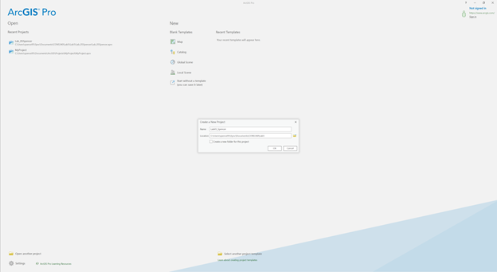
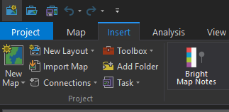
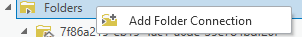
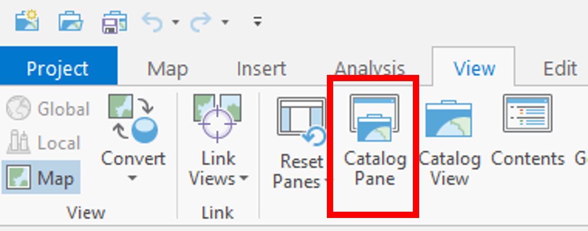
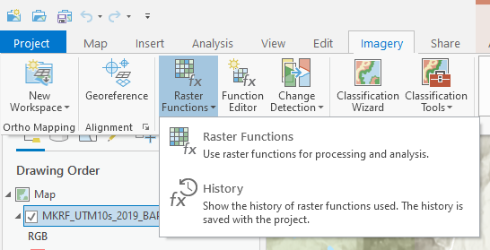
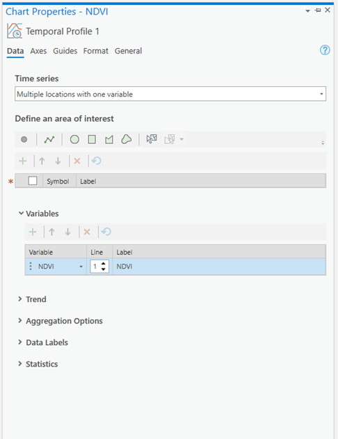
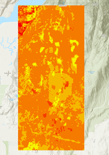
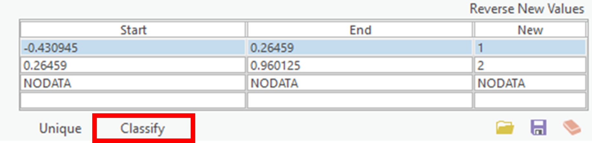
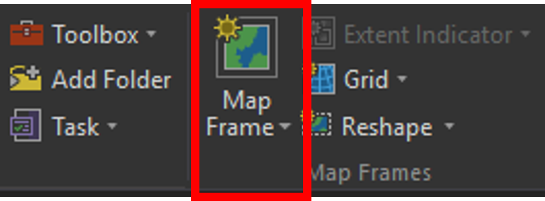

```{r echo=FALSE}
yml_content <- yaml::read_yaml("chapterauthors.yml")
author <- yml_content[["time-series-image-analysis"]][["author"]]
```

# Writing Metadata and Documentation {#time-series-image-analysis}

Written by
```{r results='asis', echo=FALSE}
cat(author)
```

## Lab Overview {.unnumbered}

In this lab, we will be using Landsat derived Best Available Pixel (BAP) imagery to examine changes in the Malcom Knapp Research Forest over a 19-year time span. In Task 1 you will use the “raster calculator” to calculate NDVI across the study area. In Task 2, you will use ArcPro to visualize a multidimensional NDVI data set and create a temporal profile. In task 3, you will conduct a change detection between two NDVI layers. For task 4 you will create a map showing this change. 

------------------------------------------------------------------------

## Learning Objectives {.unnumbered}

TBD

------------------------------------------------------------------------

## Deliverables {#lab7-deliverables .unnumbered}

After you have completed the lab you will submit a pdf on Canvas with: 

<input type="checkbox" unchecked> 1.	Answer to lab questions.</input>

<input type="checkbox" unchecked> 2.	Screen Shots.</input>

<input type="checkbox" unchecked> 3.	Full page map showing the True Colour BAP image and the NDVI file you created.</input>

------------------------------------------------------------------------

## Data {.unnumbered}

The data for this lab consists of a Landsat derived BAP imagery from the year 2000 – 2019. Information on this dataset and direction for downloading similar datasets can be found here:

White, J.C.; Wulder, M.A.; Hobart, G.W.; Luther, J.E.; Hermosilla, T.; Griffiths, P.; Coops, N.C.; Hall, R.J.; Hostert, P.; Dyk, A.; et al. Pixel-based image compositing for large-area dense time series applications and science. Can. J. Remote Sens. 2014, 40, 192–212, doi:10.1080/07038992.2014.945827.  

[https://github.com/saveriofrancini/bap](https://github.com/saveriofrancini/bap)


------------------------------------------------------------------------

## Task 1: Starting ArcGIS Pro {.unnumbered}

To start the lab, Open ArcPro. You should have window that looks like the screenshot below. The ArcPro theme used to create this lab is Dark. The default theme is likely Light, but if you are interested in changing themes please follow the instructions at this [link](https://pro.arcgis.com/en/pro-app/latest/get-started/general-options.htm). To open a new project, choose “Map”  from the “New Blank Template” list.

```{r 01-starting-arcgispro-prompt, out.width= "100%", echo = FALSE, fig.align='center'}
    
```

A prompt will appear requesting you to Name and state the location of your project. It is recommended to name your project “LabXX_yourlastname”. Uncheck the “Create a new folder for this project” box. As usual, save your project on the (C:) drive in the same folder that your downloaded data is located.

The next window is the generic start of a new project in ArcPro. In the centre you will see the standard “Catalog” frame. At the top is the ribbon, which is where the majority of your analysis options can be found. On the left is the standard “Contents” frame, which is similar to that of other Esri products. Tabs, similar to those found in ArcMap, can be found on the right-hand side of the window. When using tools or adjusting symbology, be sure to look here for a relevant tab before exploring the ribbon. 

You will also notice that the Catolog frame is also “tabbed”. This means that you can close the frame without closing ArcPro. It also means that you can have Maps, Catalogs and 3D Scenes all open at the same time. Although this is very cool, be aware that too many tabs are likely to crash ArcPro. Know your computers processing limits and play within it.  

## Toggling Extentions {.unnumbered}

With your ArcGIS pro student licence you have access to the full suite of Esri Extensions. In this lab we will be using the “Spatial Analyst” and “Image Analyst” extensions. If you do not toggle these some of the tools you are required to use will be grayed out. In the top ribbon navigate to **Project**. Select "Licensing" and press the "Configure your licening options" button. In the Licensing window press the check mark beside “Image Analyst” and “Spatial Analyst” and select OK and navigate back to the map view.  '

## Inserting a New Map{.unnumbered}

Without closing the Catalog window, navigate to the “Insert” tab on the ribbon and click on the “New Map” icon.

```{r 01-new-map, out.width= "50%", echo = FALSE, fig.align='center'}
    
```

A new topographic map will appear in the centre window. Note that it is separate from the Catalog tab. You can switch back and forth between these as you wish, but recall that there is another Catalog tab on the right-hand side of the screen. When analyzing a map or editing a model, this is the easiest tab to use. For the remainder of the lab, when “Catalog” is mentioned it is referring to this side tab. 

## Adding Data to the Map {.unnumbered}

This process is the exact same as in ArcMap. To add data to the map, navigate to the Pre-Lab folder using Catalog* ,if you save your project in the same folder as you data it should appear, if not right click **Folders** in the Catalog pane and select: 

```{r 01-add-folder-connection, out.width= "50%", echo = FALSE, fig.align='center'}
    
```

Navigate to where the data is saved and click ok. When you can find the data folder, drag-and-drop the **MKRF_UTM10S_2019_BAP.tif **  file into the map window. At this point, you should see an RGB satellite image of the Malcolm Knapp Research Forest (Figure 1) if the mapview does not immediately pan to the image right click **MKRF_UTM10S_2019_BAP.tif ** in the Contents pane and press Zoom to Layer.

**Note** If the catalog pane does not immediately appear in your ArcGIS Pro document use the ribbons at the top to navigate to **View -> Catalog Pane** 

```{r 01-catalog-pane, out.width= "50%", echo = FALSE, fig.align='center'}
    
```


```{r 07-true-colour-composite-mkrf, out.width= "100%", echo = FALSE, fig.align='center'}
    knitr::include_graphics("images/07-true-colour-composite-mkrf.png")
```

Figure 1: True colour composite of Malcom Knapp Research Forest (MKRF).

## Task 1: Calculating NDVI {.unnumbered}

Spectral indices are mathematical equations containing spectral reflectance values from two or more wavelengths used to highlight areas of spectral importance in an image. There are a wide variety of spectral indices used to highlight a variety of different land covers and image properties including burned Areas (Normalized Burn Ratio), urban/ built up areas (Normalized Difference Built-Up Index), and water (Normalized Difference Water Index) to name a few. The Normalized Difference Vegetation Index (NDVI) is a frequently used spectral index that takes advantage of the high near-infrared reflectance and high red absorption properties of healthy vegetation and is therefore often used to quantify vegetation in a remotely sensed multispectral image. 

NDVI is calculated with the below formula: 

$$
NDVI=\frac{NIR-Red}{NIR+Red}
$$
Where NIR is the near-infrared band (Landsat 7 Band 4) and Red is the red band (Landsat 7 Band 3). The results of this equation should be between -1 and 1 with values less than 0 representing water and values between 0-1 representing different levels of green vegetation. 

ArcGIS Pro contains a built-in tool to calculate NDVI and a series of other spectral indices. To solidify your knowledge of NDVI metric this lab uses the “band arithmetic” function and the above equation to create our own NDVI tool. This is useful because many things we want to calculate with rasters are not built-in to ArcGIS Pro. 

Navigate to the **Imagery** ribbon at the top of your ArcPro window and click the **Raster Function** button. 

```{r 07-raster-functions, out.width= "80%", echo = FALSE, fig.align='center'}
    
```

The Raster Functions pane should appear, you can either navigate the drop-down menus to **Math-> Band Arithmetic** or use the search function to find the **Band Arithmetic Tool** and click to open. 

```{r 07-band-arithmetic, out.width= "80%", echo = FALSE, fig.align='center'}
    knitr::include_graphics("images/07-band-arithmetic.png")
```

The “Band Arithmetic Properties” dialogue should appear. Under **“Raster”** use the drop-down menu and select the **MKRF_UTM10s_2019_BAP.tif** layer. If it is not currently in your map view and can use the folder button and navigate to your lab data folder and select the file. Under **“Method”** select **User Defined**. It should look like the screen shot below. 

```{r 07-band-arithmetic-properties, out.width= "60%", echo = FALSE, fig.align='center'}
    knitr::include_graphics("images/07-band-arithmetic-properties.png")
```

Use your knowledge of spectral indices, the NDVI formula given above and the table below fill in the NDVI calculation for your data. 

##### Screenshot 1: Take a screen shot of your band arithmetic equation and submit it in your lab report. {.unnumbered}


|Band Name|Bandwidth ($\mu$m)|
|-------------------|-------------------------------|
| Band 1            | 0.45 - 0.52                   |
| Band 2            | 0.52 - 0.60                   |
| Band 3            | 0.63 - 0.69                   |
| Band 4            | 0.77 - 0.90                   |
| Band 5            | 1.55 - 1.75                   |
| Band 6            | 2.09 - 2.35                   |

Table 1: Landsat BAP Composite Band Information

After taking a screen shot select **“Create new layer”** at the bottom of the window. The output should look something like figure 2. 

```{r 07-example-output-ndvi-calculation, out.width= "70%", echo = FALSE, fig.align='center'}
    knitr::include_graphics("images/07-example-output-ndvi-calculation.png")
```

Figure 2. Example output for the 2019 NDVI raster calculation for MKRF 

##### Q1. What are the minimum and maximum values of your new 2019 NDVI layer? {.unnumbered}
 
##### Q2. What do the dark areas in the image represent? The gray areas? the white? {.unnumbered}

##### Q3. What information does this type of analysis give us? When and why might this type of analysis be used? {.unnumbered}

------------------------------------------------------------------------

## Task 2: Time Series Analysis {.unnumbered}

In the previous section of this lab you calculated NDVI for an image of the Malcom Knapp Research Forest. In this section you will use a multidimensional dataset containing NDVI layers from 2000-2019 to create a temporal profile of NDVI change over time.

Open the **Catalogue** pane and navigate to the lab data folder. Press the arrow for the data folder to expand. Click and drag the NDVI multidimensional data set into your map viewer.  

```{r 07-ndvi-layer, out.width= "40%", echo = FALSE, fig.align='center'}
    knitr::include_graphics("images/07-ndvi-layer.png")
```

After opening the multidimensional dataset a new ribbon should appear at the top called Time along with a slider at the top of the map pane. 

```{r 07-slider, out.width= "100%", echo = FALSE, fig.align='center'}
    knitr::include_graphics("images/07-slider.png")
```

Press the play button on the slider to start an animation of NDVI change over time. You can also click and drag the slider to view individual years.

##### Q4: Hypothesize on what is causing the changes in NDVI? Why might the pattern in the south west corner of the timelapse look different from other changes? {.unnumbered}

Now that you have visualized the imagery, it is time to create a temporal profile help quantify the changes in the images. Right Click on the NDVI layer in the Contents pane and hover over “Create Chart” and select **Temporal Profile**. 

```{r 07-temporal-profile, out.width= "50%", echo = FALSE, fig.align='center'}
    knitr::include_graphics("images/07-temporal-profile.png")
```

The “Temporal Profile” pane should appear on your screen, select “Properties” at the top of this pane. The “Chart Properties” pane should appear. Under “Time series” select “Multiple Locations with one variable” and select “Point” under area of interest. 

```{r 07-chart-properties-ndvi, out.width= "50%", echo = FALSE, fig.align='center'}
    
```

Your cursor should change into a coloured dot when hovering over the map pane. Clicking the left mouse button will select a pixel to view on your temporal profile.  Use the Time slider animation function to find **4** changes that occur in different years, a 5th pixel representing water and a 6th representing an area with minimal change. See example bellow for possible locations but feel free to find and select your own. 

```{r 07-example-of-aois-for-temporal-profile, out.width= "70%", echo = FALSE, fig.align='center'}
    knitr::include_graphics("images/07-example-of-aois-for-temporal-profile.png")
```

Click on **Export** in the Temporal profile pane and save your chart as a jpeg and submit it in your final report. 

##### Screenshot2: Exported version of temporal profile {.unnumbered}

##### Q5: Examine your graph and provide some comments on the general trends you notice. Hypothesize on why different points take longer to recover or have smaller changes in NDVI values. {.unnumbered}

##### Q6: Examnine the line representing a water pixel. Does it have a consistant NDVI value? Explain why or why not? {.unnumbered}

------------------------------------------------------------------------

## Task 3: Change Detection {.unnumbered}

Select the NDVI layer in the Contents pane, navigate to the Imagery ribbon and select **Change Detection Wizard**. A new pane should appear, under “Change Detection Method” select **Pixel Value Change**.  Choose your NDVI multidimensional dataset as the “Input Raster”. “Variable” and “Dimension” should auto fill to NDVI and StdTime. Under “From Slice” select the year 2000 for “To Slice” select 2019 and press next. In the next window select **Absolute** under “Difference Type” and leave the remainder as default and press the Next button at the bottom. The “Classify Difference” pane should appear and you should see a histogram. Uncheck the “Classify the difference in values” button and then press next.  Under “Smoothing Neighborhood” select **3x3** and set the “Statistics Fill Method” to **median**. Save your result as a raster dataset and under “Output Dataset” write “ChangeDetection_2000_2019” and press finish.

Your results should appear in your map area. If you see a gray box right click the layer in the Contents pane and select “Symbology”. Under Primary symbology use the drop down menu and select **Classify**. You should now see an image on your screen that looks something like this:

```{r 07-difference-in-ndvi, out.width= "50%", echo = FALSE, fig.align='center'}
    
```

This output shows the difference in NDVI values between the 2000 and 2019 values close to zero mean that no change occurred while negative values represent a decrease in NDVI and positive values an increase in NDVI. In our case we are trying to extract the cut blocks and are therefore looking for decreases in NDVI representing clear-cuts.  

##### Q7: Using what you know about NDVI, what would cause an increase in NDVI values over time? {.unnumbered}

We are now going to use Geoprocessing tools to extract only the areas that have been identified. Navigate to the **Analysis** tab and select **Tools**. 

```{r 07-analysis-tools, out.width= "60%", echo = FALSE, fig.align='center'}
    knitr::include_graphics("images/07-analysis-tools.png")
```

The “Geoprocessing” window should appear, in the search bar type “Reclassify” and select the second option **Reclassify (Spatial Analyst Tools)**. The “Reclassify Window” should appear. Under the reclassification table press the **Classify** button and under “Number of Classes” write 2. The table should change and look like this: 

```{r 07-classify-table, out.width= "50%", echo = FALSE, fig.align='center'}
    
```

Change the “End” value in the first class to **-0.05** and the “Start” value in the second class to **-0.049999** and change the new field from 2 to **NODATA**. Run the tool. Your output should be a layer containing only pixels that had a negative change between the year 2000 NDVI image and the year 2019 NDVI image. 

Notice that some of the pixels you have retained are above lakes. Since we are principally concerned with terrestrial vegetation it is common practice to remove pixels that represent water using a water mask. Masking can either be done as a pre-processing step or at the end of our analysis. 

Navigate to the “Analysis” ribbon and select **Tools**.  Search for the tool “Extract by Mask”. Under “Input Raster” select your cutblock raster and under feature mask data navigate to the data folder and select the “LakeMask” file. Save your output as “NDVICutblocks” select run. 

------------------------------------------------------------------------

## Task 4: Map Creation {.unnumbered}

In this section you will create a map showing the location of NDVI derived cut blocks overtop of your 2019 BAP true colour composite. 

In order to map your NDVI Cutblocks and true colour composite you will need to create a layout, using symbology and ensuring that the map communicates the purpose of your analysis. This process is both a strategic, but also artistic showcase of your data. 

In ArcPro, the process of creating and stylizing a map is slightly different than ArcMap. To create a new layout, navigate to the “Insert” ribbon tab and click “New Layout”.

```{r 07-new-layout, out.width= "20%", echo = FALSE, fig.align='center'}
    knitr::include_graphics("images/07-new-layout.png")
```

When the page size and orientation options appear, select the one you wish to use. Be sure to follow lab guidelines when making this selection (ie. 11” x 17” in portrait or landscape). 

To insert your map, select “Map Frame -> Default” under the Insert ribbon tab.


```{r 07-map-frame-default, out.width= "30%", echo = FALSE, fig.align='center'}
    
```

A map frame will appear, but it is not active yet. To alter the extent of this frame, select **“Activate”** under the Layout ribbon tab.

```{r 07-activate-map-frame, out.width= "30%", echo = FALSE, fig.align='center'}
    knitr::include_graphics("images/07-activate-map-frame.png")
```

You should now be able to Zoom In and Out in the map frame. “Full Extent” is located beside the “Activate” button. If it isn’t acting as you expect, remove any topographic baselayers from your Contents pane. 

To access a particular layer’s symbology or properties, follow standard Arc protocol by right-clicking on the desired layer. Alternatively, you can select the layer in the Contents pane with a single left-click and access the newly activated “Symbology” tab on the left-hand side of the screen. Compared to ArcMap, the symbology options in ArcPro are more intuitive, so please explore. 

Now is the time for your cartographic skills to shine. To design a map of the highest quality you will need to draw on all of you GIS skills. Ensure you include all the standard components of a map along with your artistic flair. 

If you need some inspiration a quick google search for “Design principles for cartography” or browsing through some of the maps featured [here](https://www.esri.com/en-us/maps-we-love/gallery) should do the trick.  

Also, be sure to include important data, but also make sure the map is not too cluttered. 
The physical requirements are as follows: 
-   Map should be 11”x17” either as a landscape or portrait layout 

-   You should export the map as a pdf 

-   Your map should incorporate the suite of standard map element:
  -   Title 
  -   Scale bar
  -   Compass 
  -   Legend 
  
-   ONE map showing both NDVIcutblocks and true colour BAP scene.

------------------------------------------------------------------------

## Summary {.unnumbered}

Todo

Return to the [**Deliverables**](#lab7-deliverables) section to check off everything you need to submit for credit in the course management system.