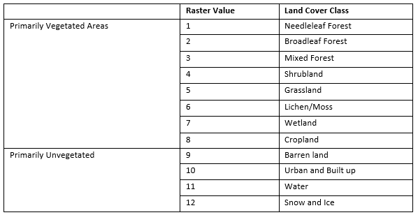
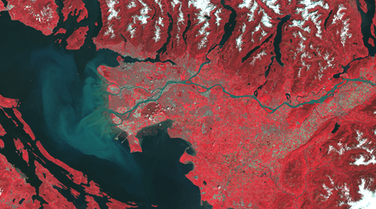
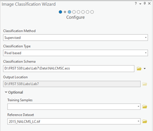
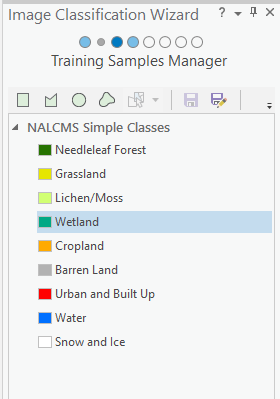
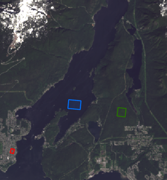
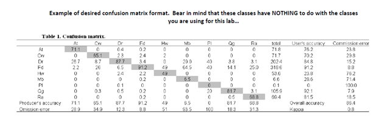

```{r echo=FALSE}
yml_content <- yaml::read_yaml("chapterauthors.yml")
author <- yml_content[["machine-learning-for-classification"]][["author"]]
```

# Machine Learning for Classification {#machine-learning-for-classification} 

Written by
```{r results='asis', echo=FALSE}
cat(author)
```

## Lab Overview {.unnumbered}

In this lab you will learn about supervised classification and selecting training and validation data. You will be classifying a Landsat 8 OLI image representing Vancouver and the surrounding area using ArcGIS Pro. You will then assess the accuracy of your classification. 

------------------------------------------------------------------------

## Learning Objectives {.unnumbered}

- Understand the four steps of supervised classification 
- Use the Classification wizard in ArcGIS pro to create classes 
- Choose representive training regions based on classes
- Train a random forest model using training data
- Interpret a confusion matrix and inspect the classification visually to assess classified map accuracy

------------------------------------------------------------------------

## Deliverables {#lab8-deliverables .unnumbered}

<input type="checkbox" unchecked> PDF report with the answers to all of the lab questions, the required screen shots and maps. </input>

------------------------------------------------------------------------

## Data {.unnumbered}

The data for this lab consist of a single Landsat 8 OLI Image of the greater Vancouver Area, southern Vancouver island and northern Washington; "LC80470262021149LGN00". The imagery was acquired May 29th 2021. The band designations for Land 8 OLI is as follows: 

```{r 08-landsat-designations, out.width= "100%", echo = FALSE, fig.align='center'}
    knitr::include_graphics("images/08-landsat-designations.png")
```

Note: Because we are using Landsat 8 imagery the bands are different than the ones you have used in previous labs.  
A 2015 Landcover layer will be used as a validation dataset. Information on this data set is available [here:](http://www.cec.org/north-american-environmental-atlas/land-cover-30m-2015-landsat-and-rapideye/)

The table below shows the legend for converting between the raster values and actual landcover types. 

```{r 08-raster-value-table, out.width= "100%", echo = FALSE, fig.align='center'}
    
```

------------------------------------------------------------------------

## Task 1: Creating training data {.unnumbered}

The goal of a supervised classification is to manually identify sample training areas, each representing a land-cover class in a remote sensing image, and use a classification algorithm to automatically classify all of the pixels in the image into these classes. There are four key steps with supervised classifications: 

**1.	Defining information classes** 

**2.	Identifying training areas**

**3.	Defining spectral signatures for classes of interest**

**4.	Applying the classification algorithm** 

**Defining information classes**- The first step of a supervised classification is to decide what classes to use. This includes deciding how many classes to use and what they represent. These classes should include the main features of interest in your remote sensing image. This step takes some serious thought, and the success of your classification depends on choosing good classes. The detail of the classes you choose is related to the spatial and radiometric resolution of the data you are using. For example, given a very high spatial resolution image, you may be able to classify individual tree crowns and shrubs; however, given a more moderate spatial resolution image, you may have more success classifying broad forest types (for example, conifer forest and broadleaf forest). Remember, the more similar the pixels are within classes and the more different the pixels are between classes, the better the classification will work. 

**Identifying training areas** - The second step in a supervised classification is collecting “training areas”. This involves drawing boundaries around a number of sample areas that represent the land-cover classes. The idea is that you are manually classifying a subset of pixels, and the classification algorithm will use these training areas to classify all of the other pixels in the image. Each class will have a number of training areas, ideally sufficient to represent the range of pixel values for each land-cover across the entire image. The location of training areas may be determined in the field using GPS; interpreted from remotely sensed data; or from other sources (such as existing maps). 

**Defining the spectral signatures for the classes** - The third step is to calculate training statistics for the pixels in each land-cover class. Some of these statistics include: minimum, maximum, mean, standard deviation for the digital numbers of each band for each class. These statistics are used to assign membership to a class/category (land-cover type) for each and every image pixel in the remote sensing scene using an image classification algorithm (e.g., Maximum Likelihood). 

**Applying the classification algorithm**-The fourth and final step is to assess the accuracy of the classification. Accuracy assessment is crucial, for any map that is produced. 

To begin **Open** ArcGIS Pro and create a new Project called “LabML_yourName” and save it in your lab folder. Navigate to the Catalog and open the “LC08_L1TP_047026_20210529_2.tif” file in map view. This file is a raster layer stack representing 8 bands/channels of Landsat 8 OLI imagery acquired May 29th 2021; where each band corresponds to the table above in the Data description except band_8 = Cirrus. 

##### Q1: Landsat OLI Bands 8, 10, and 11 were not included in the provided layer and therefore purposefully excluded from this classification and excersise. What portion of the electromagnetic spectrum do these bands represent, and why do you think they were not included? {.unnumbered}

Navigate to the **Symbology** pane and from the available bands list display an RGB colour composite, using bands_2 (blue), band_3 (green) and band_4 (red). Start by having a look around the scene and in the **Appearance** ribbon feel free to change the Stretch Type, Contrast, Brightness and Gamma until you are happy with how you scene looks. As you are working on this assignment you are encouraged to load different band combinations and enhancements to highlight the features that you are interested in. For example, a False Colour Composite using Red= NIR Band, Green = Red Band, Blue = Green Band is particularly useful for looking at vegetation (Figure 1).


```{r 08-false-colour-composite, out.width= "80%", echo = FALSE, fig.align='center'}
    
```

Figure 1: False colour composite.

To perform supervised classification of digital remotely sensed data, training (calibration) data are required to provide examples of the statistical values representing particular land-cover classes. In addition to training (calibration) data, testing (validation) data are also required to assess the accuracy of the classification. Validation data are of the same nature as calibration data, however they are independent datasets.

We are going to classify the 2021 Landsat 8 OLI image by defining training areas for a number of land-cover categories. Remember that a land-cover class is only realistic if it is spectrally unique and observable at the spatial and spectral resolution of the imagery. In other words, the spatial and spectral resolution of Landsat imagery in most cases allow for distinguishing between taxonomic tree types, such as broadleaf and coniferous, but do not permit separating
specific tree species, such as Douglas-fir and Western redcedar. Therefore, defining broadleaf and conifer as target land-cover categories is practical and achievable, as these are realistic spectral classes, whereas classes based on specific tree species (such as distinguishing between Douglas-fir and Western redcedar) are unrealistic as these divisions are not spectrally distinguishable.

When considering Landsat imagery, beyond forests, other types of vegetation can be distinguished. For instance, often times, areas dominated by herbs, shrubs and/or agricultural growth will appear spectrally different to forests in Landsat imagery; however, these non-forest vegetation types may appear spectrally similar to each other. An exception to this relates to vegetation health, which can be associated with things such as stress (due to water shortage and/or pest infestation). Furthermore, time of year is important. Due to phenological properties vegetation may appear very differently in July vs. January.

Beyond vegetation, other types of land-cover features are spectrally identifiable in Landsat imagery. For example, these may include classes relatable to water and human-made features (for example, urban development).

ArcGIS PRO has a convenient built in **Classification Wizard** that we will be using for this lab to develop our training data. Ensure that the “LC08_L1TP_047026_20210529_2.tif” layer in selected in the contents pane and then navigate to the “Imagery” ribbon and select **Classification Wizard**. Under “Classification Method” select **Supervised**, for “Classification Type” select **Pixel Based**, for “Classification Schema” use the drop-down menu on the side and select Browse to **Existing Schema**  and navigate to the NALCMSC.ecs file in your data folder should appear in the window. Under **Optional** select the 2015_NALCMS_LC.tif data set. 

```{r 08-image-classification-wizard, out.width= "50%", echo = FALSE, fig.align='center'}
    
```

Select the Lab Project folder as your “Output Location” and select **Next** at the bottom of the Image Classification Wizard pane. The “Training Samples Manager” should appear and you should see something similar to the image below. 

```{r 08-nalcms-simple-classes, out.width= "30%", echo = FALSE, fig.align='center'}
    
```

##### Q5: Using what you have learned about classification is there a landcover class that is not appropriate for the current sensor and study area? why? {.unnumbered}

Remove this class from the training sample manager by left clicking on this class and pressing the red X button. 

##### Q6: Using the provided image hypothesize at least three additional possible classes. {.unnumbered}

It is now time to create your training data set. In this lab we will create our own training samples using the training sample manager. In your own research you may have field plots or polygons that you can import. Before we begin there are a few things to keep in mind as you create your training data:

- For every land cover class, you need to have multiple polygons. It is better (and required!) to have numerous small class specific training areas spread out throughout the image than it is to have only a couple of very large training areas. 
- To capture class variability, you should have at least 10 different polygons per class as spread throughout the image as much as possible. 
- For Needleleaf Forest, Cropland, Barren Land, Urban and Built Up, Water, Snow and Ice you are required to have 10 polygons per class. 
- For all other classes, you are Required to have 5 polygons per class. 

It will take some time to delineate all necessary training samples. Get comfortable, and get into it. Know your imagery. Feel free to use google maps and other software to hunt for areas if it helps.

To begin select the first class you want to draw a training area from and press the **Rectangle** button and draw a polygon over the proper class. Do this for the required amount of polygons for each class.  


```{r 08-rectangle-training-areas, out.width= "50%", echo = FALSE, fig.align='center'}
    
```

------------------------------------------------------------------------

## Task 2: Training a Random Forest (Random Forest Algorithm) {.unnumbered}

When you have finished creating your training polygons. Select **Next** at the bottom of your window. The “Train” window should appear. Under “Classifier” Select **Random Trees** and leave the other options has default. Press **Run** and a preview of your classified raster should appear. Look it over, if you are happy with the classification select **Next**, if not select **previous** and add more training data. The “Classify” pane should appear, under “Output Classified Dataset” write “Random_Trees_Classification” leave the rest blank and select Run at the bottom. After the Classification has run select **Next** and then press **Next** again in the “Merge Classes” pane. In the “Accuracy Assessment” window leave the default settings for “Number of Random Points” and change “Sampling Strategy” to **Equalized Stratified Random**, change the “Output Confusion Matrix” to ConfusionMatrix_RF and press **Run**. After Completion a small coloured grid should appear, you can hover over the squares to see your confusion matrix statistics. Don’t worry too much about this as we will explore the Confusion matrix more in the next steps. 

```{r 08-confusion-matrix, out.width= "50%", echo = FALSE, fig.align='center'}
    knitr::include_graphics("images/08-confusion-matrix.png")
```

Click **Next** and proceed to the final portion of the “Image Classification Wizard”. After you classify an image, there can be small errors in the classification result. To address these, it is often easier to edit the final classified image rather than re-create training sites and perform each step in the classification again. The **Reclassifier** page allows you to make edits to individual features or objects in the classified image. We will skip this step in this lab and move on to interpreting our confusion matrix. 

##### Q4: Describe (2 sentences) the random trees algorithm process and key outputs.{.unnumbered}

------------------------------------------------------------------------

## Task 3: Interpreting Classification Results {.unnumbered}

All image classifications will contain misclassification. There is no such thing as a perfectly classified map. The accuracy and therefore usability of a classified map depends on many factors, including the original data used (i.e., the remotely sensed data), and the nature of the training and testing data. 
To assess the accuracy of your map we will do a visual assessment and a standard confusion matrix. The confusion matrix is a cross-tabulation of the mapped class labels (i.e., land-cover categories) against independent validation data. The confusion matrix measures the percentage of cases correctly allocated overall (i.e., overall accuracy), the Kappa index of agreement and the percentage of cases correctly allocated per class (i.e, producer’s and user’s accuracies). Kappa analysis is conducted to determine if individual classifications are significantly better than random classifications and if any two classifications are significantly different. Producer’s accuracy assesses if there are instances when cases in a class are omitted from a class they should have been mapped as (i.e., omission error). User’s accuracy assesses if there are instances when cases in a class are committed to a class they were known not to belong to (i.e., commission error).

**Note:** If your map exhibits high levels of misclassification, it is likely that the training areas are not appropriate/not truly representative of the full spectral range of a class. It is also possible that some of the classes you are attempting to map may not in actuality be spectrally distinct and therefore may not be appropriate. If there were high levels of misclassification associated with a particular class, you would want to evaluate the appropriateness of this class and/or whether you have truly captured the spectral variability of the class. It is not unusual to add and remove a number of classes and/or “tweak” the classes that you have and rerun the classification algorithm a number of times before satisfactory results are achieved.

Scroll to the bottom of the **Contents** pane and right click “ConfusionMatrix_RF” and select **Open**. A window should appear with your Confusion Matrix that look something like this (Although your values should be different).

```{r 08-confusion-matrix-table, out.width= "80%", echo = FALSE, fig.align='center'}
    knitr::include_graphics("images/08-confusion-matrix-table.png")
```

While this table works it isn’t very readable. Right click on “ConfusionMatix_RF” go down to **Data** and select **Export Table**. Export your table as a .csv file type and open in Microsoft Excel (or your table editor of choice) and create readable confusion matrix . 
 

```{r 08-desired-confusion-matrix, out.width= "80%", echo = FALSE, fig.align='center'}
    
```

##### Screenshot 1: Submit a screen shot of your formated confusion matrix. {.unnumbered}

##### Q5: Describe producer's and user's accuracy {.unnumbered}

##### Q6: Which class has the highest producers accuracy? Why? {.unnumbered}

##### Q7: Which class has the lowest producers accuracy? Why? What class was it most often confused with? {.unnumbered}

We will now be using the **swipe** feature to conduct a visual accuracy assessment. Ensure your Classification layer is the top layer in the “Drawing Order” tab in the “Contents” pane and that the NALCMS_LC_2015 layer is second. Select your classified layer and navigate to the “Appearance” ribbon and select the **Swipe** button. Hover your cursor over the map scene and it should have turned into an arrow click and drag the arrow up and down or across your Map pane to switch between the two layers.

```{r 08-visual-accuracy-assessment, out.width= "30%", echo = FALSE, fig.align='center'}
    knitr::include_graphics("images/08-visual-accuracy-assessment.png")
```

##### Q8: Do you think that your confusion matrix corresponds to your visual accuracy assessement? Why or why not? Are there any classes you thougth would be more difficult to differentiate between? Explain. {.unnumbered}

------------------------------------------------------------------------

## Task 4: Making a Map {.unnumbered}

Now is the time for your cartographic skills to shine. To design a map of the highest quality you will need to draw on all of you GIS skills. Ensure you include all the standard components of a map along with your artistic flair.

If you need some inspiration a quick google search for “Design principles for cartography” or browsing through some of the maps featured [here](https://livingatlas.arcgis.com/en/home/) should do the trick.  

You should design a map that shows the output of your random tree’s classification. Feel free to use inset maps to show areas differed from the reference dataset. 

Also, be sure to include important data, but also make sure the map is not too cluttered. 
The physical requirements are as follows: 

- Map should be 11”x17” either as a landscape or portrait layout 

- You should export the map as a pdf 

- Your map should incorporate the suite of standard map element:

  - Title 
  
  - Scale bar
  
  - Compass 
  
  - Legend 

------------------------------------------------------------------------

## Summary {.unnumbered}

In this lab, you will conduct a supervised classification of a remote sensing image. The process involves four key steps: defining information classes, identifying training areas, defining spectral signatures, and applying a classification algorithm. You’ll start by defining land-cover classes relevant to your image, followed by manually selecting training areas that represent these classes. Next, you will create a random forest model to classify the full image. Machine learning plays a crucial role in this process by automating and improving the accuracy of the classification, enabling more efficient and reliable analysis. Finally, you’ll assess the accuracy of the classification using visual interpretation and confusion matrix to ensure dependable results.

Return to the [**Deliverables**](#lab8-deliverables) section to check off everything you need to submit for credit in the course management system.